# day07【Collection、List、泛型、数据结构】

## 今日内容

- Collection集合
- 迭代器
- 泛型
- 数据结构
- List集合

## 教学目标

- [ ] 能够说出集合与数组的区别
- [ ] 能够使用Collection集合的常用功能
- [ ] 能够使用迭代器对集合进行取元素
- [ ] 能够使用增强for循环遍历集合和数组
- [ ] 能够理解泛型上下限
- [ ] 能够阐述泛型通配符的作用
- [ ] 能够说出常见的数据结构
- [ ] 能够说出数组结构特点
- [ ] 能够说出栈结构特点
- [ ] 能够说出队列结构特点
- [ ] 能够说出单向链表结构特点
- [ ] 能够说出List集合特点
- [ ] 能够完成斗地主的案例

# 第一章 Collection集合

## 知识点-- 集合概述

### 目标:

- 在前面基础班我们已经学习过并使用过集合ArrayList<E> ,那么集合到底是什么呢?

### 路径:

- 集合的概述
- 集合和数组的区别

### 讲解:

- **集合**：集合是java中提供的一种容器，可以用来存储多个引用数据类型数据的容器。

集合和数组既然都是容器，它们有什么区别呢？

- 数组的长度是固定的。集合的长度是可变的。
- 数组中存储的是同一类型的元素，集合中可以存储任意类型数据。
- 集合存储的都是引用数据类型。如果想存储基本类型数据需要存储对应的包装类型。

### 小结:

- 略

## 知识点-- 单列集合常用类的继承体系

### 目标:

- 单列集合常用类的继承体系

### 步骤:

- 单列集合常用类的继承体系

### 讲解:

Collection：是单列集合类的根接口，用于存储一系列符合某种规则的元素，它有两个重要的子接口,分别是

- `java.util.List:` **List的特点是元素有序、元素可重复 ;** 
  - `List`接口的主要实现类有`java.util.ArrayList`和`java.util.LinkedList`，
- `java.util.Set:` **Set的特点是元素不可重复**。
  - `Set`接口的主要实现类有`java.util.HashSet`和`java.util.LinkedHashSet`，`java.util.TreeSet`。

为了便于初学者进行系统地学习，接下来通过一张图来描述集合常用类的继承体系


### 小结

- **注意**:上面这张图只是我们常用的集合有这些，不是说就只有这些集合。

## 知识点-- Collection 常用功能

### 目标:

- Collection是所有单列集合的父接口，因此在Collection中定义了单列集合(List和Set)通用的一些方法，这些方法可用于操作所有的单列集合。

### 步骤:

- Collection集合 常用功能

### 讲解:

Collection是所有单列集合的父接口，因此在Collection中定义了单列集合(List和Set)通用的一些方法，这些方法可用于操作所有的单列集合。方法如下：

- `public boolean add(E e)`：  把给定的对象添加到当前集合中 。
- `public void clear()` :清空集合中所有的元素。
- `public boolean remove(E e)`: 把给定的对象在当前集合中删除。
- `public boolean contains(Object obj)`: 判断当前集合中是否包含给定的对象。
- `public boolean isEmpty()`: 判断当前集合是否为空。
- `public int size()`: 返回集合中元素的个数。
- `public Object[] toArray()`: 把集合中的元素，存储到数组中

> tips: 有关Collection中的方法可不止上面这些，其他方法可以自行查看API学习。

```java
public class Demo {
    public static void main(String[] args) {
        /*
            Collection<E>接口 常用功能:
                - public boolean add(E e)：  把给定的对象添加到当前集合中 。
                - public void clear() :清空集合中所有的元素。
                - public int size(): 返回集合中元素的个数。
                - public boolean remove(E e): 把给定的对象在当前集合中删除。
                - public boolean contains(Object obj): 判断当前集合中是否包含给定的对象。
                - public boolean isEmpty(): 判断当前集合是否为空。
                - public Object[] toArray(): 把集合中的元素，存储到数组中
         */
        // 创建一个Collection集合对象,指定集合中元素的类型为String
        Collection<String> coll = new ArrayList<>();

        // 往集合中添加元素: public boolean add(E e)
        coll.add("李冰冰");
        coll.add("范冰冰");
        coll.add("高圆圆");
        coll.add("陈圆圆");
        System.out.println("添加元素后的集合:"+coll);// 添加元素后的集合:[李冰冰, 范冰冰, 高圆圆, 陈圆圆]

        /*// 清空集合中所有的元素:public void clear()
        coll.clear();
        System.out.println("清空所有元素后的集合:"+coll);// 清空所有元素后的集合:[]

        // 统计集合中元素的个数: public int size()
        System.out.println("清空所有元素后的集合大小:"+coll.size());// 清空所有元素后的集合大小:0*/

        // 删除集合中指定元素: public boolean remove(E e)
        // 例如:删除集合中的元素范冰冰
        boolean flag1 = coll.remove("范冰冰");
        System.out.println("flag1:"+flag1);// flag1:true
        System.out.println("删除范冰冰元素后的集合:"+coll);// 删除范冰冰元素后的集合:[李冰冰, 高圆圆, 陈圆圆]

        // 判断集合中是否包含指定的元素:public boolean contains(Object obj)
        // 例如:判断集合中是否包含范冰冰这个元素
        boolean flag2 = coll.contains("范冰冰");
        System.out.println("范冰冰这个元素是否存在:"+flag2);// false

        // 例如:判断集合中是否包含李冰冰这个元素
        boolean flag3 = coll.contains("李冰冰");
        System.out.println("李冰冰这个元素是否存在:"+flag3);// true

        // 判断集合中是否还有元素:public boolean isEmpty()
        boolean flag4 = coll.isEmpty();
        System.out.println("集合中是否还有元素:"+flag4);// false
        /*coll.clear();
        boolean flag5 = coll.isEmpty();
        System.out.println("集合中是否还有元素:"+flag5);// true*/

        // 把集合转换为数组:public Object[] toArray()  本质是:把该集合中的元素存储到一个数组中
        Object[] arr = coll.toArray();
        System.out.println("数组:"+ Arrays.toString(arr));// 数组:[李冰冰, 高圆圆, 陈圆圆]

    }
}

```

### 小结

略

# 第二章 Iterator迭代器

## 知识点-- Iterator接口

### 目标:

- 在程序开发中，经常需要遍历单列集合中的所有元素。针对这种需求，JDK专门提供了一个接口`java.util.Iterator`。

### 路径:

- 迭代的概念
- 获取迭代器对象
- Iterator接口的常用方法

### 讲解:

#### 迭代的概念

**迭代**：即Collection集合元素的通用获取方式。在取元素之前先要判断集合中有没有元素，如果有，就把这个元素取出来，继续再判断，如果还有就再取出来。一直把集合中的所有元素全部取出。这种取出方式专业术语称为迭代。

#### 获取迭代器对象

Collection集合提供了一个获取迭代器的方法：

- `public Iterator iterator()`: 获取集合对应的迭代器，用来遍历集合中的元素的。

#### Iterator接口的常用方法

- `public E next()`:返回迭代的下一个元素。
- `public boolean hasNext()`:如果仍有元素可以迭代，则返回 true。

##### 案例演示

```java
public class Test {
    public static void main(String[] args) {
        /*
            - 迭代的概念
                概述: Collection集合获取元素通用的方式。在获取元素之前要先判断集合中是否有元素可以获取,如果有,
                     就把这个元素取出来,接下来继续判断,如果还有,就继续取出来,直到把集合中所有元素取出来为止,这就
                     是迭代
            - 获取迭代器对象
                1.迭代器对象:Iterator接口对象
                2.如何获取集合对应的迭代器对象
                  使用Collection集合中的iterator()方法:
                        Iterator<E> iterator();获取集合对应的迭代器对象

            - Iterator接口的常用方法
                    boolean hasNext() 判断集合中是否有元素可以迭代
                    E next()  获取集合中的元素
         */
        // 创建一个Collection集合,限制集合中元素的类型为String
        Collection<String> col = new ArrayList<>();
        // 添加元素
        col.add("范冰冰");
        col.add("李冰冰");
        col.add("高圆圆");
        col.add("刘诗诗");
        // 迭代
        // 获取该集合对应的迭代器对象
        Iterator<String> it = col.iterator();

        // 使用while循环,判断集合中是否有元素可以获取
        while (it.hasNext()) {
            // 如果有,就取出来
            String e = it.next();
            System.out.println(e);
        }
    }
}

```

### 小结

略

## 知识点-- 迭代器的常见问题 

### 目标

- 理解迭代器的常见问题

### 路径

- 常见问题一
- 常见问题二

### 讲解

#### 常见问题一

- 在进行集合元素获取时，如果集合中已经没有元素可以迭代了，还继续使用迭代器的next方法，将会抛出java.util.NoSuchElementException没有集合元素异常。

  ```java
   public static void main(String[] args) throws Exception{
          Collection<String> coll = new ArrayList<>();
          coll.add("李冰冰");
          coll.add("范冰冰");
          coll.add("高圆圆");
          coll.add("陈圆圆");
  
          Iterator<String> it = coll.iterator();
          while (it.hasNext()) {
              String s = it.next();
              System.out.println(s);//正确
          }
          System.out.println("=====================");
          System.out.println(it.next());//集合中已经没有元素可以迭代了 报异常
      }
  
  ```

- 解决办法: 如果还需要重新迭代,那么就重新获取一个新的迭代器对象进行操作

#### 常见问题二

- 在进行集合元素迭代时，如果添加或移除集合中的元素 , 将无法继续迭代 , 将会抛出ConcurrentModificationException并发修改异常.

  ```java
  public static void main(String[] args) throws Exception{
          Collection<String> coll = new ArrayList<>();
           coll.add("李冰冰");
          coll.add("范冰冰");
          coll.add("高圆圆");
          coll.add("陈圆圆");
  
          Iterator<String> it = coll.iterator();
          while (it.hasNext()) {
              String s = it.next();
              System.out.println(s);
              //coll.add("章子怡");// 报异常
              //coll.remove(s);// 报异常
              it.remove();
          }
          System.out.println("====================="+coll);
  }
  ```

### 小结

略

## 知识点-- 迭代器的实现原理

### 目标:

- 迭代器的实现原理

### 路径:

- 迭代器的实现原理

### 讲解:

​        我们在之前案例已经完成了Iterator遍历集合的整个过程。当遍历集合时，首先通过调用t集合的iterator()方法获得迭代器对象，然后使用hashNext()方法判断集合中是否存在下一个元素，如果存在，则调用next()方法将元素取出，否则说明已到达了集合末尾，停止遍历元素。

​        Iterator迭代器对象在遍历集合时，内部采用指针的方式来跟踪集合中的元素。在调用Iterator的next方法之前，迭代器的索引位于第一个元素之前，不指向任何元素，当第一次调用迭代器的next方法后，迭代器的索引会向后移动一位，指向第一个元素并将该元素返回，当再次调用next方法时，迭代器的索引会指向第二个元素并将该元素返回，依此类推，直到hasNext方法返回false，表示到达了集合的末尾，终止对元素的遍历。

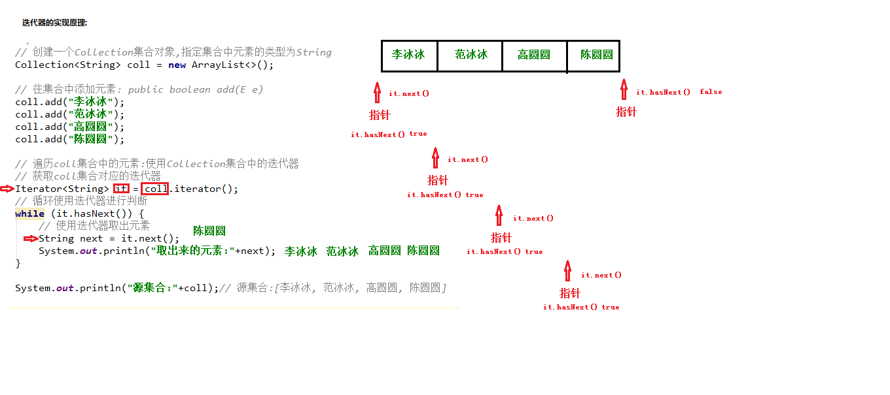

### 小结

略

## 知识点-- 增强for

### 目标:

- 增强for循环

### 路径:

- 增强for循环

### 讲解:

增强for循环(也称for each循环)是**JDK1.5**以后出来的一个高级for循环，专门用来遍历数组和集合的。它的内部原理其实是个Iterator迭代器，所以在遍历的过程中，不能对集合中的元素进行增删操作。

格式：

```java
for(元素的数据类型  变量 : Collection集合or数组){ 
  	//写操作代码
}
```

它用于遍历Collection和数组。通常只进行遍历元素，不要在遍历的过程中对集合元素进行增删操作。

代码演示

```java
public class Test {
    public static void main(String[] args) {
        /*
            增强for循环:
                概述:增强for循环(也称for each循环)是JDK1.5以后出来的一个高级for循环，专门用来遍历数组和集合的。
                    它的内部原理其实是个Iterator迭代器，所以在遍历的过程中，不能对集合中的元素进行增删操作。
                格式:
                    for(数据类型 变量名 : 数组名\集合名){
                    }
         */
        // 使用增强for循环遍历集合
        // 定义一个Collection集合,限制集合中的元素类型为String类型
        Collection<String> coll = new ArrayList<>();// 经理  打扫4层楼

        // 添加元素到集合中
        coll.add("范冰冰");
        coll.add("李冰冰");
        coll.add("赵薇");
        coll.add("林心如");

        // 增强for遍历
        for (String temp : coll) {
            System.out.println("取出来的元素:"+temp);// 范冰冰 李冰冰 赵薇 林心如
        }

        System.out.println("==========================================");
        // 使用增强for循环遍历数组
        String[] arr = new String[4];
        arr[0] = "范冰冰";
        arr[1] = "李冰冰";
        arr[2] = "赵薇";
        arr[3] = "林心如";

        // 增强for遍历
        for (String temp : arr) {
            System.out.println("元素:"+temp);
        }

        System.out.println("==========================================");

        // 快捷键: 数组名\集合名.for  回车
        for (String s : arr) {
            System.out.println(s);
        }

        for (String s : coll) {
            System.out.println(s);
        }

    }
}


```

> tips: 
>
> 增强for循环必须有被遍历的目标，目标只能是Collection或者是数组；
>
> 增强for（迭代器）仅仅作为遍历操作出现，不能对集合进行增删元素操作，否则抛出ConcurrentModificationException并发修改异常 

### 小结

- Collection是所有单列集合的根接口，如果要对单列集合进行遍历，通用的遍历方式是迭代器遍历或增强for遍历。

# 第三章 泛型

## 知识点--  泛型的作用

### 目标:

- 理解泛型的作用

### 路径:

- 集合不使用泛型
- 集合使用泛型

### 讲解:

- 集合不使用泛型的时候，存的时候什么类型都能存。但是取的时候就懵逼了。取出来啥也不是。

  ```java
  public class Demo_01不使用泛型 {
      public static void main(String[] args) {
          //创建集合对象
          Collection c = new ArrayList();
  
          //添加元素
          c.add("迪丽热巴");
          c.add(123);
          c.add(3.14);
  
          //判断元素的长度是否大于4
          //获取迭代器
          Iterator it = c.iterator();
  
          //ClassCastException类型转换异常
          while (it.hasNext()) {
              String s = (String)it.next();
              int len = s.length();
              System.out.println("打印字符串的长度" + len);
          }
      }
  }
  ```

- 使用泛型

  - 使用泛型在编译期直接对类型作出了控制，只能存储泛型定义的数据

  ```java
  public class Demo02_使用泛型 {
      public static void main(String[] args) {
          //创建集合
          Collection<String> list = new ArrayList<>();
          //添加元素
          list.add("迪丽热巴");
          //list.add(123);    //在存储的时候就对类型作出了编译判断
          list.add("柳岩");
  
          //取出来的也都是字符串
      }
  }
  ```

- **泛型**：可以在类或方法中预知地使用未知的类型。

> tips:泛型的作用是在创建对象时，将未知的类型确定具体的类型。当没有指定泛型时，默认类型为Object类型。

### 小结

略

## 知识点--定义和使用含有泛型的类

### 目标

- 定义和使用含有泛型的类

### 路径

- 定义含有泛型的类
- 确定泛型具体类型

### 讲解

#### 定义含有泛型的类

定义格式：

```
修饰符 class 类名<代表泛型的变量> {  }
代表泛型的变量: 可以是任意字母  例如: T,E...
```

泛型在定义的时候不具体类型，使用的时候才具体类型。在使用的时候确定泛型的具体数据类型。

```java
class ArrayList<E>{ 
    public boolean add(E e){ }

    public E get(int index){ }
   	....
}
```

#### 确定泛型具体类型

**在创建对象的时候确定泛型**

 例如，`ArrayList<String> list = new ArrayList<String>();`

此时，变量E的值就是String类型,那么我们的类型就可以理解为：

```java 
class ArrayList<String>{ 
     public boolean add(String e){ }

     public String get(int index){  }
     ...
}
```

### 课堂代码

```java
public class MyArrayList<E> {
    // 泛型类的使用场景: 如果类中的很多方法的参数类型或者返回值类型不能确定,但是类型又要一致,
    // 就可以定义含有泛型的类,该类中的方法的参数类型或者返回值类型就可以使用泛型类上的泛型来表示

    E e;

    public void add(E e){

    }

    public void remove(E e){

    }

    public E method(E e){
        return e;
    }

}
public class Test {
    public static void main(String[] args) {
        /*
            定义和使用含有泛型的类:
                定义含义泛型的类: 在类上定义泛型
                    格式:
                        public class 类名<泛型变量>{
                        }
                        尖括号中的泛型变量可以是任意字母: E A B c  d.......
                        例如系统中的ArrayList类:
                            public class ArrayList<E>{
                                public boolean add(E e){
                                }
                            }
                使用含有泛型的类: 在创建该类对象的时候,确定类上的泛型的具体数据类型
         */
        // 使用系统含有泛型的类
        ArrayList<String> list = new ArrayList<>();
        list.add("jack");

        // 使用自定义含有泛型的类
        MyArrayList<String> myList = new MyArrayList<>();
        myList.add("rose");
        myList.remove("rose");

        MyArrayList<Integer> myList2 = new MyArrayList<>();
        myList2.add(100);
        myList2.remove(100);


    }
}
```


### 小结

略

## 知识点--定义和使用含有泛型的方法

### 目标

- 定义和使用含有泛型的方法

### 路径

- 定义含有泛型的方法
- 确定泛型具体类型

### 讲解

#### 定义含有泛型的方法

定义格式：

```
修饰符 <代表泛型的变量> 返回值类型 方法名(参数){  }
```

例如，

```java
public class MyGenericMethod {	  
    public <MVP> void show(MVP mvp) {
    	System.out.println(mvp.getClass());
    }
    
    public <MVP> MVP show2(MVP mvp) {	
    	return mvp;
    }
}
```

#### 确定泛型具体类型

**调用方法时，确定泛型的类型**

```java
public class GenericMethodDemo {
    public static void main(String[] args) {
        // 创建对象
        MyGenericMethod mm = new MyGenericMethod();
        // 演示看方法提示
        mm.show("aaa");
        mm.show(123);
        mm.show(12.45);
    }
}
```

### 小结

## 知识点--定义和使用含有泛型的接口

### 目标

- 定义和使用含有泛型的接口

### 路径

- 定义含有泛型的接口
- 确定泛型具体类型

### 讲解

#### 定义含有泛型的接口

定义格式：

```
修饰符 interface接口名<代表泛型的变量> {  }
```

例如，

```java
public interface MyGenericInterface<E>{
	public abstract void add(E e);
	
	public abstract E getE();  
}
```

#### 确定泛型具体类型

使用格式：

**1、定义实现类时确定泛型的类型**

例如

```java
public class MyImp1 implements MyGenericInterface<String> {
	@Override
    public void add(String e) {
        // 省略...
    }

	@Override
	public String getE() {
		return null;
	}
}
```

此时，泛型E的值就是String类型。

 **2、始终不确定泛型的类型，直到创建对象时，确定泛型的类型**

 例如

```java
public class MyImp2<E> implements MyGenericInterface<E> {
	@Override
	public void add(E e) {
       	 // 省略...
	}

	@Override
	public E getE() {
		return null;
	}
}
```

确定泛型：

```java
/*
 * 使用
 */
public class GenericInterface {
    public static void main(String[] args) {
        MyImp2<String>  my = new MyImp2<String>();  
        my.add("aa");
    }
}
```

### 小结

- 泛型是一种未知的数据类型，定义在类上的泛型，使用类的时候会确定泛型的类型，定义在方法上的泛型，会在使用方法的时候确定泛型，定义在接口上的泛型，需要使用接口的时候确定泛型。

## 知识点--  泛型通配符

### 目标:

- 能够使用泛型通配符

### 路径:

- 通配符基本使用
- 通配符高级使用----受限泛型

### 讲解:

#### 通配符基本使用

泛型的通配符:**不知道使用什么类型来接收的时候,此时可以使用?,?表示未知通配符。**

此时只能接受数据,不能往该集合中存储数据。

例如:

```java
public static void main(String[] args) {
    Collection<Intger> list1 = new ArrayList<Integer>();
    getElement(list1);
    Collection<String> list2 = new ArrayList<String>();
    getElement(list2);
}

public static void getElement(Collection<?> coll){}

//？代表可以接收任意类型
//泛型不存在继承关系 Collection<Object> list = new ArrayList<String>();这种是错误的。
```

#### 通配符高级使用----受限泛型

之前设置泛型的时候，实际上是可以任意设置的，只要是类就可以设置。但是在JAVA的泛型中可以指定一个泛型的**上限**和**下限**。

**泛型的上限**：

- **格式**： `类型名称 <? extends 类 > 对象名称`
- **意义**： `只能接收该类型及其子类`

**泛型的下限**：

- **格式**： `类型名称 <? super 类 > 对象名称`
- **意义**： `只能接收该类型及其父类型`

比如：现已知Object类，String 类，Number类，Integer类，其中Number是Integer的父类

```java
public static void main(String[] args) {
    Collection<Integer> list1 = new ArrayList<Integer>();
    Collection<String> list2 = new ArrayList<String>();
    Collection<Number> list3 = new ArrayList<Number>();
    Collection<Object> list4 = new ArrayList<Object>();
    
    getElement1(list1);
    getElement1(list2);//报错
    getElement1(list3);
    getElement1(list4);//报错
  
    getElement2(list1);//报错
    getElement2(list2);//报错
    getElement2(list3);
    getElement2(list4);
  
}
// 泛型的上限：此时的泛型?，必须是Number类型或者Number类型的子类
public static void getElement1(Collection<? extends Number> coll){}
// 泛型的下限：此时的泛型?，必须是Number类型或者Number类型的父类
public static void getElement2(Collection<? super Number> coll){}
```

### 小结

- ?表示泛型通配符，如果要对?泛型通配符的取值范围进行限制，可以使用泛型限定


# 第四章 数据结构

## 知识点-- 数据结构介绍

### 目标:

- 了解数据结构的作用

### 路径:

- 了解数据结构的作用

### 讲解:

数据结构 : **其实就是存储数据和表示数据的方式**。数据结构内容比较多，细细的学起来也是相对费功夫的，不可能达到一蹴而就。我们将常见的数据结构：堆栈、队列、数组、链表和红黑树 这几种给大家介绍一下，作为数据结构的入门，了解一下它们的特点即可。

### 小结:

- 数据结构其实就是**存储数据和表示数据的方式** 
- 每种数据结构都有自己的优点和缺点,由于数据结构内容比较多,作为数据结构的入门,了解一下他们的特点即可

## 知识点-- 常见数据结构

### 目标:

- 数据存储的常用结构有：栈、队列、数组、链表和红黑树。我们分别来了解一下

### 步骤:

- 栈结构的特点
- 队列结构的特点
- 数组结构的特点
- 链表结构的特点

### 讲解:

数据存储的常用结构有：栈、队列、数组、链表和红黑树。我们分别来了解一下：

#### 栈

- **栈**：**stack**,又称堆栈，它是运算受限的线性表，其限制是仅允许在表的一端进行插入和删除操作，不允许在其他任何位置进行添加、查找、删除等操作。

简单的说：采用该结构的集合，对元素的存取有如下的特点

- **先进后出**（即，存进去的元素，要在后它后面的元素依次取出后，才能取出该元素）。例如，子弹压进弹夹，先压进去的子弹在下面，后压进去的子弹在上面，当开枪时，先弹出上面的子弹，然后才能弹出下面的子弹。

- **栈的入口、出口的都是栈的顶端位置**。

  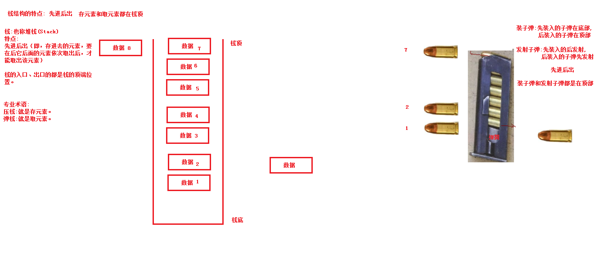


这里两个名词需要注意：

- **压栈**：就是存元素。即，把元素存储到栈的顶端位置，栈中已有元素依次向栈底方向移动一个位置。
- **弹栈**：就是取元素。即，把栈的顶端位置元素取出，栈中已有元素依次向栈顶方向移动一个位置。

#### 队列

- **队列**：**queue**,简称队，它同堆栈一样，也是一种运算受限的线性表，其限制是仅允许在表的一端进行插入，而在表的另一端进行取出并删除。

  简单的说，采用该结构的集合，对元素的存取有如下的特点：

  - **先进先出**（即，存进去的元素，要在后它前面的元素依次取出后，才能取出该元素）。例如，小火车过山洞，车头先进去，车尾后进去；车头先出来，车尾后出来。
  - **队列的入口、出口各占一侧。**例如，下图中的左侧为入口，右侧为出口。

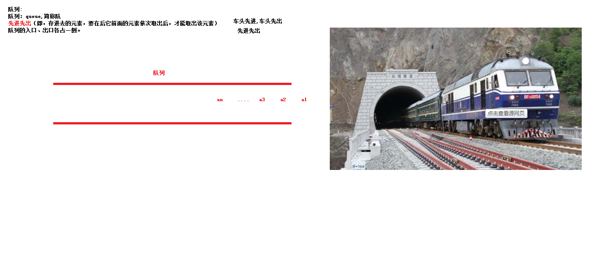

#### 数组

- **数组**:**Array**,是有序的元素序列，数组是在内存中开辟一段连续的空间，并在此空间存放元素。就像是一排出租屋，有100个房间，从001到100每个房间都有固定编号，**通过编号**就可以**快速**找到租房子的人。

简单的说,采用该结构的集合，对元素的存取有如下的特点：

- **查找元素快**：通过索引，可以快速访问指定位置的元素

  

- **增删元素慢**

- **指定索引位置增加元素**：需要创建一个新数组，将指定新元素存储在指定索引位置，再把原数组元素根据索引，复制到新数组对应索引的位置。如下图

- **指定索引位置删除元素：**需要创建一个新数组，把原数组元素根据索引，复制到新数组对应索引的位置，原数组中指定索引位置元素不复制到新数组中。如下图


#### 链表

- **链表**:**linked list**,由一系列结点node（链表中每一个元素称为结点）组成，结点可以在运行时动态生成。每个结点包括两个部分：一个是存储数据元素的数据域，另一个是存储下一个结点地址的指针域。我们常说的链表结构有单向链表与双向链表，那么这里给大家介绍的是**单向链表**。

  

  简单的说，采用该结构的集合，对元素的存取有如下的特点：

  - 多个结点之间，通过地址进行连接。例如，多个人手拉手，每个人使用自己的右手拉住下个人的左手，依次类推，这样多个人就连在一起了。

  - 查找元素慢：想查找某个元素，需要通过连接的节点，依次向后查找指定元素。

  - 增删元素快：只需要修改链接下一个元素的地址值即可

  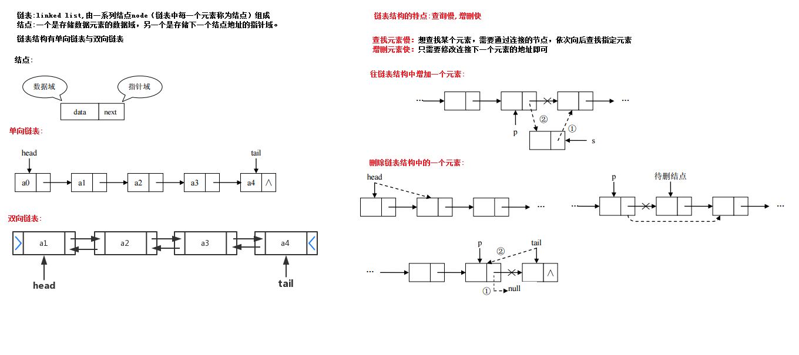

### 小结:

- 栈结构的特点:先进后出,栈的入口和出口都在栈顶的位置
- 队列结构的特点:先进先出,队列的入口和出口在队列的2侧
- 数组结构的特点:查询快,增删慢
- 链表结构的特点:查询慢,增删快

## 知识点-- 树基本结构介绍

### 目标:

- 树基本结构的介绍

### 步骤:

- 树具有的特点
- 二叉树
- 二叉查找树
- 平衡二叉树
- 红黑树

### 讲解:

#### 树具有的特点：

1. 每一个节点有零个或者多个子节点
2. 没有父节点的节点称之为根节点，一个树最多有一个根节点。
3. 每一个非根节点有且只有一个父节点

 

| 名词     | 含义                                                         |
| -------- | ------------------------------------------------------------ |
| 节点     | 指树中的一个元素                                             |
| 节点的度 | 节点拥有的子树的个数，二叉树的度不大于2                      |
| 叶子节点 | 度为0的节点，也称之为终端结点                                |
| 高度     | 叶子结点的高度为1，叶子结点的父节点高度为2，以此类推，根节点的高度最高 |
| 层       | 根节点在第一层，以此类推                                     |
| 父节点   | 若一个节点含有子节点，则这个节点称之为其子节点的父节点       |
| 子节点   | 子节点是父节点的下一层节点                                   |
| 兄弟节点 | 拥有共同父节点的节点互称为兄弟节点                           |

#### 二叉树

如果树中的每个节点的子节点的个数不超过2，那么该树就是一个二叉树。


#### 二叉查找树	

二叉查找树的特点：

1. 左子树上所有的节点的值均小于等于他的根节点的值
2. 右子树上所有的节点值均大于或者等于他的根节点的值
3. 每一个子节点最多有两个子树

案例演示(20,18,23,22,17,24,19)数据的存储过程；


遍历获取元素的时候可以按照"左中右"的顺序进行遍历；

注意：二叉查找树存在的问题：会出现"瘸子"的现象，影响查询效率


#### 平衡二叉树

##### 概述

为了避免出现"瘸子"的现象，减少树的高度，提高我们的搜素效率，又存在一种树的结构："平衡二叉树"

规则：**它的左右两个子树的高度差的绝对值不超过1，并且左右两个子树都是一棵平衡二叉树**

如下图所示：


如下图所示，左图是一棵平衡二叉树，根节点10，左右两子树的高度差是1，而右图，虽然根节点左右两子树高度差是0，但是右子树15的左右子树高度差为2，不符合定义，

所以右图不是一棵平衡二叉树。


#### 旋转

在构建一棵平衡二叉树的过程中，当有新的节点要插入时，检查是否因插入后而破坏了树的平衡，如果是，则需要做旋转去改变树的结构。

##### 左旋：

**左旋就是将节点的右支往左拉，右子节点变成父节点，并把晋升之后多余的左子节点出让给降级节点的右子节点；**

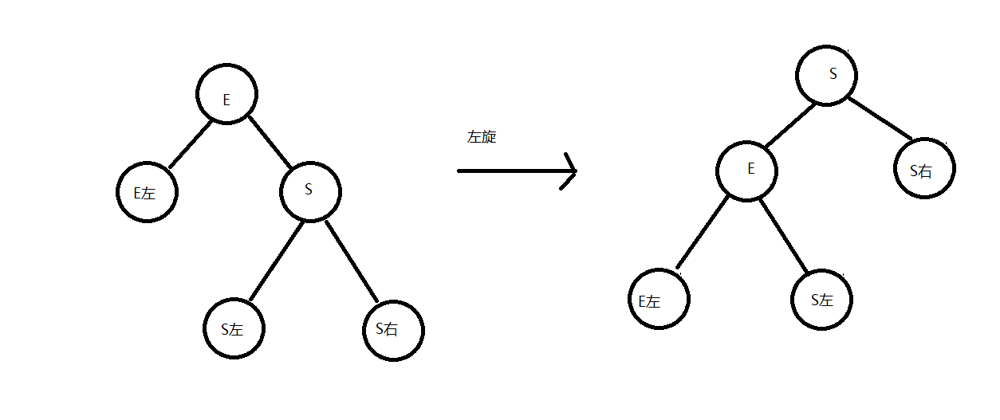


##### 右旋：

**将节点的左支往右拉，左子节点变成了父节点，并把晋升之后多余的右子节点出让给降级节点的左子节点**

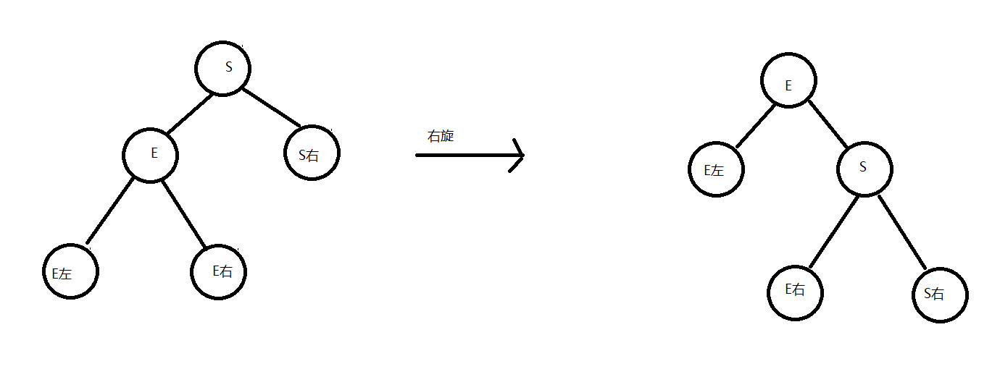

举个例子，像上图是否平衡二叉树的图里面，左图在没插入前"19"节点前，该树还是平衡二叉树，但是在插入"19"后，导致了"15"的左右子树失去了"平衡"，

所以此时可以将"15"节点进行左旋，让"15"自身把节点出让给"17"作为"17"的左树，使得"17"节点左右子树平衡，而"15"节点没有子树，左右也平衡了。如下图，

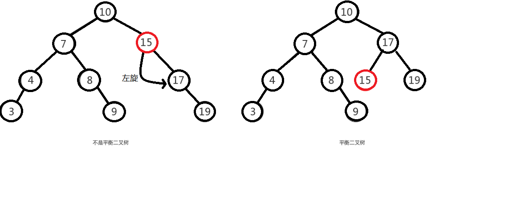 


由于在构建平衡二叉树的时候，当有**新节点插入**时，都会判断插入后时候平衡，这说明了插入新节点前，都是平衡的，也即高度差绝对值不会超过1。当新节点插入后，

有可能会有导致树不平衡，这时候就需要进行调整，而可能出现的情况就有4种，分别称作**左左，左右，右左，右右**。

```java
左左：只需要做一次右旋就变成了平衡二叉树。
右右：只需要做一次左旋就变成了平衡二叉树。
左右：先做一次分支的左旋，再做一次树的右旋，才能变成平衡二叉树。
右左：先做一次分支的右旋，再做一次数的左旋，才能变成平衡二叉树。
课上只讲解“左左”的情况
```

##### 左左

**左左：只需要做一次右旋就变成了平衡二叉树。**

左左即为在原来平衡的二叉树上，在节点的左子树的左子树下，有新节点插入，导致节点的左右子树的高度差为2，如下即为"10"节点的左子树"7"，的左子树"4"，插入了节点"5"或"3"导致失衡。

 


左左调整其实比较简单，只需要对节点进行右旋即可，如下图，对节点"10"进行右旋，

 


 


##### 左右

**左右：先做一次分支的左旋，再做一次树的右旋，才能变成平衡二叉树。**

左右即为在原来平衡的二叉树上，在节点的左子树的右子树下，有新节点插入，导致节点的左右子树的高度差为2，如上即为"11"节点的左子树"7"，的右子树"9"，

插入了节点"10"或"8"导致失衡。

 

左右的调整就不能像左左一样，进行一次旋转就完成调整。我们不妨先试着让左右像左左一样对"11"节点进行右旋，结果图如下，右图的二叉树依然不平衡，而右图就是接下来要

讲的右左，即左右跟右左互为镜像，左左跟右右也互为镜像。

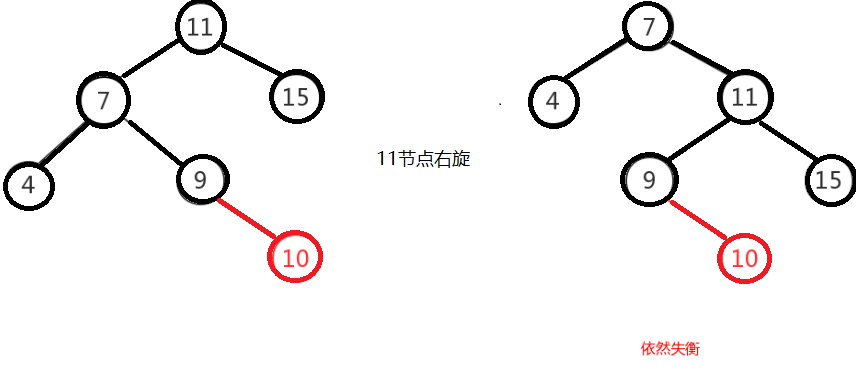 


左右这种情况，进行一次旋转是不能满足我们的条件的，正确的调整方式是，将左右进行第一次旋转，将左右先调整成左左，然后再对左左进行调整，从而使得二叉树平衡。

即先对上图的节点"7"进行左旋，使得二叉树变成了左左，之后再对"11"节点进行右旋，此时二叉树就调整完成，如下图:

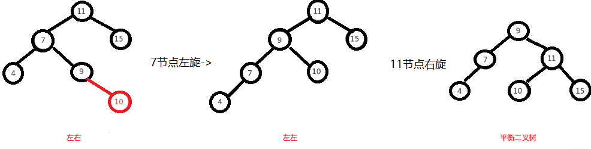 


##### 右左

**右左：先做一次分支的右旋，再做一次数的左旋，才能变成平衡二叉树。**

右左即为在原来平衡的二叉树上，在节点的右子树的左子树下，有新节点插入，导致节点的左右子树的高度差为2，如上即为"11"节点的右子树"15"，的左子树"13"，

插入了节点"12"或"14"导致失衡。

 


前面也说了，右左跟左右其实互为镜像，所以调整过程就反过来，先对节点"15"进行右旋，使得二叉树变成右右，之后再对"11"节点进行左旋，此时二叉树就调整完成，如下图:

 


##### 右右

**右右：只需要做一次左旋就变成了平衡二叉树。**

右右即为在原来平衡的二叉树上，在节点的右子树的右子树下，有新节点插入，导致节点的左右子树的高度差为2，如下即为"11"节点的右子树"13"，的左子树"15"，插入了节点

"14"或"19"导致失衡。

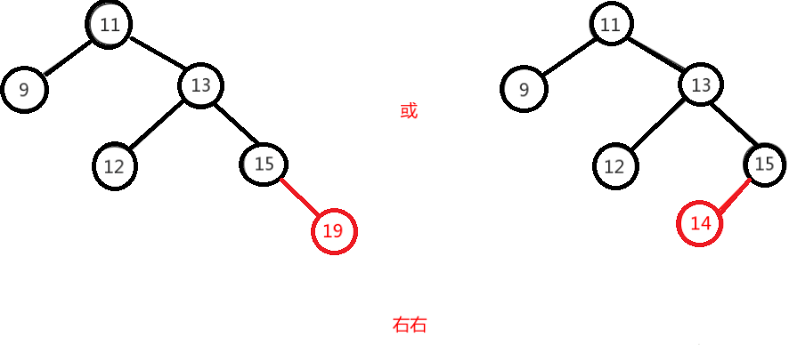 


右右只需对节点进行一次左旋即可调整平衡，如下图，对"11"节点进行左旋。

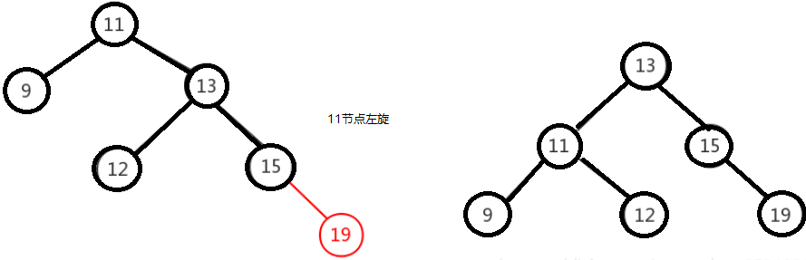 


#### 红黑树

**红黑树是一种自平衡的二叉查找树**，是计算机科学中用到的一种数据结构，它是在1972年由Rudolf Bayer发明的，当时被称之为平衡二叉B树，后来，在1978年被

Leoj.Guibas和Robert Sedgewick修改为如今的"红黑树"。它是一种特殊的二叉查找树，红黑树的每一个节点上都有存储位表示节点的颜色，可以是红或者黑；

红黑树不是高度平衡的，它的平衡是通过"红黑树的特性"进行实现的；

**红黑树的特性：**

1. 每一个节点或是红色的，或者是黑色的。
2. 根节点必须是黑色
3. 每个叶节点(Nil)是黑色的；（如果一个节点没有子节点或者父节点，则该节点相应的指针属性值为Nil，这些Nil视为叶节点）
4. 如果某一个节点是红色，那么它的子节点必须是黑色(不能出现两个红色节点相连的情况)
5. 对每一个节点，从该节点到其所有后代叶节点的简单路径上，均包含相同数目的黑色节点；

如下图所示就是一个

 


在进行元素插入的时候，和之前一样； 每一次插入完毕以后，使用黑色规则进行校验，如果不满足红黑规则，就需要通过变色，左旋和右旋来调整树，使其满足红黑规则；

### 小结

- 表示集合的类有很多,但是每个集合存储数据的的数据结构不同,所以每个集合有各自的特点,
- ArrayList集合: 查询快,增删慢 --->存储数据的数据结构是数组
- LinkedList集合: 查询慢,增删快--->存储数据的数据结构是链表
- .....

# 第五章 List接口

## 知识点-- List接口介绍

### 目标:

- 我们掌握了Collection接口的使用后，再来看看Collection接口中的子类，他们都具备那些特性呢？

  接下来，我们一起学习Collection中的常用几个子类（`java.util.List`集合、`java.util.Set`集合）。

### 路径:

- List接口的概述
- List接口的特点

### 讲解:

#### List接口的概述

`java.util.List`接口继承自`Collection`接口，是单列集合的一个重要分支，习惯性地会将实现了`List`接口的对象称为List集合。

#### List接口特点

1. 它是一个元素存取有序的集合。例如，存元素的顺序是11、22、33。那么集合中，元素的存储就是按照11、22、33的顺序完成的）。
2. 它是一个带有索引的集合，通过索引就可以精确的操作集合中的元素（与数组的索引是一个道理）。
3. 集合中可以有重复的元素。

> tips:我们在基础班的时候已经学习过List接口的子类java.util.ArrayList类，该类中的方法都是来自List中定义。

### 小结

略

## 知识点-- List接口中常用方法

### 目标:

- List作为Collection集合的子接口，不但继承了Collection接口中的全部方法，而且还增加了一些根据元素索引来操作集合的特有方法

### 路径:

- List接口新增常用方法
- List接口新增常用方法的使用

### 讲解:

#### List接口新增常用方法

List作为Collection集合的子接口，不但继承了Collection接口中的全部方法，而且还增加了一些根据元素索引来操作集合的特有方法，如下：

- `public void add(int index, E element)`: 将指定的元素，添加到该集合中的指定位置上。
- `public E get(int index)`:返回集合中指定位置的元素。
- `public E remove(int index)`: 移除列表中指定位置的元素, 返回的是被移除的元素。
- `public E set(int index, E element)`:用指定元素替换集合中指定位置的元素,返回值的更新前的元素。

List集合特有的方法都是跟索引相关，我们在基础班都学习过。

#### List接口新增常用方法的使用

```java
public class Demo {
    public static void main(String[] args) {
        // 创建一个List集合,限制集合中的元素为String类型
        List<String> list = new ArrayList<>();

        // 往集合中添加一些元素
        list.add("苍老师");
        list.add("波老师");
        list.add("吉泽老师");
        list.add("小泽老师");
        System.out.println(list);// [苍老师, 波老师, 吉泽老师, 小泽老师]

        // 添加元素到集合的指定位置:public void add(int index, E element)
        // 例如:在索引为1的位置添加一个元素(王老师)
        list.add(1,"王老师");
        System.out.println(list);// [苍老师, 王老师, 波老师, 吉泽老师, 小泽老师]

        // 获取指定索引位置上的元素: public E get(int index)
        // 例如:获取索引为2的元素
        String e1 = list.get(2);
        System.out.println("索引为2的元素是:"+e1);// 索引为2的元素是:波老师

        // 删除指定索引位置上的元素:public E remove(int index)
        // 例如:删除索引为1的元素
        String removeE = list.remove(1);
        System.out.println("被删除的元素:"+removeE);// 被删除的元素:王老师
        System.out.println(list);// [苍老师, 波老师, 吉泽老师, 小泽老师]

        // 修改指定位置上的元素:public E set(int index, E element)
        // 例如:把索引为0的元素替换为明老师
        String e2 = list.set(0, "明老师");
        System.out.println("被替换的元素:"+e2);// 被替换的元素:苍老师
        System.out.println(list);// [明老师, 波老师, 吉泽老师, 小泽老师]
    }
}

```

### 小结

略

## 知识点-- List的子类

### 目标:

- 了解List接口的实现类

### 步骤:

- ArrayList集合
- LinkedList集合

### 讲解:

#### ArrayList集合

`java.util.ArrayList`集合数据存储的结构是数组结构。元素增删慢，查找快，由于日常开发中使用最多的功能为查询数据、遍历数据，所以`ArrayList`是最常用的集合。

许多程序员开发时非常随意地使用ArrayList完成任何需求，并不严谨，这种用法是不提倡的。

#### LinkedList集合

`java.util.LinkedList`集合数据存储的结构是链表结构。方便元素添加、删除的集合。

> LinkedList是一个双向链表，那么双向链表是什么样子的呢，我们用个图了解下


实际开发中对一个集合元素的添加与删除经常涉及到首尾操作，而LinkedList提供了大量首尾操作的方法。这些方法我们作为**了解即可**：

- `public void addFirst(E e)`:将指定元素插入此列表的开头。
- `public void addLast(E e)`:将指定元素添加到此列表的结尾。
- `public E getFirst()`:返回此列表的第一个元素。
- `public E getLast()`:返回此列表的最后一个元素。
- `public E removeFirst()`:移除并返回此列表的第一个元素。
- `public E removeLast()`:移除并返回此列表的最后一个元素。
- `public E pop()`:从此列表所表示的堆栈处弹出一个元素。
- `public void push(E e)`:将元素推入此列表所表示的堆栈。

LinkedList是List的子类，List中的方法LinkedList都是可以使用，这里就不做详细介绍，我们只需要了解LinkedList的特有方法即可。在开发时，LinkedList集合也可以作为堆栈，队列的结构使用。

```java
public class Demo {
    public static void main(String[] args) {
        // 创建一个LinkedList集合,限制集合中元素的类型为String类型
        LinkedList<String> list = new LinkedList<>();

        // 往集合中添加一些元素
        list.add("王宝强");
        list.add("贾乃亮");
        list.add("文章");
        list.add("陈羽凡");
        System.out.println(list);// [王宝强, 贾乃亮, 文章, 陈羽凡]

        // 添加一个元素在集合的开头位置: public void addFirst(E e)
        list.addFirst("谢霆锋");

        // 添加一个元素在集合的末尾位置: public void addLast(E e)
        list.addLast("吴秀波");
        System.out.println(list);// [谢霆锋, 王宝强, 贾乃亮, 文章, 陈羽凡, 吴秀波]

        // 获取集合中的第一个元素:public E getFirst()
        System.out.println("集合中第一个元素为:"+list.getFirst());// 集合中第一个元素为:谢霆锋

        // 获取集合中的最后一个元素:public E getLast()
        System.out.println("集合中最后一个元素为:"+list.getLast());// 集合中最后一个元素为:吴秀波

        // 删除集合中的第一个元素:public E removeFirst()
        String removeFirst = list.removeFirst();
        System.out.println("被删除的元素:"+removeFirst);// 谢霆锋
        System.out.println("删除第一个元素后的集合:"+list);// [王宝强, 贾乃亮, 文章, 陈羽凡, 吴秀波]

        // 删除集合中的最后一个元素:public E removeLast()
        String removeLast = list.removeLast();
        System.out.println("被删除的元素:"+removeLast);// 吴秀波
        System.out.println("删除最后一个元素后的集合:"+list);// [王宝强, 贾乃亮, 文章, 陈羽凡]

        // public E pop():从此列表所表示的堆栈处弹出一个元素。 删除第一个元素
        String popE = list.pop();
        System.out.println("popE:"+popE);// popE:王宝强
        System.out.println("调用pop方法后的集合:"+list);// [贾乃亮, 文章, 陈羽凡]

        // public void push(E e):将元素推入此列表所表示的堆栈。添加一个元素在集合的开头位置
        list.push("刘强东");
        System.out.println("调用push方法后的集合:"+list);// [刘强东, 贾乃亮, 文章, 陈羽凡]
    }
}

```


### 小结

略

## 案例---集合综合案例

### 需求:

- 按照斗地主的规则，完成洗牌发牌的动作。
  具体规则：

  使用54张牌打乱顺序,三个玩家参与游戏，三人交替摸牌，每人17张牌，最后三张留作底牌。

### 分析:

- 准备牌：

  牌可以设计为一个ArrayList<String>,每个字符串为一张牌。
  每张牌由花色数字两部分组成，我们可以使用花色集合与数字集合嵌套迭代完成每张牌的组装。
  牌由Collections类的shuffle方法进行随机排序。

- 发牌

  将每个人以及底牌设计为ArrayList<String>,将最后3张牌直接存放于底牌，剩余牌通过对3取模依次发牌。

- 看牌

  直接打印每个集合。

### 实现:

```java
import java.util.ArrayList;
import java.util.Collections;

public class Poker {
    public static void main(String[] args) {
        /*
        * 1: 准备牌操作
        */
        //1.1 创建牌盒 将来存储牌面的 
        ArrayList<String> pokerBox = new ArrayList<String>();
        //1.2 创建花色集合
        ArrayList<String> colors = new ArrayList<String>();

        //1.3 创建数字集合
        ArrayList<String> numbers = new ArrayList<String>();

        //1.4 分别给花色 以及 数字集合添加元素
        colors.add("♥");
        colors.add("♦");
        colors.add("♠");
        colors.add("♣");

        for(int i = 2;i<=10;i++){
            numbers.add(i+"");
        }
        numbers.add("J");
        numbers.add("Q");
        numbers.add("K");
        numbers.add("A");
        //1.5 创造牌  拼接牌操作
        // 拿出每一个花色  然后跟每一个数字 进行结合  存储到牌盒中
        for (String color : colors) {
            //color每一个花色 guilian
            //遍历数字集合
            for(String number : numbers){
                //结合
                String card = color+number;
                //存储到牌盒中
                pokerBox.add(card);
            }
        }
        //1.6大王小王
        pokerBox.add("小☺");
        pokerBox.add("大☠");	  
        // System.out.println(pokerBox);
        //洗牌 是不是就是将  牌盒中 牌的索引打乱 
        // Collections类  工具类  都是 静态方法
        // shuffer方法   
        /*
         * static void shuffle(List<?> list) 
         *     使用默认随机源对指定列表进行置换。 
         */
        //2:洗牌
        Collections.shuffle(pokerBox);
        //3 发牌
        //3.1 创建 三个 玩家集合  创建一个底牌集合
        ArrayList<String> player1 = new ArrayList<String>();
        ArrayList<String> player2 = new ArrayList<String>();
        ArrayList<String> player3 = new ArrayList<String>();
        ArrayList<String> dipai = new ArrayList<String>();	  

        //遍历 牌盒  必须知道索引   
        for(int i = 0;i<pokerBox.size();i++){
            //获取 牌面
            String card = pokerBox.get(i);
            //留出三张底牌 存到 底牌集合中
            if(i>=51){//存到底牌集合中
                dipai.add(card);
            } else {
                //玩家1   %3  ==0
                if(i%3==0){
                  	player1.add(card);
                }else if(i%3==1){//玩家2
                  	player2.add(card);
                }else{//玩家3
                  	player3.add(card);
                }
            }
        }
        //看看
        System.out.println("令狐冲："+player1);
        System.out.println("田伯光："+player2);
        System.out.println("绿竹翁："+player3);
        System.out.println("底牌："+dipai);  
	}
}
```

### 小结:

略

# 总结

```java
- 能够说出集合与数组的区别
    1.集合的长度不固定的,数组的长度是固定的
    2.集合中的元素只能是引用数据类型,而数组可以是基本数据类型
    3.集合中元素的类型可以不一致,数组中元素的类型必须一致
    
- 能够使用Collection集合的常用功能
     - public boolean add(E e)：  把给定的对象添加到当前集合中 。
     - public void clear() :清空集合中所有的元素。
     - public boolean remove(E e): 把给定的对象在当前集合中删除。
     - public boolean contains(Object obj): 判断当前集合中是否包含给定的对象。
     - public boolean isEmpty(): 判断当前集合是否为空。
     - public int size(): 返回集合中元素的个数。
     - public Object[] toArray(): 把集合中的元素，存储到数组中
- 能够使用迭代器对集合进行取元素
    步骤:
		1.获取集合对应的迭代器
        2.实现循环判断集合中是否有元素可以迭代
        3.如果有,就取出这个元素,如果没有,就结束获取
   Collection集合中的方法: 获取迭代器
       	Iterator<E> iterator(); //  获取迭代器对象
   Iterator迭代器中的方法:
		boolean hasNext();// 判断集合中是否有元素可以迭代
	    E next(); // 获取可以迭代的元素
- 能够使用增强for循环遍历集合和数组
    for(元素的数据类型 变量名 : 集合名\数组名){
        
    }
- 能够理解泛型上下限
    泛型的通配符:　？表示，当泛型不知道具体指定什么类型，那么就可以使用泛型通配符
    上限：<? extends XXX>  XXX类型和其子类类型
    下限：<? super XXX>    XXX类型和其父类类型
- 能够阐述泛型通配符的作用
     ? : 可以接收泛型为任意类型
     上限：<? extends XXX>  XXX类型和其子类类型
     下限：<? super XXX>    XXX类型和其父类类型
         
- 能够说出常见的数据结构
    栈,队列,数组,链表,树(红黑树)
- 能够说出数组结构特点
     查询快,增删慢
- 能够说出栈结构特点
     先进后出
- 能够说出队列结构特点
      先进先出
- 能够说出单向链表结构特点
       查询慢,增删快
- 能够说出List集合特点
     1.集合元素存取有序
     2.集合元素可以重复
     3.集合元素有索引
- 能够完成斗地主的案例
     造牌,洗牌,发牌

```

