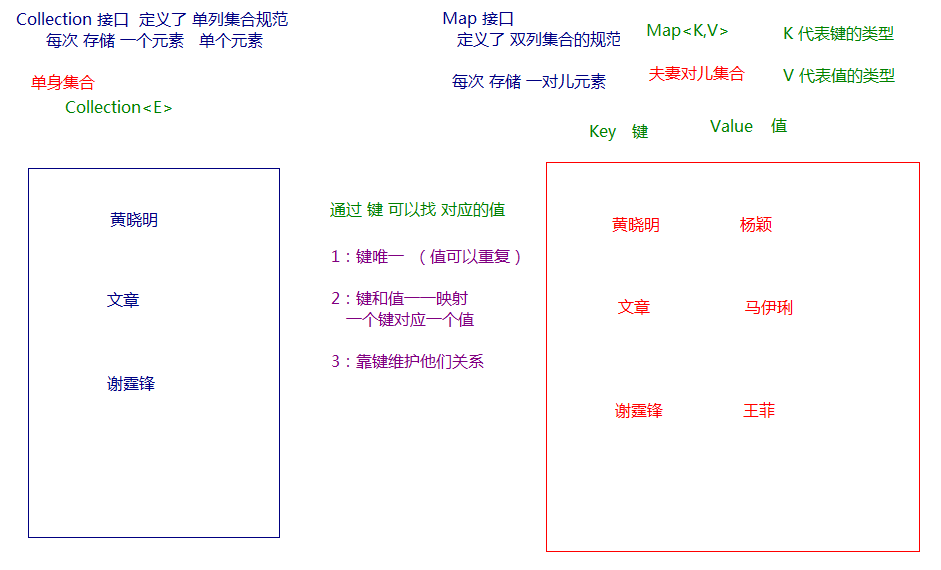
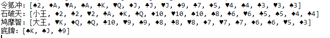

day08【Collections、Set、Map、斗地主排序】

## 今日内容

- Collections工具类
- Set集合------>重点
- Map集合---->重点
- 练习

## 教学目标

- [ ] 能够使用集合工具类
- [ ] 能够使用Comparator比较器进行排序
- [ ] 能够使用可变参数
- [ ] 能够说出Set集合的特点
- [ ] 能够说出哈希表的特点
- [ ] 使用HashSet集合存储自定义元素
- [ ] 能够说出Map集合特点
- [ ] 使用Map集合添加方法保存数据
- [ ] 使用”键找值”的方式遍历Map集合
- [ ] 使用”键值对”的方式遍历Map集合
- [ ] 能够使用HashMap存储自定义键值对的数据
- [ ] 能够完成斗地主洗牌发牌案例

# 第一章  Collections类

## 知识点-- Collections常用功能

### 目标

- 能够使用集合工具类Collections

### 路径

- 代码演示

### 讲解

- ``java.utils.Collections``是集合工具类，用来对集合进行操作。

  常用方法如下：


- `public static void shuffle(List<?> list) `:打乱集合顺序。
- `public static <T> void sort(List<T> list)`:将集合中元素按照默认规则排序。
- `public static <T> void sort(List<T> list，Comparator<? super T> com )`:将集合中元素按照指定规则排序。

代码演示：

```java
 /**
     * public static void shuffle(List<?> list):打乱集合中元素的顺序。
     */
    private static void method01() {
        // 创建一个List集合对象,限制集合中元素类型为Integer
        List<Integer> list = new ArrayList<>();
        // 往集合中添加一些元素
        list.add(300);
        list.add(100);
        list.add(200);
        list.add(500);
        list.add(400);
        System.out.println("打乱顺序之前:"+list);// 打乱顺序之前:[300, 100, 200, 500, 400]

        // 随机打乱集合中元素的顺序:public static void shuffle(List<?> list)
        Collections.shuffle(list);
        System.out.println("打乱顺序之后:"+list);
    }
    /**
     *  public static <T> void sort(List<T> list):将集合中元素按照默认规则排序。
     *  集合中的元素为系统类的对象
     */
    private static void method02() {
        // 创建一个List集合对象,限制集合中元素类型为Integer
        List<Integer> list = new ArrayList<>();
        // 往集合中添加一些元素
        list.add(300);
        list.add(100);
        list.add(200);
        list.add(500);
        list.add(400);
        System.out.println("排序之前的集合:"+list);// 打乱顺序之前:[300, 100, 200, 500, 400]

        // 将集合中元素按照默认规则排序: public static <T> void sort(List<T> list)
        Collections.sort(list);
        System.out.println("排序之后的集合:"+list);// 排序之后的集合:[100, 200, 300, 400, 500]
    }

```

我们的集合按照默认的自然顺序进行了排列，如果想要指定顺序那该怎么办呢？

### 小结

略

## 知识点-- Comparator比较器

### 目标

- 能够使用Comparator比较器进行排序

### 路径

- 代码演示

### 讲解

```java
 public static void main(String[] args) {
        /*
            Collections常用功能:
                - public static void shuffle(List<?> list):打乱集合中元素的顺序。
                - public static <T> void sort(List<T> list):将集合中元素按照默认规则排序。
                    默认规则: 事先写好的规则
                    对集合中的元素按照默认规则排序,要求该集合元素所属的类实现Comparable接口,重写compareTo()方法
                    然后在compareTo()方法中指定排序的默认规则

                - public static <T> void sort(List<T> list，Comparator<? super T> ):将集合中元素按照指定规则排序。
                    指定规则: 自己定义的规则
                    参数Comparator<T>接口:也称比较器接口,用来指定排序的规则
         */
        // 创建一个List集合对象,限制集合中元素类型为Integer
        List<Integer> list = new ArrayList<>();
        // 往集合中添加一些元素
        list.add(300);
        list.add(100);
        list.add(200);
        list.add(500);
        list.add(400);
        System.out.println("排序之前的集合:"+list);// 打乱顺序之前:[300, 100, 200, 500, 400]

     	// 300 100 200 500 400
        //  300  
        // 对list集合指定规则排序: 降序
        Collections.sort(list, new Comparator<Integer>() {
            @Override
            public int compare(Integer o1, Integer o2) {
                // 指定排序规则 
                // 前减后:升序
                // 后减前:降序
                // 前:第一个参数  o1
                // 后:第二个参数  o2
                return o2 - o1;
            }
        });

        System.out.println("排序之后的集合:"+list);// 排序之后的集合:[500, 400, 300, 200, 100]

        // 对list集合指定规则排序: 升序
        Collections.sort(list, new Comparator<Integer>() {
            @Override
            public int compare(Integer o1, Integer o2) {
                // 指定排序规则
                // 前减后:升序
                // 后减前:降序
                // 前:第一个参数  o1
                // 后:第二个参数  o2
                return o1 - o2;
            }
        });
        System.out.println("排序之后的集合:"+list);// 排序之后的集合:[100, 200, 300, 400, 500]

    }
```

### 小结

略

## 知识点-- 可变参数

### 目标

- 能够使用可变参数

### 路径

- 可变参数的使用
- 注意事项
- 应用场景: Collections

### 讲解

#### 可变参数的使用

在**JDK1.5**之后，如果我们定义一个方法需要接受多个参数，并且多个参数类型一致，我们可以对其简化.

**格式：**

```
修饰符 返回值类型 方法名(参数类型... 形参名){  }
```

**代码演示:**

```java
 public class Demo {
    public static void main(String[] args) {
        // 可变参数的语法
        /*int[] arr = {10, 20, 30, 40, 50, 60};

        // 调用method1方法
        method1(10, 20, 30, 40, 50);
        // 调用method2方法
        method2(arr);
        method2(10, 20, 30, 40, 50, 60);
        //
        method3(arr);
        method3(10, 20, 30, 40, 50, 60);

        method4(10,"jack","rose");*/
    }

    public static void method4(int num,String... str){

    }

    // 定义一个方法,可以接收5个int类型的参数
    public static void method3(int[] arr) {
        for (int i : arr) {
            System.out.println(i);
        }
        System.out.println(arr[0]);
    }


    // 定义一个方法,可以接收5个int类型的参数
    public static void method2(int... num) {
        for (int i : num) {
            System.out.println(i);
        }
        System.out.println(num[0]);
    }

    // 定义一个方法,可以接收5个int类型的参数
    public static void method1(int num1, int num2, int num3, int num4, int num5) {

    }
}

```

#### 注意事项

​	1.一个方法只能有一个可变参数

​	2.如果方法中有多个参数，可变参数要放到最后。

#### **应用场景: Collections**

​	在Collections中也提供了添加一些元素方法：

​	`public static <T> boolean addAll(Collection<T> c, T... elements)  `:往集合中添加一些元素。

**代码演示:**

```java
public class CollectionsDemo {
	public static void main(String[] args) {
      ArrayList<Integer> list = new ArrayList<Integer>();
      //原来写法
      //list.add(12);
      //list.add(14);
      //list.add(15);
      //list.add(1000);
      //采用工具类 完成 往集合中添加元素  
      Collections.addAll(list, 5, 222, 1，2);
      System.out.println(list);
}
```

### 小结

略

# 第二章 Set接口

## 知识点--Set接口介绍

### 目标

- Set接口介绍

### 路径

- Set接口

### 讲解

```java
 Set接口:也称Set集合,但凡是实现了Set接口的类都叫做Set集合
        特点:元素无索引,元素存取无序,元素不可重复(唯一)
        实现类:
              HashSet集合:元素无索引,元素存取无序,元素不可重复(唯一)
              LinkedHashSet集合:元素无索引,元素存取有序,元素不可重复(唯一)
              TreeSet集合:元素无索引,元素存取无序,元素不可重复(唯一),元素可排序
 注意:
        1.Set集合并没有特有的功能,都是使用Collection父接口中的方法
        2.Set集合元素无索引,所以遍历方式只能是:迭代器,增强for循环
```

### 小结

略

## 知识点--HashSet集合

### 目标

- 能够说出HashSet集合的特点

### 路径

- HashSet集合的特点

### 讲解

`java.util.HashSet`是`Set`接口的一个实现类，它所存储的元素是不可重复的，并且元素都是无序的(即存取顺序不能保证不一致)。

我们先来使用一下Set集合存储，看下现象，再进行原理的讲解:

```java
public class Test {
    public static void main(String[] args) {
        /*
          HashSet集合的特点:
            HashSet集合(类): 存储数据的数据结构,哈希表结构,元素唯一,元素无索引,元素存取无序
         */
        // 创建一个HashSet集合,限制集合中元素的类型为String类型
        HashSet<String> set = new HashSet<>();

        // 往集合中添加元素
        set.add("nba");
        set.add("cba");
        set.add("bac");
        set.add("abc");
        set.add("nba");

        System.out.println(set);// [cba, abc, bac, nba]
    }
}

```

### 小结

略

## 知识点--HashSet集合存储数据的结构（哈希表）

### 目标

- 哈希表底层结构以及HashSet保证元素唯一原理

### 路径

- 哈希表底层结构
- HashSet保证元素唯一原理

### 讲解

##### 哈希表底层结构

在**JDK1.8**之前，哈希表底层采用数组+链表实现，即使用数组处理冲突，同一hash值的链表都存储在一个数组里。但是当位于一个桶中的元素较多，即hash值相等的元素较多时，通过key值依次查找的效率较低。而JDK1.8中，哈希表存储采用数组+链表+红黑树实现，当链表长度超过阈值（8）时，将链表转换为红黑树，这样大大减少了查找时间。

简单的来说，哈希表是由数组+链表+红黑树（JDK1.8增加了红黑树部分）实现的，如下图所示。


##### HashSet保证元素唯一原理

```java
HashSet集合保证元素唯一的原理:底层是哈希表结构,哈希表保证元素唯一依赖于hashCode()和equals方法();
1.当HashSet集合存储元素的时候,就会调用该元素的hashCode()方法计算哈希值
2.判断该哈希值位置上,是否有相同哈希值的元素
3.如果该哈希值位置上没有相同哈希值的元素,那么就直接存储
4.如果该哈希值位置上有相同哈希值的元素,那么就产生了哈希冲突
5.如果产生了哈希冲突,就得调用该元素的equals()方法与该哈希值位置上的所有元素进行一一比较:
  如果该哈希值位置上有任意一个元素与该元素相等,那么就不存储
  如果该哈希值位置上所有元素与该元素都不相等,那么就直接存储
补充:
     Object类: hashCode()和equals()方法;
              hashCode():Object类中的hashCode()方法是根据地址值计算哈希值
              equals方法():Object类中的equals()方法是比较地址值
```

```java
public class Demo {
    public static void main(String[] args) {
        // 创建一个HashSet集合,限制集合中元素的类型为String
        HashSet<String> set = new HashSet<>();

        // 往集合中添加一些元素
        set.add("nba");
        set.add("cba");
        set.add("bac");
        set.add("abc");
        set.add("nba");

        // 遍历打印集合
        for (String e : set) {
            System.out.println(e);// cba abc  bac  nba
        }

        System.out.println("nba".hashCode());// nba:108845
        System.out.println("cba".hashCode());// cba:98274
        System.out.println("bac".hashCode());// bac:97284
        System.out.println("abc".hashCode());// abc:96354
    }
}
```

### 小结

略

## 知识点--  HashSet存储自定义类型元素

### 1.目标

- 使用HashSet集合存储自定义元素

### 2.路径

- 代码演示

### 3.讲解

给HashSet中存放自定义类型元素时，需要重写对象中的hashCode和equals方法，建立自己的比较方式，才能保证HashSet集合中的对象唯一.

```java
public class Person{
    /**
     * 姓名
     */
    public String name;
    /**
     * 年龄
     */
    public int age;

    public Person() {
    }

    public Person(String name, int age) {
        this.name = name;
        this.age = age;
    }

    @Override
    public String toString() {
        return "Person{" +
                "name='" + name + '\'' +
                ", age=" + age +
                '}';
    }

    @Override
    public boolean equals(Object o) {
        if (this == o) return true;
        if (o == null || getClass() != o.getClass()) return false;
        Person person = (Person) o;
        return age == person.age &&
                Objects.equals(name, person.name);
    }

    @Override
    public int hashCode() {
        return Objects.hash(name, age);
    }
}

```

创建测试类:

```java
public class Demo {
    public static void main(String[] args) {
        // 创建多个Person对象
        Person p1 = new Person("张三", 18);
        Person p2 = new Person("李四", 38);
        Person p3 = new Person("王五", 28);
        Person p4 = new Person("张三", 18);

        // 创建HashSet集合对象,限制集合中元素的类型为Person
        HashSet<Person> set = new HashSet<>();

        // 往集合中添加Person对象
        set.add(p1);
        set.add(p2);
        set.add(p3);
        set.add(p4);

        // 遍历打印集合中的元素
        for (Person p : set) {
            System.out.println(p);
        }

        System.out.println(p1.hashCode());
        System.out.println(p2.hashCode());
        System.out.println(p3.hashCode());
        System.out.println(p4.hashCode());
    }
}
```


### 小结

略

## 知识点-- LinkedHashSet

### 目标

- 使用LinkedHashSet保证元素怎么存就怎么取,即存取有序

### 路径

- 代码演示

### 讲解

我们知道HashSet保证元素唯一，可是元素存放进去是没有顺序的，那么我们要保证有序，怎么办呢？

在HashSet下面有一个子类`java.util.LinkedHashSet`，它是链表和哈希表组合的一个数据存储结构。

演示代码如下:

```java
public class LinkedHashSetDemo {
	public static void main(String[] args) {
		Set<String> set = new LinkedHashSet<String>();
		set.add("bbb");
		set.add("aaa");
		set.add("abc");
		set.add("bbc");
        Iterator<String> it = set.iterator();
		while (it.hasNext()) {
			System.out.println(it.next());
		}
	}
}
结果：
  bbb
  aaa
  abc
  bbc
```

### 小结

略

## 知识点-- TreeSet集合

### 目标

- 知道使用TreeSet集合的特点并能够使用TreeSet集合

### 路径

- 代码演示

### 讲解

#### 特点

TreeSet集合是Set接口的一个实现类,底层依赖于TreeMap,是一种基于**红黑树**的实现,其特点为：

1. 元素唯一
2. 元素没有索引
3. 使用元素的[自然顺序](../../java/lang/Comparable.html)对元素进行排序，或者根据创建 TreeSet 时提供的 [`Comparator`](../../java/util/Comparator.html) 比较器
   进行排序，具体取决于使用的构造方法：

```java
public TreeSet()：								根据其元素的自然排序进行排序
public TreeSet(Comparator<E> comparator):    根据指定的比较器进行排序
```

#### 演示

案例演示**自然排序**(20,18,23,22,17,24,19):

```java
public static void main(String[] args) {
	//无参构造,默认使用元素的自然顺序进行排序
	TreeSet<Integer> set = new TreeSet<Integer>();
	set.add(20);
	set.add(18);
  	set.add(23);
  	set.add(22);
  	set.add(17);
  	set.add(24);
  	set.add(19);
  	System.out.println(set);
}

控制台的输出结果为:
[17, 18, 19, 20, 22, 23, 24]
```

案例演示**比较器排序**(20,18,23,22,17,24,19):

```java
public static void main(String[] args) {
  	//有参构造,传入比较器,使用比较器对元素进行排序
  	TreeSet<Integer> set = new TreeSet<Integer>(new Comparator<Integer>() {
    	@Override
    	public int compare(Integer o1, Integer o2) {
      		//元素前 - 元素后 : 升序
      		//元素后 - 元素前 : 降序
      		return o2 - o1;
    	}
  	});
  	set.add(20);
  	set.add(18);
  	set.add(23);
  	set.add(22);
  	set.add(17);
  	set.add(24);
  	set.add(19);
  	System.out.println(set);
}

控制台的输出结果为:
[24, 23, 22, 20, 19, 18, 17]
```

### 小结

略

# 第三章 Map集合

## 知识点-- Map概述

### 目标

- 能够说出Map集合的特点

### 路径

- 图文演示

### 讲解



```java
 Map集合的概述:
       Map<K,V>接口概述:也称Map集合,是所有双列集合的顶层父接口,K用来限制键的类型,V用来限制值的类型
       Map集合的特点:
                    1.Map集合存储元素是以键值对的形式存储,也就是说每一个键值对都有键和值
                    2.通过键取值
                    3.Map集合中的键不能重复,如果键重复了,那么值就会覆盖
                    4.Map集合中的值是可以重复
       Map集合的实现类:
                    HashMap类:键唯一,键值对存取无序, 由哈希表保证键唯一
                    LinkedHashMap类:键唯一,键值对存取有序,由哈希表保证键唯一,由链表保证键值对存取有序
                    TreeMap类:键唯一,可以对键值对进行排序
```

### 小结

略

## 知识点-- Map的常用方法

### 目标

- 使用Map的常用方法

### 路径

- 代码演示

### 讲解

Map接口中定义了很多方法，常用的如下：

- `public V put(K key, V value)`:  把指定的键与指定的值添加到Map集合中。
- `public V remove(Object key)`: 把指定的键 所对应的键值对元素 在Map集合中删除，返回被删除元素的值。
- `public V get(Object key)` 根据指定的键，在Map集合中获取对应的值。
- `public boolean containsKey(Object key)`:判断该集合中是否有此键
- `public Set<K> keySet()`: 获取Map集合中所有的键，存储到Set集合中。
- `public  Collection<V> values()`  获取Map集合中所有的值,存储到Collection集合中
- `public Set<Map.Entry<K,V>> entrySet()`: 获取到Map集合中所有的键值对对象的集合(Set集合)。

Map接口的方法演示

```java
public class Test {
    public static void main(String[] args) {
        /*
            Map<K,V>的常用方法:
                - public V put(K key, V value):  把指定的键与指定的值添加到Map集合中。
                - public  int size()  获取集合中键值对的个数(Map集合的大小)
                - public V remove(Object key): 把指定的键 所对应的键值对元素 在Map集合中删除，返回被删除元素的值。
                - public V get(Object key) 根据指定的键，在Map集合中获取对应的值。
                - public boolean containsKey(Object key):判断该集合中是否有此键
                - public  boolean containsValue(Object value)  判断该集合中是否有此值

                - public Set<K> keySet(): 获取Map集合中所有的键，存储到Set集合中。
                - public Collection<V> values() 获取Map集合中所有的值，存储到Collection集合中。

                - public Set<Map.Entry<K,V>> entrySet(): 获取到Map集合中 所有的 键值对对象 的集合(Set集合)。
                Entry<K, V>: 一种数据类型,表示键值对对象类型
                由于 Entry<K, V> 是Map接口的成员内部接口,所以表示的时候这么写Map.Entry<K,V>
                Entry接口中的方法:
                    K getKey();  获取键值对对象的键
                    V getValue(); 获取键值对对象的值

                键值对:    两个对象
                键值对对象: 一个对象(包装了键值对后的一个对象)
         */
        Map<String, String> map = new HashMap<>();
        // 往集合中添加键值对
        map.put("黄晓明", "杨颖");
        map.put("文章", "马伊琍");
        map.put("谢霆锋", "王菲");
        map.put("李亚鹏", "王菲");

        // public Set<Map.Entry<K,V>> entrySet(): 获取到Map集合中 所有的 键值对对象 的集合(Set集合)。
        Set<Map.Entry<String, String>> entrySet = map.entrySet();

        System.out.println(entrySet);
        System.out.println(entrySet.size());
    }

    /*
      - public Set<K> keySet(): 获取Map集合中所有的键，存储到Set集合中。
      - public Collection<V> values() 获取Map集合中所有的值，存储到Collection集合中。
     */
    private static void method02() {
        // 创建Map集合,限制键的类型为String,限制值的类型为String
        Map<String, String> map = new HashMap<>();
        // 往集合中添加键值对
        map.put("黄晓明", "杨颖");
        map.put("文章", "马伊琍");
        map.put("谢霆锋", "王菲");
        map.put("李亚鹏", "王菲");

        //  public Set<K> keySet(): 获取Map集合中所有的键，存储到Set集合中。
        Set<String> keys = map.keySet();
        System.out.println(keys);// [文章, 谢霆锋, 李亚鹏, 黄晓明]

        // public Collection<V> values() 获取Map集合中所有的值，存储到Collection集合中。
        Collection<String> values = map.values();
        System.out.println(values);// [马伊琍, 王菲, 王菲, 杨颖]
    }

    /*
        - public V put(K key, V value):  把指定的键与指定的值添加到Map集合中。
        - public  int size()  获取集合中键值对的个数(Map集合的大小)
        - public V remove(Object key): 把指定的键 所对应的键值对元素 在Map集合中删除，返回被删除元素的值。
        - public V get(Object key) 根据指定的键，在Map集合中获取对应的值。
        - public boolean containsKey(Object key):判断该集合中是否有此键
        - public  boolean containsValue(Object value)  判断该集合中是否有此值
     */
    private static void method01() {
        // 创建Map集合,限制键的类型为String,限制值的类型为String
        Map<String, String> map = new HashMap<>();

        // public V put(K key, V value) 把指定的键与指定的值添加到Map集合中。
        map.put("黄晓明","杨颖");
        String value1 = map.put("文章", "马伊琍");// null
        String value2 = map.put("文章", "姚笛");// 马伊琍
        map.put("谢霆锋", "王菲");
        System.out.println("value1:"+value1);
        System.out.println("value2:"+value2);
        System.out.println(map);// {文章=姚笛, 谢霆锋=王菲, 黄晓明=杨颖}

        //  public  int size()  获取集合中键值对的个数(Map集合的大小)
        System.out.println(map.size());// 3

        System.out.println("=================================");
        // public V remove(Object key); 根据指定的键,删除集合中对应的键值对
        String value3 = map.remove("文章");
        System.out.println("value3:"+value3);// 姚笛
        System.out.println(map);// {谢霆锋=王菲, 黄晓明=杨颖}


        // public V get(Object key) 根据指定的键，在Map集合中获取对应的值。
        String value4 = map.get("谢霆锋");
        System.out.println("value4:"+value4);// 王菲

        System.out.println("======================");
        // public boolean containKey(Object key):判断该集合中是否有此键
        System.out.println(map.containsKey("谢霆锋"));// true
        System.out.println(map.containsKey("李亚鹏"));// false

        //  public  boolean containsValue(Object value)  判断该集合中是否有此值
        System.out.println(map.containsValue("王菲"));// true
        System.out.println(map.containsValue("张柏芝"));// false
    }
}

```

> tips:
>
> 使用put方法时，若指定的键(key)在集合中没有，则没有这个键对应的值，返回null，并把指定的键值添加到集合中； 
>
> 若指定的键(key)在集合中存在，则返回值为集合中键对应的值（该值为替换前的值），并把指定键所对应的值，替换成指定的新值。 

### 小结

略

## 知识点--Map的遍历

### 目标

- 使用Map的遍历

### 路径

- 方式1:键找值方式
- 方式2:键值对方式

### 讲解

#### 方式1:键找值方式

通过元素中的键，获取键所对应的值

分析步骤：

1. 获取Map中所有的键，由于键是唯一的，所以返回一个Set集合存储所有的键。方法提示:`keyset()`
2. 遍历键的Set集合，得到每一个键。
3. 根据键，获取键所对应的值。方法提示:`get(K key)`

```java
public class Demo {
    public static void main(String[] args) {
        // 创建Map集合对象,限制键的类型为String,值的类型为String
        Map<String, String> map = new HashMap<>();
        // 往map集合中添加键值对
        map.put("黄晓明", "杨颖");
        map.put("文章", "马伊琍");
        map.put("谢霆锋", "王菲");

        // 遍历map集合
        // 获取集合中所有的键  Set<K> keySet()方法
        Set<String> keys = map.keySet();
        // 遍历所有的键的集合
        for (String key : keys) {
            // 在循环中,根据键找值 V get(K key)方法
            String value = map.get(key);
            System.out.println("键:"+key+",值:"+value);
        }
    }
}

```

#### 方式2:键值对方式

```
Entry<K,V>接口:简称Entry项,表示键值对对象,用来封装Map集合中的键值对
Entry<K,V>接口:是Map接口中的内部接口,在外部使用的时候是这样表示: Map.Entry<K,V>

Map集合中提供了一个方法来获取所有键值对对象:
            public Set<Map.Entry<K,V>> entrySet()

根据键值对对对象获取键和值:
            - public K getKey()：获取Entry对象中的键。
            - public V getValue()：获取Entry对象中的值。

Map遍历方式二:根据键值对对象的方式
            1.获取集合中所有键值对对象，以Set集合形式返回。  Set<Map.Entry<K,V>> entrySet()
            2.遍历所有键值对对象的集合，得到每一个键值对(Entry)对象。
            3.在循环中,可以使用键值对对对象获取键和值   getKey()和getValue()
```

```java
public class Demo {
    public static void main(String[] args) {
        // 创建Map集合对象,限制键的类型为String,值的类型为String
        Map<String, String> map = new HashMap<>();
        // 往map集合中添加键值对
        map.put("黄晓明", "杨颖");
        map.put("文章", "马伊琍");
        map.put("谢霆锋", "王菲");

        // 获取集合中所有键值对对象  Set<Map.Entry<K,V>> entrySet()
        Set<Map.Entry<String, String>> entrySet = map.entrySet();

        // 遍历所有键值对对象的集合
        for (Map.Entry<String, String> entry : entrySet) {
            // 在循环中,可以使用键值对对对象获取键和值   getKey()和getValue()
            String key = entry.getKey();
            String value = entry.getValue();
            System.out.println("键:"+key+",值:"+value);
        }
    }
}
```

### 小结

略

## 知识点--  HashMap存储自定义类型

### 目标

- 使用HashMap存储自定义类型

### 路径

- 代码演示

### 讲解

练习：每位学生（姓名，年龄）都有自己的家庭住址。那么，既然有对应关系，则将学生对象和家庭住址存储到map集合中。学生作为键, 家庭住址作为值。

> 注意，学生姓名相同并且年龄相同视为同一名学生。

编写学生类：

```java
public class Student {
    /**
     * 姓名
     */
    public String name;
    /**
     * 年龄
     */
    public int age;

    public Student() {
    }

    public Student(String name, int age) {
        this.name = name;
        this.age = age;
    }

    @Override
    public String toString() {
        return "Student{" +
                "name='" + name + '\'' +
                ", age=" + age +
                '}';
    }

    @Override
    public boolean equals(Object o) {
        if (this == o) return true;
        if (o == null || getClass() != o.getClass()) return false;
        Student student = (Student) o;
        return age == student.age &&
                Objects.equals(name, student.name);
    }

    @Override
    public int hashCode() {
        return Objects.hash(name, age);
    }
}
```

编写测试类：

```java 
public class Demo {
    public static void main(String[] args) {
        // 创建Map集合,指定键的类型为Student,值的类型为String
        HashMap<Student,String> map = new HashMap<>();

        // 创建多个学生对象
        Student stu1 = new Student("张三", 18);
        Student stu2 = new Student("李四", 38);
        Student stu3 = new Student("王五", 28);
        Student stu4 = new Student("张三", 18);

        // 把学生对象作为键,家庭地址作为值,存储到map集合中
        map.put(stu1,"北京");
        map.put(stu2,"上海");
        map.put(stu3,"深圳");
        map.put(stu4,"广州");

        // 打印map集合
        System.out.println(map);
        System.out.println(map.size());// 3
    }
}
```

- 当给HashMap中存放自定义对象时，如果自定义对象作为key存在，这时要保证对象唯一，必须复写对象的hashCode和equals方法(如果忘记，请回顾HashSet存放自定义对象)。
- 如果要保证map中存放的key和取出的顺序一致，可以使用`java.util.LinkedHashMap`集合来存放。

### 小结

略

## 知识点--LinkedHashMap介绍

### 目标

- 我们知道HashMap保证成对元素唯一，并且查询速度很快，可是成对元素存放进去是没有顺序的，那么我们要保证有序，还要速度快怎么办呢？

### 路径

- LinkedHashMap

### 讲解

- 通过链表结构可以保证元素的存取顺序一致；
- 通过哈希表结构可以保证的键的唯一、不重复，需要重写键的hashCode()方法、equals()方法。

```java
public class Test {
    public static void main(String[] args) {
        /*
            LinkedHashMap介绍:
                 LinkedHashMap集合(类): 元素无索引,键唯一,键值对元素存取有序
                                 存储数据采用的是哈希表+链表结构
                                 由哈希表保证键唯一,由链表保证键值对元素存取有序
                                  如果键是自定义类型的类,为了保证键唯一,就得重写hashCode()和equals()方法
         */
        // 创建LinkedHashMap集合,限制键的类型为String类型,限制值的类型为String类型
        LinkedHashMap<String, String> map = new LinkedHashMap<>();
        //HashMap<String, String> map = new HashMap<>();

        // 往集合中添加键值对
        map.put("黄晓明", "杨颖");
        map.put("文章", "马伊琍");
        map.put("谢霆锋", "王菲");
        map.put("李亚鹏", "王菲");
        map.put("文章", "姚笛");

        // 打印集合
        System.out.println(map);
    }
}

```

### 小结

略

## 知识点--TreeMap集合

### 目标

- 使用TreeMap集合

### 路径

- TreeMap介绍
- 构造方法

### 讲解

#### TreeMap介绍

TreeMap集合和Map相比没有特有的功能，底层的数据结构是红黑树；可以对元素的***键***进行排序，排序方式有两种:**自然排序**和**比较器排序**；到时使用的是哪种排序，取决于我们在创建对象的时候所使用的构造方法；

#### 构造方法

```java
public TreeMap()									使用自然排序
public TreeMap(Comparator<? super K> comparator) 	   通过比较器指定规则排序
```

#### 案例演示

```java
public class Test {
    public static void main(String[] args) {
        /*
            TreeMap集合:
                TreeMap集合(类):元素无索引,键唯一,键值对元素根据键排序
                                   存储数据采用的是红黑树结构,由红黑树结构保证键唯一
                构造方法:
                    TreeMap(); 按照键的默认排序规则对键值对进行排序
                            要求: 集合中键所属的类要实现Comparable接口,重写compareTo方法,在该方法中写好默认的排序规则
                    TreeMap(Comparator<? super K> comparator):按照键的指定排序规则对键值对进行排序

               键为自定义类型的类,课后自己去玩玩
         */
        // 按照键的默认规则排序:
        // 创建TreeMap集合,限制键的类型为Integer,限制值的类型为String
        TreeMap<Integer, String> map = new TreeMap<>();

        // 往集合中添加键值对
        map.put(300, "黄晓明");
        map.put(100, "刘德华");
        map.put(200, "黎明");
        map.put(500, "张学友");
        map.put(400, "郭富城");
        // 打印集合
        System.out.println(map);// {100=刘德华, 200=黎明, 300=黄晓明, 400=郭富城, 500=张学友}

        System.out.println("+++++++++++++++++++++++++++++++++");
        // 按照键的指定规则排序:
        // 创建TreeMap集合,限制键的类型为Integer,限制值的类型为String
        TreeMap<Integer, String> map2 = new TreeMap<>(new Comparator<Integer>() {
            @Override
            public int compare(Integer o1, Integer o2) {
                // 指定规则: 前减后 升序  后减前 降序
                return o2 - o1;
            }
        });

        // 往集合中添加键值对
        map2.put(300, "黄晓明");
        map2.put(100, "刘德华");
        map2.put(200, "黎明");
        map2.put(500, "张学友");
        map2.put(400, "郭富城");

        System.out.println(map2);// {500=张学友, 400=郭富城, 300=黄晓明, 200=黎明, 100=刘德华}
    }
}

```

### 小结

略

## 案例-- Map集合练习

### 需求

- 输入一个字符串,获取该字符串中每个字符出现次数。

### 分析

- 获取一个字符串对象
- 创建一个Map集合，键代表字符，值代表次数。
- 遍历字符串得到每个字符。
- 判断Map中是否有该键。
- 如果没有，第一次出现，存储次数为1；如果有，则说明已经出现过，获取到对应的值进行++，再次存储。     
- 打印最终结果

### 实现

**方法介绍**

`public boolean containKey(Object key)`:判断该集合中是否有此键。

**代码：**

```java
public class Test {
    public static void main(String[] args) {
        /*
            Map集合练习:
                需求:输入一个字符串中每个字符出现次
         */
       // 分析:
       // 1.创建Map集合,限制键的类型为Character,值的类型为Integer
        Map<Character, Integer> map = new HashMap<>();

       // 2.创建Scanner对象
        Scanner sc = new Scanner(System.in);

       // 3.获取键盘录入的字符串
        System.out.println("请输入一个字符串:");
        String str = sc.nextLine();

        // 4.遍历字符串的每一个字符
        for (int i = 0; i < str.length(); i++) {
           // 5.在循环中,获取字符串的字符,该字符作为map集合的键
            char cKey = str.charAt(i);

            // 6.在循环中,判断遍历出来的字符在map集合中是否存在该键
            boolean flag = map.containsKey(cKey);

            // 7.在循环中,如果不存在,字符作为键,值为1,存储到map集合中
           // 8.在循环中,如果存在,获取该字符键对应的值,进行+1后作为新的值
           //         然后在重新存储到集合中
            if (flag == false){
                map.put(cKey,1);
            }else{
                Integer oldValue = map.get(cKey);// 获取该字符键对应的值
                Integer newValue = oldValue + 1;// +1
                map.put(cKey,newValue);
            }
        }
       // 9.最后打印map集合
        System.out.println(map);
    }
}

```

### 小结

略

# 第四章 集合的嵌套

- **总述：任何集合内部都可以存储其它任何集合**

## 知识点--集合的嵌套

### 目标

- 理解集合的嵌套

### 路径

- List嵌套List
- List嵌套Map
- Map嵌套Map

### 讲解

#### List嵌套List

~~~java
public class Test1 {
    public static void main(String[] args) {
        /*
            集合的嵌套:
                - List嵌套List
                - List嵌套Map
                - Map嵌套Map
            结论:任何集合内部都可以存储其它任何集合
         */
        //  List嵌套List
        // 创建一个List集合,限制元素类型为String
        List<String> list1 = new ArrayList<>();

        // 往集合中添加元素
        list1.add("王宝强");
        list1.add("贾乃亮");
        list1.add("陈羽凡");

        // 创建一个List集合,限制元素类型为String
        List<String> list2 = new ArrayList<>();

        // 往集合中添加元素
        list2.add("马蓉");
        list2.add("李小璐");
        list2.add("白百何");

        // 创建一个List集合,限制元素类型为List集合 (List集合中的元素是List集合)
        List<List<String>> list = new ArrayList<>();
        list.add(list1);
        list.add(list2);

        // 遍历
        for (List<String> e : list) {
            for (String name : e) {
                System.out.println(name);
            }
            System.out.println("=============");
        }

        System.out.println(list);
    }
}


~~~

#### List嵌套Map

~~~java
public class Test2 {
    public static void main(String[] args) {
        /*
            List嵌套Map:

         */
        // 创建Map集合对象
        Map<String,String> map1 = new HashMap<>();
        map1.put("it001","迪丽热巴");
        map1.put("it002","古力娜扎");

        // 创建Map集合对象
        Map<String,String> map2 = new HashMap<>();
        map2.put("heima001","蔡徐坤");
        map2.put("heima002","李易峰");

        // 创建List集合,用来存储以上2个map集合
        List<Map<String,String>> list = new ArrayList<>();
        list.add(map1);
        list.add(map2);

        System.out.println(list.size()); // 2

        for (Map<String, String> map : list) {
            // 遍历获取出来的map集合对象
            Set<String> keys = map.keySet();// 获取map集合所有的键
            // 根据键找值
            for (String key : keys) {
                System.out.println(key + ","+ map.get(key));
            }
        }

    }
}

~~~

#### Map嵌套Map

~~~java
public class Test3 {
    public static void main(String[] args) {
        /*
            Map嵌套Map:

         */
        // 创建Map集合对象
        Map<String,String> map1 = new HashMap<>();
        map1.put("it001","迪丽热巴");
        map1.put("it002","古力娜扎");

        // 创建Map集合对象
        Map<String,String> map2 = new HashMap<>();
        map2.put("heima001","蔡徐坤");
        map2.put("heima002","李易峰");

        // 创建Map集合,把以上2个Map集合作为值存储到这个map集合中
        Map<String, Map<String, String>> map = new HashMap<>();

        map.put("传智博客",map1);
        map.put("黑马程序员",map2);

        System.out.println(map.size());// 2

        // 获取map集合中的所有键
        Set<String> keys = map.keySet();
        // 遍历所有的键
        for (String key : keys) {
            // 根据键找值
            Map<String, String> value = map.get(key);
            // 遍历value这个Map集合
            Set<String> keySet = value.keySet();
            for (String k : keySet) {
                String v = value.get(k);
                System.out.println(k+","+v);
            }
        }
    }
}

~~~

### 小结

# 第五章 模拟斗地主洗牌发牌

## 需求

按照斗地主的规则，完成洗牌发牌的动作。



具体规则：

1. 组装54张扑克牌
2. 54张牌顺序打乱
3. 三个玩家参与游戏，**三人交替摸牌，每人17张牌**，最后三张留作底牌。
4. 查看三人各自手中的牌（按照牌的大小排序）、底牌

> 规则：手中扑克牌从大到小的摆放顺序：大王,小王,2,A,K,Q,J,10,9,8,7,6,5,4,3

## 分析

1.准备牌：

完成数字与纸牌的映射关系：

使用双列Map(HashMap)集合，完成一个数字与字符串纸牌的对应关系(相当于一个字典)。

2.洗牌：

通过数字完成洗牌发牌

3.发牌：

将每个人以及底牌设计为ArrayList<String>,将最后3张牌直接存放于底牌，剩余牌通过对3取模依次发牌。

存放的过程中要求数字大小与斗地主规则的大小对应。

将代表不同纸牌的数字分配给不同的玩家与底牌。

4.看牌：

通过Map集合找到对应字符展示。

通过查询纸牌与数字的对应关系，由数字转成纸牌字符串再进行展示。


## 实现

```java
package com.itheima04;

import java.util.ArrayList;
import java.util.Collections;
import java.util.HashMap;

public class Test {
    public static void main(String[] args) {
        /*
            模拟斗地主洗牌发牌:
            需求
                按照斗地主的规则，完成洗牌发牌的动作。
                具体规则：
                    1. 组装54张扑克牌
                    2. 54张牌顺序打乱
                    3. 三个玩家参与游戏，三人交替摸牌，每人17张牌，最后三张留作底牌。
                    4. 查看三人各自手中的牌（按照牌的大小排序）、底牌
                    规则：手中扑克牌从大到小的摆放顺序：大王,小王,2,A,K,Q,J,10,9,8,7,6,5,4,3
         */
        // 造牌
        // 1.创建Map集合对象,限制键的类型为Integer,值的类型为String
        HashMap<Integer, String> pokeBox = new HashMap<>();
        // 2.创建一个List集合,表示花色集合,
        ArrayList<String> colors = new ArrayList<>();
        // 3.创建一个List集合,表示牌面值集合
        ArrayList<String> numbers = new ArrayList<>();

        // 4.往花色集合中存储4个花色
        Collections.addAll(colors, "♥", "♦", "♠", "♣");
        // 5.往牌面值集合中存储13个牌面值
        Collections.addAll(numbers, "2", "A", "K", "Q", "J", "10", "9", "8", "7", "6", "5", "4", "3");

        // 6.定义一个int类型的变量,表示牌的编号,初始值为0
        int id = 0;
        // 7.往map集合中添加大王,编号为0,添加完后编号自增1
        pokeBox.put(id++, "大王");

        // 8.往map集合中添加小王,编号为1,添加完后编号自增1
        pokeBox.put(id++, "小王");

        // 9.牌面值的集合和花色集合循环嵌套遍历,注意牌面值集合作为外层循环,花色集合作为内层循环
        for (String number : numbers) {
            for (String color : colors) {
                // 10.在循环中,遍历出来的牌面值和花色组成一张扑克牌
                String pai = color + number;
                // 11.在循环中,编号作为键,扑克牌作为值存储到map集合中,每存储一张牌后,编号自增1
                pokeBox.put(id++,pai);
            }
        }

        System.out.println(pokeBox.size());
        System.out.println(pokeBox);

        //2.洗牌 :--->洗牌的编号
        //2.1 获取所有牌的编号,返回的是所有编号的Set集合
        Set<Integer> keySet = pokeBox.keySet();

        //2.2 创建ArrayList集合,用来存储所有的牌编号
        ArrayList<Integer> idList = new ArrayList<>();

        //2.3 把keySet集合中存储的所有牌编号,存储到这个新的ArrayList集合中
        idList.addAll(keySet);

        //2.4 使用Collections.shuffle方法对新的ArrayList集合中的元素打乱顺序
        Collections.shuffle(idList);
        System.out.println("打乱顺序后的牌编号:"+idList.size());// 54
        System.out.println("打乱顺序后的牌编号:"+idList);


        // 3.发牌-->发牌的编号--->对牌的编号进行从小到大排序---->再根据排好序的编号去map集合中获取牌
        // 3.1 创建4个List集合,分别用来存储玩家一,玩家二,玩家三,底牌得到的牌编号
        ArrayList<Integer> play1Id = new ArrayList<>();
        ArrayList<Integer> play2Id = new ArrayList<>();
        ArrayList<Integer> play3Id = new ArrayList<>();
        ArrayList<Integer> diPaiId = new ArrayList<>();

        // 3.2 循环把打乱顺序的牌编号,按照规律依次发给玩家一,玩家二,玩家三,底牌
        for (int i = 0; i < idList.size(); i++) {
            // 获取牌编号
            Integer paiId = idList.get(i);
            // 三人交替摸牌
            if (i >= 51){
                diPaiId.add(paiId);
            }else if (i%3==0){
                play1Id.add(paiId);
            }else if (i%3==1){
                play2Id.add(paiId);
            }else if (i%3==2){
                play3Id.add(paiId);
            }
        }

        // 3.3 对获取到的牌编号进行从小到大排序
        Collections.sort(play1Id);
        Collections.sort(play2Id);
        Collections.sort(play3Id);
        Collections.sort(diPaiId);

        // 3.4 根据排好序的牌编号去map集合中获取牌
        // 遍历玩家一的牌编号
        System.out.print("玩家一的牌:");
        for (Integer paiId : play1Id) {// 1,2,3,4,5
            String pai = pokeBox.get(paiId);
            System.out.print(pai+" ");
        }

        System.out.println();

        // 遍历玩家二的牌编号
        System.out.print("玩家二的牌:");
        for (Integer paiId : play2Id) {
            String pai = pokeBox.get(paiId);
            System.out.print(pai+" ");
        }

        System.out.println();

        // 遍历玩家三的牌编号
        System.out.print("玩家三的牌:");
        for (Integer paiId : play3Id) {
            String pai = pokeBox.get(paiId);
            System.out.print(pai+" ");
        }

        System.out.println();

        // 遍历底牌的牌编号
        System.out.print("底牌的牌:");
        for (Integer paiId : diPaiId) {
            String pai = pokeBox.get(paiId);
            System.out.print(pai+" ");
        }
    }
}

```

## 小结

略

# 总结

```java
- 能够使用集合工具类
     Collections工具类:
		- public static void shuffle(List<?> list):打乱集合顺序。
        - public static <T> void sort(List<T> list):将集合中元素按照默认规则排序。
        - public static <T> void sort(List<T> list，Comparator<? super T> com ):将集合中元素按照指定规则排序。
         - public static <T> boolean addAll(Collection<T> c, T... elements):往集合中添加一些元素。

- 能够使用Comparator比较器进行排序
       创建Comparator接口的匿名内部类,重写compare方法,在comapre方法中定义排序规则
       前减后  升序
       后减前  降序
- 能够使用可变参数
    使用场景; 如果一个方法需要接收多个相同类型的参数,就可以使用可变参数
    格式:  修饰符  返回值类型 方法名(数据类型... 变量名){}
    注意:  1.一个方法只能有一个可变参数,2.如果方法有多个参数,可变参数需要放在最后面 
- 能够说出Set集合的特点
        元素唯一,元素存取无序,元素无索引
- 能够说出哈希表的特点
        哈希表:保证元素唯一,依赖hashCode和equals方法
        哈希表结构: 
			jdk8以前: 数组+链表
            jdk8以后: 数组+链表+红黑树
                
- 使用HashSet集合存储自定义元素
        重写hashCode和equals方法
- 能够说出Map集合特点
       键唯一,键重复,就会覆盖原来的值
       以键值对的形式存储数据
       根据键找值
- 使用Map集合添加方法保存数据
 - public V put(K key, V value):  把指定的键与指定的值添加到Map集合中。
- public V remove(Object key): 把指定的键 所对应的键值对元素 在Map集合中删除，返回被删除元素的值。
- public V get(Object key) 根据指定的键，在Map集合中获取对应的值。
- public boolean containsKey(Object key):判断该集合中是否有此键
- public Set<K> keySet(): 获取Map集合中所有的键，存储到Set集合中。
- public  Collection<V> values()  获取Map集合中所有的值,存储到Collection集合中
- public Set<Map.Entry<K,V>> entrySet(): 获取到Map集合中所有的键值对对象的集合(Set集合)。
              
- 使用”键找值”的方式遍历Map集合
      1.获取所有的键
      2.遍历所有的键
      3.根据键找值
- 使用”键值对”的方式遍历Map集合
      1.获取所有的键值对对象
      2.遍历所有的键值对对象
      3.使用键值对对象获取键和值
- 能够使用HashMap存储自定义键值对的数据
      键所属的类要重写hashCode和equals方法
- 能够完成斗地主洗牌发牌案例
   造牌--洗牌--发牌
```


