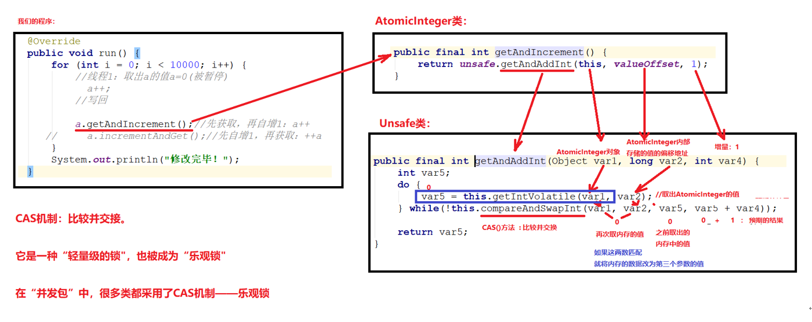

# day09【排序算法、异常、多线程基础】

## 今日内容

- 冒泡排序 
- 选择排序
- 二分查找
- 异常处理
- 多线程基础

## 教学目标

- [ ] 能够理解冒泡排序的执行原理
- [ ] 能够理解选择排序的执行原理
- [ ] 能够理解二分查找的执行原理
- [ ] 能够辨别程序中异常和错误的区别
- [ ] 说出异常的分类
- [ ] 列举出常见的三个运行期异常
- [ ] 能够使用try...catch关键字处理异常
- [ ] 能够使用throws关键字处理异常
- [ ] 能够自定义并使用异常类
- [ ] 说出进程和线程的概念
- [ ] 能够理解并发与并行的区别
- [ ] 能够描述Java中多线程运行原理
- [ ] 能够使用继承类的方式创建多线程
- [ ] 能够使用实现接口的方式创建多线程
- [ ] 能够说出实现接口方式的好处

# 第一章 冒泡排序

## 知识点-- 冒泡排序

### 目标

- 能够理解冒泡排序的执行原理

### 路径

- 冒泡排序概述
- 冒泡排序图解
- 冒泡排序代码实现

### 讲解

#### 冒泡排序概述

- 一种排序的方式，对要进行排序的数据, **相邻的数据进行两两比较**，将较大的数据放在后面，依次对所有的数据进行操作，直至所有数据按要求完成排序
- 如果有n个数据进行排序，总共需要比较n-1轮
  每一轮比较完毕，下一轮的比较就会少一个数据参与

#### 冒泡排序图解




#### 冒泡排序代码实现

```java
/*
    冒泡排序：
        一种排序的方式，对要进行排序的数据中相邻的数据进行两两比较，将较大的数据放在后面，
        依次对所有的数据进行操作，直至所有数据按要求完成排序
 */
public class ArrayDemo {
    public static void main(String[] args) {
        //定义一个数组
        int[] arr = {7, 6, 5, 4, 3};
        System.out.println("排序前：" + Arrays.toString(arr));

        // 这里减1，是控制每轮比较的次数
        for (int x = 0; x < arr.length - 1; x++) {
            // -1是为了避免索引越界，-x是为了调高比较效率
            for (int i = 0; i < arr.length - 1 - x; i++) {
                if (arr[i] > arr[i + 1]) {
                    int temp = arr[i];
                    arr[i] = arr[i + 1];
                    arr[i + 1] = temp;
                }
            }
        }
        System.out.println("排序后：" + Arrays.toString(arr));
    }
}
```

### 小结

略

# 第二章 选择排序

## 知识点-- 选择排序

### 目标

- 能够理解选择排序的执行原理

### 路径

- 选择排序概述
- 选择排序图解
- 选择排序代码实现

### 讲解

#### 选择排序概述

- 另外一种排序的方式，从头开始选中数组元素,与其后面的元素依次进行两两比较，将较大的数据放在后面，依次从前到后选中每个元素，直至所有数据按要求完成排序
- 如果有n个数据进行排序，总共需要比较n-1轮
- 每一轮比较完毕，下一轮的比较就会少一个数据参与

#### 选择排序图解


#### 选择排序代码实现

```java
public class Test {
    public static void main(String[] args) {
        //定义一个数组
        int[] arr = {7, 6,18, 5, 4, 3};
        System.out.println("排序前：" + Arrays.toString(arr));

        // 选择排序----每比较一次就交换
        /*for (int i = 0;i<arr.length-1;i++){
            for (int j = i+1;j<arr.length;j++){
                // 比较
                if (arr[i] > arr[j]){
                    // 交换
                    int temp = arr[i];
                    arr[i] = arr[j];
                    arr[j] = temp;
                }
            }
        }*/

        // 选择排序-----优化  每比较一次,记录一下索引,比较完之后找到最小值索引,然后交换
        for (int i = 0;i<arr.length-1;i++){
            // 定义一个存储最小值索引的变量
            int min = i;
            // 找最小值的索引
            for (int j = i+1;j<arr.length;j++){
                // 比较
                if (arr[min] > arr[j]){
                    // 记录最小值的索引
                    min = j;
                }
            }

            // 最小值和指定位置进行交换
            if (min != i) {
                // 交换
                int temp = arr[i];
                arr[i] = arr[min];
                arr[min] = temp;
            }
        }
        System.out.println("排序后：" + Arrays.toString(arr));
    }
}

```

### 小结

略

# 第三章 二分查找

## 知识点-- 二分查找

### 目标

- 能够理解二分查找的执行原理

### 路径

- 普通查找和二分查找
- 二分查找图解
- 二分查找代码实现

### 讲解

#### 普通查找和二分查找

**普通查找**

原理：遍历数组，获取每一个元素，然后判断当前遍历的元素是否和要查找的元素相同，如果相同就返回该元素的索引。如果没有找到，就返回一个负数作为标识(一般是-1)

**二分查找**

原理: 每一次都去获取数组的中间索引所对应的元素，然后和要查找的元素进行比对，如果相同就返回索引；

如果不相同，就比较中间元素和要查找的元素的值；

如果中间元素的值大于要查找的元素，说明要查找的元素在左侧，那么就从左侧按照上述思想继续查询(忽略右侧数据)；

如果中间元素的值小于要查找的元素，说明要查找的元素在右侧，那么就从右侧按照上述思想继续查询(忽略左侧数据)；

**二分查找对数组是有要求的,数组必须已经排好序**

####  二分查找图解

假设有一个给定有序数组(10,14,21,38,45,47,53,81,87,99),要查找50出现的索引

则查询过程如下图所示:


#### 二分查找代码实现

```java
	public static void main(String[] args) {
        int[] arr = {10, 14, 21, 38, 45, 47, 53, 81, 87, 99};
        int index = binarySerach(arr, 38);
        System.out.println(index);
	}
	/**
     * 二分查找方法
     * @param arr 查找的目标数组
     * @param number 查找的目标值
     * @return 找到的索引,如果没有找到返回-1
     */
    public static int binarySerach(int[] arr, int number) {
        int start = 0;
        int end = arr.length - 1;

        while (start <= end) {
            int mid = (start + end) / 2;
            if (number == arr[mid]) {
                return mid ;
            } else if (number < arr[mid]) {
                end = mid - 1;
            } else if (number > arr[mid]) {
                start = mid + 1;
            }
        }
        return -1;  //如果数组中有这个元素，则返回
    }
```

### 小结

略

# 第四章   异常

## 知识点-- 异常

### 目标

- 能够辨别程序中异常和错误的区别,并且说出异常的分类

### 路径

- 异常概念
- 异常体系
- 异常分类
- 异常的产生过程解析

### 讲解

#### 异常概念

异常，就是不正常的意思。在生活中:医生说,你的身体某个部位有异常,该部位和正常相比有点不同,该部位的功能将受影响.在程序中的意思就是：

- **异常** ：指的是程序在执行过程中，出现的非正常的情况，最终会导致JVM的非正常停止。

**注意:** 在Java等面向对象的编程语言中，异常本身是一个类，产生异常就是创建异常对象并抛出了一个异常对象。Java处理异常的方式是中断处理。

> 异常指的并不是语法错误,语法错了,编译不通过,不会产生字节码文件,根本不能运行.

#### 异常体系

异常机制其实是帮助我们**找到**程序中的问题，异常的根类是`java.lang.Throwable`，其下有两个子类：`java.lang.Error`与`java.lang.Exception`，平常所说的异常指`java.lang.Exception`。


**Throwable体系：**

- **Error**:严重错误Error，无法通过处理的错误，只能事先避免，好比绝症。
- **Exception**:表示异常，异常产生后程序员可以通过代码的方式纠正，使程序继续运行，是必须要处理的。好比感冒、阑尾炎。

#### 异常分类

我们平常说的异常就是指Exception，因为这类异常一旦出现，我们就要对代码进行更正，修复程序。

**异常(Exception)的分类**:根据在编译时期还是运行时期去检查异常?

- **编译时期异常**:checked异常。在编译时期,就会检查,如果没有处理异常,则编译失败。(如日期格式化异常)
- **运行时期异常**:runtime异常。在运行时期,检查异常.在编译时期,运行异常不会编译器检测(不报错)。(如数学异常)

​    

```java
public class Test {
    public static void main(String[] args) {
        /*
            异常的概述:
                - 异常概念: 程序运行期间,出现的不正常情况,导致jvm终止程序运行
                  注意:
                    java是面向对象语言,异常本身也是一个类,当出现异常的时候,就会创建该异常类的对象并抛出该异常对象
                    创建异常对象,该对象就会包装异常的类型,异常的信息,异常的位置等信息

                - 异常体系
                    Throwable类:是 Java 语言中所有错误或异常的超类\父类
                        Error类: 表示错误,无法通过代码进行纠正,只能事先避免,相当于:绝症
                                 例如：　栈内存溢出错误，服务器宕机，数据库奔溃...
                        Exception类:表示异常,可以通过代码进行纠正,相当于: 感冒...

                - 异常分类
                    编译异常:在编译期间,出现的异常,导致程序无法通过编译,这就是编译异常
                            除了RuntimeException及其子类都是编译异常
                    运行异常:在运行期间,才出现的异常,编译期间不处理,编译可以通过,这就是运行异常
                            RuntimeException及其子类都是运行异常
         */
        // 异常和错误
        System.out.println("开始");
        //System.out.println(1/0);// 异常
        //method();// StackOverflowError 错误
        System.out.println("结束");

        // 例如: 编译异常
        //SimpleDateFormat sdf = new SimpleDateFormat("yyyy-MM-dd");
        //Date date = sdf.parse("1999-10-10");

        // 例如: 运行异常
        //System.out.println(1/0);// 异常

    }

    public static void method(){
        System.out.println("1");
        method();
    }
}

```


#### 异常的产生过程解析

先运行下面的程序，程序会产生一个数组索引越界异常ArrayIndexOfBoundsException。我们通过图解来解析下异常产生的过程。

 测试类

```java
public class Test {

    public static void main(String[] args) {
        int[] arr = { 34, 12, 67 };
        int num = getElement(arr, 4);
        System.out.println("num=" + num);
        System.out.println("over");
    }

    // 对给定的数组通过给定的角标获取元素。
    public static int getElement(int[] arr, int index) {
        int element = arr[index];
        return element;
    }
}

```

上述程序执行过程图解：


### 小结

略

# 第五章 异常的产生和处理

## 知识点-- 异常的产生

### 目标

- 能够理解使用throw关键字产生异常

### 路径

- throw关键字的作用
- throw关键字的使用格式
- 案例演示

### 讲解

#### throw关键字的作用

在java中，提供了一个**throw**关键字，它用来抛出一个指定的异常对象。throw**用在方法内**，用来抛出一个异常对象，将这个异常对象传递到调用者处，并结束当前方法的执行。

#### throw关键字的使用格式

```
throw new 异常类名(参数);
```

 例如：

```java
throw new NullPointerException("要访问的arr数组不存在");

throw new ArrayIndexOutOfBoundsException("该索引在数组中不存在，已超出范围");
```

#### 案例演示

```java
public class Student {

    //姓名
    private String name;
    //年龄
    private int age;

    //构造方法

    public Student() {
    }

    public Student(String name, int age) {
        this.name = name;
        //对年龄的判断
        if(age >= 0) {
            this.age = age;
        }else{
            //如果年龄是负数,就让他报错
            throw new RuntimeException("年龄不能是" + age);
        }
    }
    //set get

    public String getName() {
        return name;
    }

    public void setName(String name) {
        this.name = name;
    }

    public int getAge() {
        return age;
    }

    public void setAge(int age) {
        //对年龄的判断
        if(age >= 0) {
            this.age = age;
        }else{
            //如果年龄是负数,就让他报错
            throw new RuntimeException("年龄不能是" + age);
        }
    }

    //toString

    @Override
    public String toString() {
        return "Student{" +
                "name='" + name + '\'' +
                ", age=" + age +
                '}';
    }
}

public class Demo02_异常的产生 {
    public static void main(String[] args) {
        //正常情况下,年龄不可能是一个负数
        //要求：赋值正数正常赋值,赋值负数就让代码报错！

        //创建对象
        Student s = new Student("柳岩",36);
        System.out.println(s);


        //创建对象
        Student s2 = new Student();
        s2.setName("美美");
        s2.setAge(-20);
        System.out.println(s2);
    }
}
```

### 小结

略

## 知识点--声明处理异常

### 目标

- 掌握声明处理异常

### 路径

- 声明处理异常的概述
- 声明处理异常格式

### 讲解

#### 声明处理异常的概述

**声明处理异常**：使用throws关键字将异常标识出来, 表示当前方法不处理异常，而是提醒给调用者, 让调用者来处理....最终会到虚拟机,虚拟机直接结束程序,打印异常信息。

#### 声明处理异常格式

```java
修饰符 返回值类型 方法名(参数) throws 异常类名1,异常类名2…{  // 可以抛出一个,也可以多个
}	
```

#### 案例演示

```java
public class Demo {
    public static void main(String[] args) throws IOException{
        method1();
    }

    public static void method3(int num) throws Exception {
        if(num == 1) {
            throw new IOException("IO异常");// 创建了一个编译异常,并通过throw抛出这个编译异常
        }else{
            throw new ParseException("解析异常",1);
        }
    }

    public static void method2(int num) throws IOException,ParseException{
        if(num == 1) {
            throw new IOException("IO异常");// 创建了一个编译异常,并通过throw抛出这个编译异常
        }else{
            throw new ParseException("解析异常",1);
        }
    }


    public static void method1() throws IOException{
        throw new IOException("IO异常");// 创建了一个编译异常,并通过throw抛出这个编译异常
    }
}
```

### 小结

略

## 知识点--捕获处理异常try…catch

### 目标

- 掌握捕获处理异常

### 路径

- 捕获处理异常的概述
- 捕获处理异常格式
- 获取异常信息

### 讲解

#### 捕获处理异常的概述

- **捕获处理异常**：对异常进行捕获处理 , 处理完后程序可以正常向下执行。

#### 捕获处理异常格式

```java
try{
     编写可能会出现异常的代码
}catch(异常类型  e){
     处理异常的代码
     //记录日志/打印异常信息/继续抛出异常
}
执行步骤:
	1.首先执行try中的代码,如果try中的代码出现了异常,那么就直接执行catch()里面的代码,执行完后,程序继续往下执行
    2.如果try中的代码没有出现异常,那么就不会执行catch()里面的代码,而是继续往下执行
```

> 注意:
>
> 1. try和catch都不能单独使用,必须连用。
> 2. try中的代码出现了异常,那么出现异常位置后面的代码就不会再执行了
> 3. 捕获处理异常,如果程序出现了异常,程序会继续往下执行
>
> ​       声明处理异常,如果程序出现了异常,程序就不会继续往下执行

演示如下：

```java
public class Demo {
    public static void main(String[] args) {
        try {
            SimpleDateFormat sdf = new SimpleDateFormat("yyyy-MM-dd");
            Date date = sdf.parse("1999年10月12日");
            System.out.println(date);
        }catch (Exception e){
            System.out.println("出现了异常....");
        }
        System.out.println("结束");
    }
}

```

#### 获取异常信息

Throwable类中定义了一些查看方法:

- `public String getMessage()`:获取异常的描述信息,原因(提示给用户的时候,就提示错误原因。


- `public String toString()`:获取异常的类型和异常描述信息(不用)。
- `public void printStackTrace()`:打印异常的跟踪栈信息并输出到控制台。

​            *包含了异常的类型,异常的原因,还包括异常出现的位置,在开发和调试阶段,都得使用printStackTrace。*

在开发中呢也可以在catch将编译期异常转换成运行期异常处理。

### 小结

略

## 知识点--finally 代码块

### 目标

- 掌握finally代码块的格式和执行流程

### 路径

- finally代码块的概述
- finally代码块的语法格式
- 案例演示

### 讲解

#### finally代码块的概述

**finally**：有一些特定的代码无论异常是否发生，都需要执行。另外，因为异常会引发程序跳转，导致有些语句执行不到。而finally就是解决这个问题的，在finally代码块中存放的代码都是一定会被执行的。

#### finally代码块的语法格式

```java
try{
    可能会出现异常的代码
}catch(异常的类型 变量名){
    处理异常的代码或者打印异常的信息
}finally{
    无论异常是否发生,都会执行这里的代码(正常情况,都会执行finally中的代码,一般用来释放资源)
}

执行步骤:
 1.首先执行try中的代码,如果try中的代码出现了异常,那么就直接执行catch()里面的代码,执行完后会执行finally中的代码,然后程序继续往下执行
 2.如果try中的代码没有出现异常,那么就不会执行catch()里面的代码,但是还是会执行finally中的代码,然后程序继续往下执行
```

> 注意:finally不能单独使用。

#### 案例演示

```java
public class Test {
    public static void main(String[] args) {
        /*
              注意:
                即使catch中有return,finally中的代码还是会执行
         */
       Scanner sc = null;
        try{
            sc = new Scanner(System.in);
            String s = sc.next();
            System.out.println(1/0);// 出现异常,throw new ArithmeticException("");

        }catch (Exception e){
            System.out.println("出现了异常");
            //return;// 结束方法 finally会执行
            // System.exit(0);// 系统退出 finally不会执行
        }finally{
            sc.close();// 不会执行
            System.out.println("关闭...");
        }

        System.out.println("======================");
       /* Scanner sc2 = null;
        try{
            sc2 = new Scanner(System.in);
            String s = sc2.next();
            System.out.println(1/1);// 1 没有异常

        }catch (Exception e){
            System.out.println("出现了异常");
        }finally{
            sc2.close();// 不会执行
            System.out.println("关闭...");
        }*/

        System.out.println("结束");
    }
}


```

> 当只有在try或者catch中调用退出JVM的相关方法,此时finally才不会执行,否则finally永远会执行。


### 小结

略

## 知识点--异常注意事项

### 目标

- 理解异常注意事项

### 路径

- 异常注意事项

### 讲解

- 运行时异常被抛出可以不处理。即不捕获也不声明抛出。

- 如果父类的方法抛出了多个异常,子类覆盖(重写)父类方法时,只能抛出相同的异常或者是他的子集。

- 父类方法没有抛出异常，子类覆盖父类该方法时也不可抛出异常。此时子类产生该异常，只能捕获处理，不能声明抛出

- 当多异常分别处理时，捕获处理，前边的类不能是后边类的父类

- 在try/catch后可以追加finally代码块，其中的代码一定会被执行，通常用于资源回收。

- 多个异常使用捕获又该如何处理呢？

  1. 多个异常分别处理。
  2. 多个异常一次捕获，多次处理。
  3. 多个异常一次捕获一次处理。

  一般我们是使用一次捕获多次处理方式，格式如下：

  ```java
  try{
       编写可能会出现异常的代码
  }catch(异常类型A  e){  当try中出现A类型异常,就用该catch来捕获.
       处理异常的代码
       //记录日志/打印异常信息/继续抛出异常
  }catch(异常类型B  e){  当try中出现B类型异常,就用该catch来捕获.
       处理异常的代码
       //记录日志/打印异常信息/继续抛出异常
  }
  ```

  > 注意:这种异常处理方式，要求多个catch中的异常不能相同，并且若catch中的多个异常之间有子父类异常的关系，那么子类异常要求在上面的catch处理，父类异常在下面的catch处理。

代码如下:

```java
public class Demo {
    public static void main(String[] args) {
		System.out.println(1/0);
    }

    /**
     * 多个异常一次捕获一次处理
     * @param num
     */
    public static void method3(int num) {
        try {
            if(num == 1) {
                throw new IOException("IO异常");
            }else{
                throw new ParseException("解析异常",1);
            }
        } catch (Exception e) {
            e.printStackTrace();
        }
    }

    /**
     * 多个异常一次捕获，多次处理。
     * @param num
     */
    public static void method2(int num) {
        try {
            if(num == 1) {
                throw new IOException("IO异常");
            }else{
                throw new ParseException("解析异常",1);
            }
        } catch (IOException e) {
            e.printStackTrace();
        } catch (ParseException e) {
            e.printStackTrace();
        }
    }

    /**
     * 多个异常分别处理。
     * @param num
     */
    public static void method1(int num) {
        if(num == 1) {
            try {
                throw new IOException("IO异常");
            } catch (IOException e) {
                e.printStackTrace();
            }
        }else{
            try {
                throw new ParseException("解析异常",1);
            } catch (ParseException e) {
                e.printStackTrace();
            }
        }
    }
}
```

### 小结

略

# 第六章 自定义异常

## 知识点-- 自定义异常

### 目标

- 能够自定义并使用异常类

### 路径

- 自定义异常概述
- 自定义异常练习

### 讲解

#### 自定义异常概述

**为什么需要自定义异常类:**

我们说了Java中不同的异常类,分别表示着某一种具体的异常情况,那么在开发中总是有些异常情况是SUN没有定义好的,例如年龄负数问题,考试成绩负数问题.这些异常在JDK中没有定义过,此时我们根据自己业务的异常情况来定义异常类。

**什么是自定义异常类:**

在开发中根据自己业务的异常情况来定义异常类.

自定义一个业务逻辑异常: **RegisterException**。一个注册异常类。

**异常类如何定义:**

1. 自定义一个编译期异常: 自定义类 并继承于`java.lang.Exception`。
2. 自定义一个运行时期的异常类:自定义类 并继承于`java.lang.RuntimeException`。

#### 自定义异常的练习

要求：我们模拟注册操作，如果用户名已存在，则抛出异常并提示：亲，该用户名已经被注册。

首先定义一个注册异常类RegisterException：

```java
// 业务逻辑异常
public class RegisterException extends Exception {
    /**
     * 空参构造
     */
    public RegisterException() {
    }

    /**
     *
     * @param message 表示异常提示
     */
    public RegisterException(String message) {
        super(message);
    }
}
```

模拟登陆操作，使用数组模拟数据库中存储的数据，并提供当前注册账号是否存在方法用于判断。

```java
public class Demo {
    // 模拟数据库中已存在账号
    private static String[] names = {"bill","hill","jill"};
   
    public static void main(String[] args) {     
        //调用方法
        try{
              // 可能出现异常的代码
            checkUsername("nill");
            System.out.println("注册成功");//如果没有异常就是注册成功
        }catch(LoginException e){
            //处理异常
            e.printStackTrace();
        }
    }

    //判断当前注册账号是否存在
    //因为是编译期异常，又想调用者去处理 所以声明该异常
    public static boolean checkUsername(String uname) throws LoginException{
        for (String name : names) {
            if(name.equals(uname)){//如果名字在这里面 就抛出登陆异常
                throw new LoginException("亲"+name+"已经被注册了！");
            }
        }
        return true;
    }
}
```

### 小结

略

# 第七章 多线程

我们在之前，学习的程序在没有跳转语句的前提下，都是由上至下依次执行，那现在想要设计一个程序，边打游戏边听歌，怎么设计？

要解决上述问题,咱们得使用多进程或者多线程来解决.

## 知识点--并发与并行

### 目标

- 能够理解什么是并发和并行

### 路径

- 并行的概述
- 并发的概述

### 讲解

- **并行**：指两个或多个事件在**同一时刻**发生（同时执行）。
- **并发**：指两个或多个事件在**同一个时间段内**发生(交替执行)。


在操作系统中，安装了多个程序，并发指的是在一段时间内宏观上有多个程序同时运行，这在单 CPU 系统中，每一时刻只能有一道程序执行，即微观上这些程序是分时的交替运行，只不过是给人的感觉是同时运行，那是因为分时交替运行的时间是非常短的。

而在多个 CPU 系统中，则这些可以并发执行的程序便可以分配到多个处理器上（CPU），实现多任务并行执行，即利用每个处理器来处理一个可以并发执行的程序，这样多个程序便可以同时执行。目前电脑市场上说的多核 CPU，便是多核处理器，核越多，并行处理的程序越多，能大大的提高电脑运行的效率。

> 注意：单核处理器的计算机肯定是不能并行的处理多个任务的，只能是多个任务在单个CPU上并发运行。同理,线程也是一样的，从宏观角度上理解线程是并行运行的，但是从微观角度上分析却是串行运行的，即一个线程一个线程的去运行，当系统只有一个CPU时，线程会以某种顺序执行多个线程，我们把这种情况称之为线程调度。

### 小结

略

## 知识点-- 线程与进程

### 目标

- 能够理解什么是线程与进程

### 路径

- 线程的概述
- 进程的概述

### 讲解

- **进程**：进程是程序的一次执行过程，是系统运行程序的基本单位；系统运行一个程序即是一个进程从创建、运行到消亡的过程。每个进程都有一个独立的内存空间，一个应用程序可以同时运行多个进程；
  - 概述: 进程其实就是应用程序的可执行单元, 
  - 特点: 
    - 1.每个进程都有一个独立的内存空间
    - 2.一个应用程序可以有多个进程
- **线程**：是进程中的一个执行单元，负责当前进程中程序的执行，一个进程中至少有一个线程。一个进程中是可以有多个线程的，这个应用程序也可以称之为多线程程序。
  - 概述：线程是进程中的一个执行单元
  - 特点:
    - 每个线程都有一个独立的内存空间
    - 一个进程可以有多条线程

- 一个java程序其实就是一个进程,而一个进程一次只能执行一条线程,所以java只有高并发

**进程**


**线程**


**进程与线程的区别**

- 进程：有独立的内存空间，进程中的数据存放空间（堆空间和栈空间）是独立的，至少有一个线程。
- 线程：堆空间是共享的，栈空间是独立的，线程消耗的资源比进程小的多。

> **注意：**下面内容为了解知识点
>
> 1:因为一个进程中的多个线程是并发运行的，那么从微观角度看也是有先后顺序的，哪个线程执行完全取决于 CPU 的调度，程序员是干涉不了的。而这也就造成的多线程的随机性。
>
> 2:Java 程序的进程里面至少包含两个线程，主进程也就是 main()方法线程，另外一个是垃圾回收机制线程。每当使用 java 命令执行一个类时，实际上都会启动一个 JVM，每一个 JVM 实际上就是在操作系统中启动了一个线程，java 本身具备了垃圾的收集机制，所以在 Java 运行时至少会启动两个线程。
>
> 3:由于创建一个线程的开销比创建一个进程的开销小的多，那么我们在开发多任务运行的时候，通常考虑创建多线程，而不是创建多进程。

**线程调度:**

- 分时调度

  ​	所有线程轮流使用 CPU 的使用权，平均分配每个线程占用 CPU 的时间。

- 抢占式调度

  ​	优先让优先级高的线程使用 CPU，如果线程的优先级相同，那么会随机选择一个(线程随机性)，Java使用的为抢占式调度。

  

### 小结

- **java中线程的调度是抢占式调度**
- 一个应用程序可以有多个进程
- 一个进程可以有多条线程

## 知识点-- Thread类

### 目标

- 会使用Thread类的构造方法和常用方法

### 路径

-  Thread类的构造方法
-  Thread类的常用方法

### 讲解

#### Thread类的构造方法

线程开启我们需要用到了`java.lang.Thread`类，API中该类中定义了有关线程的一些方法，具体如下：

- `public Thread()`:分配一个新的线程对象,线程名由系统默认给出。

- `public Thread(String name)`:分配一个指定名字的新的线程对象。

- `public Thread(Runnable target)`:分配一个带有指定目标新的线程对象。 Runnable任务接口,线程名由系统默认给出

- `public Thread(Runnable target,String name)`:分配一个带有指定目标新的线程对象并指定名字。

- ```java
  - 创建Thread类对象,其实就是创建线程对象
  - 创建线程的作用:为了执行代码(任务)
  - 创建线程的方式2种:
      1. 继承Thread类的方式
      2. 实现Runnable接口的方式
  ```

####  Thread类的常用方法

- `public void start()`:导致此线程开始执行; Java虚拟机调用此线程的run方法。
- `public void run()`:此线程要执行的任务在此处定义代码。
- `public String getName()`:获取当前线程名称。
- `public static void sleep(long millis)`:使当前正在执行的线程以指定的毫秒数暂停（暂时停止执行）。
- `public static Thread currentThread()  `:返回对当前正在执行的线程对象的引用。

翻阅API后得知创建线程的方式总共有两种，一种是继承Thread类方式，一种是实现Runnable接口方式，方式一我们上一天已经完成，接下来讲解方式二实现的方式。

### 小结

略

## 知识点--创建线程方式一_继承方式

### 目标

- 能够掌握创建线程方式一

### 路径

- 创建线程方式一_继承方式

### 讲解

Java使用`java.lang.Thread`类代表**线程**，所有的线程对象都必须是Thread类或其子类的实例。每个线程的作用是完成一定的任务，实际上就是执行一段程序流即一段顺序执行的代码。Java使用线程执行体来代表这段程序流。Java中通过继承Thread类来**创建**并**启动多线程**的步骤如下：

1. 定义Thread类的子类，并重写该类的run()方法，该run()方法的方法体就代表了线程需要完成的任务,因此把run()方法称为线程执行体。
2. 创建Thread子类的实例，即创建了线程对象
3. 调用线程对象的start()方法来启动该线程

代码如下：

测试类：

```java
public class Demo01 {
	public static void main(String[] args) {
		//创建自定义线程对象
		MyThread mt = new MyThread("新的线程！");
		//开启新线程
		mt.start();
		//在主方法中执行for循环
		for (int i = 0; i < 200; i++) {
			System.out.println("main线程！"+i);
		}
	}
}
```

自定义线程类：

```java
public class MyThread extends Thread {
	//定义指定线程名称的构造方法
	public MyThread(String name) {
		//调用父类的String参数的构造方法，指定线程的名称
		super(name);
	}
  	public MyThread() {
		//不指定线程的名字,线程有默认的名字Thread-0
	}
	/**
	 * 重写run方法，完成该线程执行的逻辑
	 */
	@Override
	public void run() {
		for (int i = 0; i < 200; i++) {
			System.out.println(getName()+"：正在执行！"+i);
		}
	}
}
```

### 小结

略

## 知识点- 线程执行原理


## 知识点--创建线程的方式二_实现方式

### 目标

- 能够掌握创建线程方式二

### 路径

- 创建线程方式二_实现方式

### 讲解

采用`java.lang.Runnable`也是非常常见的一种，我们只需要重写run方法即可。

步骤如下：

1. 定义Runnable接口的实现类，并重写该接口的run()方法，该run()方法的方法体同样是该线程的线程执行体。
2. 创建Runnable实现类的实例，并以此实例作为Thread的target来创建Thread对象，该Thread对象才是真正的线程对象。
3. 调用线程对象的start()方法来启动线程。

代码如下：

```java
public class MyRunnable implements Runnable{
	@Override
	public void run() {
		for (int i = 0; i < 20; i++) {
			System.out.println(Thread.currentThread().getName()+" "+i);
		}
	}
}
```

```java
public class Demo {
    public static void main(String[] args) {
        //创建自定义类对象  线程任务对象
        MyRunnable mr = new MyRunnable();
        //创建线程对象
        Thread t = new Thread(mr, "小强");
        t.start();
        for (int i = 0; i < 20; i++) {
            System.out.println("旺财 " + i);
        }
    }
}
```

通过实现Runnable接口，使得该类有了多线程类的特征。run()方法是多线程程序的一个执行目标。所有的多线程代码都在run方法里面。Thread类实际上也是实现了Runnable接口的类。

在启动的多线程的时候，需要先通过Thread类的构造方法Thread(Runnable target) 构造出对象，然后调用Thread对象的start()方法来运行多线程代码。

实际上所有的多线程代码都是通过运行Thread的start()方法来运行的。因此，不管是继承Thread类还是实现Runnable接口来实现多线程，最终还是通过Thread的对象的API来控制线程的，熟悉Thread类的API是进行多线程编程的基础。

> tips:Runnable对象仅仅作为Thread对象的target，Runnable实现类里包含的run()方法仅作为线程执行体。而实际的线程对象依然是Thread实例，只是该Thread线程负责执行其target的run()方法。

**Thread和Runnable的区别**

如果一个类继承Thread，则不适合资源共享。但是如果实现了Runable接口的话，则很容易的实现资源共享。

**总结：**

**实现Runnable接口比继承Thread类所具有的优势：**

1. 适合多个相同的程序代码的线程去共享同一个资源。
2. 可以避免java中的单继承的局限性。
3. 增加程序的健壮性，实现解耦操作，代码可以被多个线程共享，代码和线程独立。
4. 线程池只能放入实现Runable或Callable类线程，不能直接放入继承Thread的类。

### 小结

略

## 知识点--匿名内部类方式

### 目标

- 能够掌握匿名内部类方式

### 路径

- 创建匿名内部类方式

### 讲解

使用线程的内匿名内部类方式，可以方便的实现每个线程执行不同的线程任务操作。

使用匿名内部类的方式实现Runnable接口，重新Runnable接口中的run方法：

```java
public class NoNameInnerClassThread {
   	public static void main(String[] args) {	   	
//		new Runnable(){
//			public void run(){
//				for (int i = 0; i < 20; i++) {
//					System.out.println("张宇:"+i);
//				}
//			}  
//	   	}; //---这个整体  相当于new MyRunnable()
        Runnable r = new Runnable(){
            public void run(){
                for (int i = 0; i < 20; i++) {
                  	System.out.println("张宇:"+i);
                }
            }  
        };
        new Thread(r).start();

        for (int i = 0; i < 20; i++) {
          	System.out.println("费玉清:"+i);
        }
   	}
}
```

### 小结

略

## 知识点--扩展

- Thread类API的介绍

  ```java
  public class MyThread extends Thread {
      public MyThread() {
      }
  
      public MyThread(String name) {
          super(name);
      }
  
      @Override
      public void run() {
          for (int i = 0; i < 100; i++) {
              System.out.println(getName()+": i = "+ i);
              // 执行1次循环,暂停1秒
              try {
                  Thread.sleep(1000);
              } catch (InterruptedException e) {
                  e.printStackTrace();
              }
          }
  
      }
  
  }
  
  public class Test {
      public static void main(String[] args) throws InterruptedException {
          /*
              结论:
                  1.线程默认名的格式为: Thread-数字
                  2.主线程的名称为：main
           */
          // 继承的方式创建多条线程
          /*MyThread mt = new MyThread("线程1");
          mt.start();
  
          MyThread mt2 = new MyThread("线程2");
          mt2.start();*/
          // 以上2条线程执行的任务是一样的
  
          // 实现的方式创建多条线程
          Thread t1 = new Thread(new Runnable() {
              @Override
              public void run() {
                  for (int i = 0; i < 100; i++) {
                      // 获取当前线程对象,再调用getName方法得到线程的名称
                      System.out.println(Thread.currentThread().getName()+": i = "+ i);
                      // 执行1次循环,暂停1秒
                      try {
                          Thread.sleep(1000);
                      } catch (InterruptedException e) {
                          e.printStackTrace();
                      }
                  }
              }
          },"线程A");
          t1.start();
  
          for (int j = 0; j < 100; j++) {
                  // 获取当前线程对象,再调用getName方法得到线程的名称
              System.out.println(Thread.currentThread().getName()+": j = "+ j);
              Thread.sleep(1000);
          }
      }
  }
  
  ```

  

- 继承和实现类的区别

  ```java
  public class MyRunnable implements Runnable {
      @Override
      public void run() {
          // 线程执行的任务代码
          for (int i = 0; i < 100; i++) {
              System.out.println(Thread.currentThread().getName()+": i = :"+i);
          }
      }
  }
  
  public class Test2 {
      public static void main(String[] args) {
          /*
              继承和实现的方式创建线程的区别:
                  1.继承只能单继承,实现可以多实现,也可以继承的同时实现,所以可扩展性比较强,解决单继承缺点
                  2.适合多个相同的程序代码的线程去共享同一个任务对象。
                  3.继承的方式:任务和线程在同一个对象，　实现：　线程和任务是分开
                  　增加程序的健壮性，实现解耦操作，代码可以被多个线程共享，代码和线程独立。
                  4.线程池只能放入实现Runable或Callable类线程，不能直接放入继承Thread的类。
           */
          // 实现
          // 创建实现类对象(任务对象
          /*MyRunnable mr = new MyRunnable();
          // 创建并启动线程
          new Thread(mr,"线程1").start();
          new Thread(mr,"线程2").start();
          new Thread(mr,"线程3").start();
          new Thread(mr,"线程4").start();*/
  
  
          // 继承:
          new MyThread("线程A").start();
          new MyThread("线程B").start();
          new MyThread("线程C").start();
          new MyThread("线程D").start();
      }
  }
  
  ```

  

# 总结

```java
- 能够理解冒泡排序的执行原理
     相邻的2个元素进行比较,较大的数据放在后面
- 能够理解选择排序的执行原理
    选中数组的某个位置,拿这个位置上的元素与后面的所有元素进行一一比较,选中元素从头开始选中 
- 能够理解二分查找的执行原理
    折半查找: 寻找中间索引对应的元素与要查找的元素进行比较
    如果中间索引对应的元素 == 要查找的元素,就直接返回中间元素的索引
    如果中间索引对应的元素 > 要查找的元素,说明要找的元素在左边,记录右边元素的索引=中间元素索引-1
    如果中间索引对应的元素 < 要查找的元素,说明要找的元素在右边,记录左边元素的索引=中间元素索引+1
- 能够辨别程序中异常和错误的区别
     异常: 可以通过代码进行纠正,纠正后程序可以继续执行
     错误: 无法通过代码进行纠正,只能事先避免
- 说出异常的分类
     编译异常,运行异常
- 列举出常见的三个运行期异常
     ArrayIndexOutOfBoundsException
     NullPointerException
     ArithmeticException
         .....
- 能够使用try...catch关键字处理异常
      try{
          可能出现异常的代码
      }catch(异常类型 变量名){
          处理异常代码,打印信息
      }
     如果try中的代码出现异常,就会执行catch中的代码,执行完后程序继续向下执行
      如果try中的代码没有出现异常,就不会执行catch中的代码,执行完后程序继续向下执行
- 能够使用throws关键字处理异常
      声明处理异常,表示当前方法不处理异常,告诉调用者处理异常
- 能够自定义并使用异常类
      创建类继承Exception(编译异常),继承RuntimeException(运行异常)
- 说出进程和线程的概念
      进程:应用程序的可执行单元
      线程:进程的可执行单元
- 能够理解并发与并行的区别
      并发:在一个时间段，交替发生多件事情
      并行：在同一个时刻，同时发生多件事情
- 能够描述Java中多线程运行原理
      抢占式
- 能够使用继承类的方式创建多线程
     １．创建一个类继承Thread类
     2.重写Run方法,把线程需要执行的任务代码放在run方法中
     3.创建子类线程对象
     4.调用start方法,启动线程,执行任务
- 能够使用实现接口的方式创建多线程
      １．创建一个实现类实现Runnable接口
     2.重写Run方法,把线程需要执行的任务代码放在run方法中
     3.创建实现类对象
     4.创建Thread线程对象,把实现类对象作为参数传入
     5.调用start方法,启动线程,执行任务
- 能够说出实现接口方式的好处
   1.任务对象可以重复利用
   2.任务和线程是分开的
   3.解决单继承的弊端
   4.线程池中只能存放实现接口方式的线程对象(Runnable,Callable)
```


