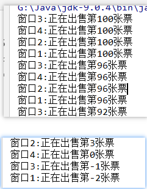
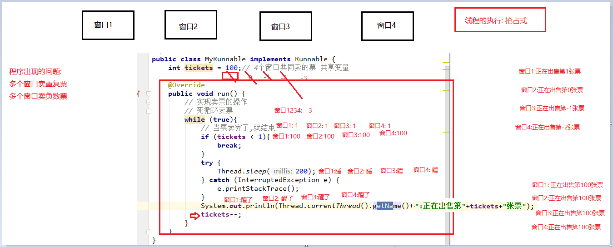
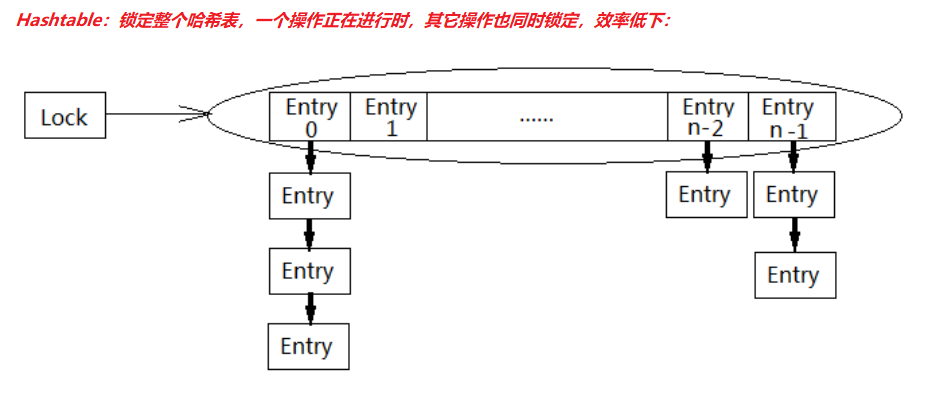
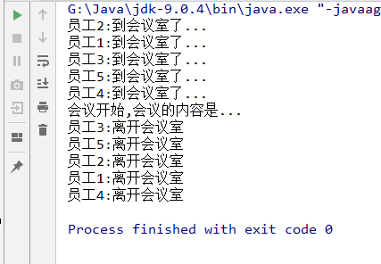
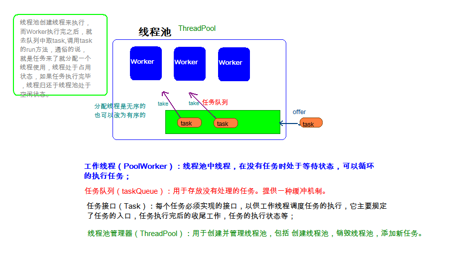

# day10【线程安全、volatile关键字、原子性、并发包、死锁、线程池】

## 今日内容

- 线程安全
- volatile关键字
- 原子类
- 并发包
- 线程池
- 死锁

## 教学目标 

- [ ] 能够解释安全问题的出现的原因
- [ ] 能够使用同步代码块解决线程安全问题

- [ ] 能够使用同步方法解决线程安全问题

- [ ] 能够说出volatile关键字的作用

- [ ] 能够说明volatile关键字和synchronized关键字的区别

- [ ] 能够理解原子类的工作机制

- [ ] 能够掌握原子类AtomicInteger的使用

- [ ] 能够描述ConcurrentHashMap类的作用

- [ ] 能够描述CountDownLatch类的作用

- [ ] 能够描述CyclicBarrier类的作用

- [ ] 能够表述Semaphore类的作用

- [ ] 能够描述Exchanger类的作用

- [ ] 能够描述Java中线程池运行原理

- [ ] 能够描述死锁产生的原因

# 第一章 线程安全

## 知识点--1.1 线程安全问题

### 目标

- 能够解释安全问题的出现的原因

### 路径

- 问题演示

### 讲解

- 我们通过一个案例，演示线程的安全问题：

  电影院要卖票，我们模拟电影院的卖票过程。假设要播放的电影是 “葫芦娃大战奥特曼”，本次电影的座位共100个(本场电影只能卖100张票)。

  我们来模拟电影院的售票窗口，实现多个窗口同时卖 “葫芦娃大战奥特曼”这场电影票(多个窗口一起卖这100张票)需要窗口，采用线程对象来模拟；需要票，Runnable接口子类来模拟。

模拟票：

```java
public class MyRunnable implements Runnable {
    int tickets = 100;// 4个窗口共同卖的票 共享变量

    @Override
    public void run() {
        // 实现卖票的操作
        // 死循环卖票
        while (true){
            // 当票卖完了,就结束
            if (tickets < 1){
                break;
            }
            try {
                Thread.sleep(200);
            } catch (InterruptedException e) {
                e.printStackTrace();
            }
            System.out.println(Thread.currentThread().getName()+":正在出售第"+tickets+"张票");
            tickets--;
        }
    }
}

```

测试类：

```java
public class Test {
    public static void main(String[] args) {
        /*
            多行代码的问题:
                通过案例演示该问题: 电影院4个窗口卖票,卖的是同一份票,这份票总共有100张票
                分析:
                    1. 电影院4个窗口 相当于 4条线程
                    2. 电影院4个窗口 卖票的操作是一样 相当于每条线程的任务是一样的
         */
        // 电影院4个窗口  去卖票
        MyRunnable mr = new MyRunnable();
        Thread t1 = new Thread(mr,"窗口1");
        Thread t2 = new Thread(mr,"窗口2");
        Thread t3 = new Thread(mr,"窗口3");
        Thread t4 = new Thread(mr,"窗口4");

        t1.start();
        t2.start();
        t3.start();
        t4.start();
    }
}

```

**程序执行后,结果会出现的问题**



发现程序出现了两个问题：

1. 相同的票数,比如100这张票被卖了四回。
2. 不存在的票，比如0票与-1票,-2票，是不存在的。

这种问题，几个窗口(线程)票数不同步了，这种问题称为线程不安全。

**卖票案例问题分析:**



### 小结

略

## 知识点-1.2 synchronized

### 目标

- synchronized关键字概述

### 路径

- synchronized关键字概述

### 讲解

- synchronized关键字：表示“同步”的。**它可以对“多行代码”进行“同步”——将多行代码当成是一个完整的整体，一个线程如果进入到这个代码块中，会全部执行完毕，执行结束后，其它线程才会执行。**这样可以保证这多行的代码作为完整的整体，被一个线程完整的执行完毕。

- synchronized被称为“重量级的锁”方式，也是“悲观锁”——效率比较低。

- **synchronized有几种使用方式：**
  **a).同步代码块**

  **b).同步方法【常用】**

当我们使用多个线程访问同一资源的时候，且多个线程中对资源有写的操作，就容易出现线程安全问题。

要解决上述多线程并发访问一个资源的安全性问题:也就是解决重复票与不存在票问题，Java中提供了同步机制(**synchronized**)来解决。

根据案例简述：

```
窗口1线程进入操作的时候，窗口2和窗口3线程只能在外等着，窗口1操作结束，窗口1和窗口2和窗口3才有机会进入代码去执行。也就是说在某个线程修改共享资源的时候，其他线程不能修改该资源，等待修改完毕同步之后，才能去抢夺CPU资源，完成对应的操作，保证了数据的同步性，解决了线程不安全的现象。
```

### 小结

略

## 知识点--1.3 同步代码块

### 目标

- 掌握同步代码块的使用

### 路径

- 同步代码块的介绍
- 同步代码块的使用

### 讲解

- **同步代码块**：`synchronized`关键字可以用于方法中的某个区块中，表示只对这个区块的资源实行互斥访问。

格式: 

```java
synchronized(同步锁){
     需要同步操作的代码
}
```

**同步锁**:

对象的同步锁只是一个概念,可以想象为在对象上标记了一个锁.

1. 锁对象 可以是任意类型。
2. 多个线程对象  要使用同一把锁。

> 注意:在任何时候,最多允许一个线程拥有同步锁,谁拿到锁就进入代码块,其他的线程只能在外等着(BLOCKED)。

使用同步代码块解决代码：

```java
public class MyRunnable implements Runnable {
    int tickets = 100;// 4个窗口共同卖的票 共享变量

    @Override
    public void run() {
        // 实现卖票的操作
        // 死循环卖票
        while (true) {
            // 当票卖完了,就结束
            // 加锁
            synchronized (this) {// mr钥匙
                if (tickets < 1) {
                    break;
                }
                try {
                    Thread.sleep(200);
                } catch (InterruptedException e) {
                    e.printStackTrace();
                }
                System.out.println(Thread.currentThread().getName() + ":正在出售第" + tickets + "张票");
                tickets--;
            }

            // 释放锁
        }
    }
}

public class Test {
    //static Object lock  = new Object();
    public static void main(String[] args) {
        /*
            解决多行代码的原子性问题:
                同步代码块:
                    概述:synchronized关键字可以用于方法中的某个区块中，表示只对这个区块的资源实行互斥访问。
                    格式:
                        synchronized(锁对象){

                        }
                    锁对象:
                        1.锁对象可以是任意类的对象
                        2.多条线程想要实现同步,那么锁对象必须一致
         */
        // 电影院4个窗口  去卖票
        MyRunnable mr = new MyRunnable();
        Thread t1 = new Thread(mr,"窗口1");
        Thread t2 = new Thread(mr,"窗口2");
        Thread t3 = new Thread(mr,"窗口3");
        Thread t4 = new Thread(mr,"窗口4");

        t1.start();
        t2.start();
        t3.start();
        t4.start();

        /*
            发现程序出现了两个问题：
                1. 相同的票数,比如100这张票被卖了四回。
                2. 不存在的票，比如0票与-1票,-2票，是不存在的。
         */
    }
}

```

当使用了同步代码块后，上述的线程的安全问题，解决了。

###  小结

略

## 知识点--1.4 同步方法

### 目标

- 掌握同步方法的使用

### 路径

- 同步方法的介绍
- 同步方法的使用

### 讲解

- **同步方法**:使用synchronized修饰的方法,就叫做同步方法,保证A线程执行该方法的时候,其他线程只能在方法外等着。

格式：

```java
public synchronized void method(){
   	可能会产生线程安全问题的代码
}
```

> 同步锁是谁?
>
> ​      对于非static方法,同步锁就是this。  
>
> ​      对于static方法,我们使用当前方法所在类的字节码对象(类名.class)。

使用同步方法代码如下：

```java
public class MyRunnable implements Runnable {
    int tickets = 100;// 4个窗口共同卖的票 共享变量

    @Override
    public  void run() {
        // 实现卖票的操作
        // 死循环卖票
        while (true) {
            // 当票卖完了,就结束
            // 加锁
            if (sellTickets()) break;

            // 释放锁
        }
    }

    private  synchronized boolean sellTickets() {
        if (tickets < 1) {
            return true;
        }
        try {
            Thread.sleep(200);
        } catch (InterruptedException e) {
            e.printStackTrace();
        }
        System.out.println(Thread.currentThread().getName() + ":正在出售第" + tickets + "张票");
        tickets--;
        return false;
    }
}
public class Test {
    //static Object lock  = new Object();
    public static void main(String[] args) {
        /*
            解决多行代码的安全性问题:
                同步方法:
                    概述:使用synchronized修饰的方法,就叫做同步方法,保证A线程执行该方法的时候,其他线程只能在方法外等着。
                    格式:
                        修饰符 synchronized 返回值类型 方法名(参数列表){}
                    锁对象:
                        1.非静态同步方法: 锁对象是this
                        2.静态同步方法: 锁对象是该方法所在类的字节码文件对象  类名.class

                    线程A中使用的是同步代码块,线程B中使用的是同步方法,线程A和线程B要实现同步,
                    那么线程A中的同步代码块锁对象和线程B中的同步方法的锁对象要一致,否则锁不住
         */
        // 电影院4个窗口  去卖票
        MyRunnable mr = new MyRunnable();
        Thread t1 = new Thread(mr,"窗口1");
        Thread t2 = new Thread(mr,"窗口2");
        Thread t3 = new Thread(mr,"窗口3");
        Thread t4 = new Thread(mr,"窗口4");

        t1.start();
        t2.start();
        t3.start();
        t4.start();

        /*
            发现程序出现了两个问题：
                1. 相同的票数,比如100这张票被卖了四回。
                2. 不存在的票，比如0票与-1票,-2票，是不存在的。
         */
    }
}

```

### 小结

㛑

## 知识点--1.5 Lock锁

### 目标

- 掌握Lock锁的使用

### 路径

- Lock锁的介绍
- Lock锁的使用

### 讲解

`java.util.concurrent.locks.Lock`机制提供了比**synchronized**代码块和**synchronized**方法更广泛的锁定操作,同步代码块/同步方法具有的功能Lock都有,除此之外更强大

Lock锁也称同步锁，加锁与释放锁方法化了，如下：

- `public void lock() `:加同步锁。
- `public void unlock()`:释放同步锁。

使用如下：

```java
public class MyRunnable implements Runnable {
    int tickets = 100;// 4个窗口共同卖的票 共享变量
    Lock lock = new ReentrantLock();

    @Override
    public void run() {
        // 实现卖票的操作
        // 死循环卖票
        while (true) {
            // 当票卖完了,就结束
            // 加锁
            lock.lock();
            if (tickets < 1) {// 窗口1 0
                lock.unlock();
                break;// 结束卖票
            }
            try {
                Thread.sleep(100);
            } catch (InterruptedException e) {
                e.printStackTrace();
            }
            System.out.println(Thread.currentThread().getName() + ":正在出售第" + tickets + "张票");
            tickets--;
            // 释放锁
            lock.unlock();
        }
    }
}

```

### 小结

略 


# 第二章 高并发及线程安全

## 知识点-- 高并发及线程安全

### 目标

- 理解高并发及线程安全的概述

### 路径

- 高并发的概述
- 线程安全的概述

### 讲解

- **高并发**：是指在某个时间点上，有大量的用户(线程)同时访问同一资源。例如：天猫的双11购物节、12306的在线购票在某个时间点上，都会面临大量用户同时抢购同一件商品/车票的情况。
- **线程安全**：在某个时间点上，当大量用户(线程)访问同一资源时，由于多线程运行机制的原因，可能会导致被访问的资源出现"数据污染"的问题。

### 小结

略

## 知识点-- 多线程的运行机制

### 目标

- 理解多线程的运行机制

### 路径

- 多线程的运行机制

### 讲解

- 当一个线程启动后，JVM会为其分配一个独立的"线程栈区"，这个线程会在这个独立的栈区中运行。

- 看一下简单的线程的代码：

  > 1. 一个线程类：

  ```java
  public class MyThread extends Thread {
      @Override
      public void run() {
          for (int i = 0; i < 20; i++) {
              System.out.println("小强: " + i);
          }
      }
  }
  ```

  > 1. 测试类：

  ```java
  public class Demo {
      public static void main(String[] args) {
          //1.创建线程对象
          MyThread mt = new MyThread();
  
          //2.启动线程
          mt.start();
          for (int i = 0; i < 20; i++) {
              System.out.println("旺财: " + i);
          }
      }
  }
  ```

- 启动后，内存的运行机制：

  

- **多个线程在各自栈区中独立、无序的运行，当访问一些代码，或者同一个变量时，就可能会产生一些问题**

### 小结

略

## 知识点-- 多线程的安全性问题-可见性

### 目标

-  多线程的安全性问题-可见性

### 路径

-  多线程的安全性问题-可见性

### 讲解

- 概述: 一个线程没有看见另一个线程对共享变量的修改

- 例如下面的程序，先启动一个线程，在线程中将一个变量的值更改，而主线程却一直无法获得此变量的新值。

  > 1. 线程类：

  ```java
  public class MyThread extends Thread {
  
      boolean flag = false;// 主和子线程共享变量
  
      @Override
      public void run() {
  
          try {
              Thread.sleep(1000);
          } catch (InterruptedException e) {
              e.printStackTrace();
          }
  
          // 把flag的值改为true
          flag = true;
          System.out.println("修改后flag的值为:"+flag);
  
      }
  }
  ```

  > 1. 测试类：

  ```java
  public class Test {
      public static void main(String[] args) {
          /*
              多线程的安全性问题-可见性:
                  一个线程没有看见另一个线程对共享变量的修改
           */
          // 创建子线程并启动
          MyThread mt = new MyThread();
          mt.start();
  
          // 主线程
          while (true){
              if (MyThread.flag == true){
                  System.out.println("死循环结束");
                  break;
              }
          }
          /*
              按照分析结果应该是: 子线程把共享变量flag改为true,然后主线程的死循环就可以结束
              实际结果是: 子线程把共享变量flag改为true,但主线程依然是死循环
              为什么?
                  其实原因就是子线程对共享变量flag修改后的值,对于主线程是不可见的
           */
  
      }
  }
  
  public class MyThread extends Thread{
      static boolean flag = false;// 主线程和子线程共享的变量
  
      @Override
      public void run() {
          try {
              Thread.sleep(3000);// 暂停\醒了
          } catch (InterruptedException e) {
              e.printStackTrace();
          }
          flag = true;
          System.out.println("flag修改后的值为:"+flag);
      }
  }
  
  ```

- 原因: 

- Java内存模型(Java Memory Model)描述了Java程序中各种变量(线程共享变量)的访问规则，以及在JVM中将变量存储到内存和从内存中读取变量这样的底层细节。

- 简而言之: 就是所有共享变量都是存在主内存中的,线程在执行的时候,有单独的工作内存,会把共享变量拷贝一份到线程的单独工作内存中,并且对变量所有的操作,都是在单独的工作内存中完成的,不会直接读写主内存中的变量值

- 

### 小结

- 概述: 一个线程没有看见另一个线程对共享变量的修改
- 为什么没有看见:
  - 简而言之: 就是所有共享变量都是存在主内存中的,线程在执行的时候,有单独的工作内存,会把共享变量拷贝一份到线程的单独工作内存中,并且对变量所有的操作,都是在单独的工作内存中完成的,不会直接读写主内存中的变量值

## 知识点-- 多线程的安全性问题-有序性

### 目标

- 多线程的安全性问题-有序性

### 路径

- 多线程的安全性问题-有序性

### 讲解

- 有些时候“编译器”在编译代码时，会对代码进行“重排”，例如：

  ​             int a = 10;     //1

  ​             int b = 20;     //2

  ​             int c = a + b;   //3

  第一行和第二行可能会被“重排”：可能先编译第二行，再编译第一行，总之在执行第三行之前，会将1,2编译完毕。1和2先编译谁，不影响第三行的结果。

- 但在“多线程”情况下，代码重排，可能会对另一个线程访问的结果产生影响：  

  

  **多线程环境下，我们通常不希望对一些代码进行重排的！！**

### 小结

略

## 知识点--多线程的安全性问题-原子性

### 目标

- 多线程的安全性问题-原子性

### 路径

- 多线程的安全性问题-原子性

### 讲解

- 概述：所谓的原子性是指在一次操作或者多次操作中，要么所有的操作全部都得到了执行并且不会受到任何因素的干扰而中断，要么所有的操作都不执行，多个操作是一个不可以分割的整体。

- 请看以下示例：

  - 一条子线程和一条主线程都对共享变量a进行++操作,每条线程对a++操作100000次

  > 1.制作线程类
  
  ```java
  public class MyThread extends  Thread {
      public static int a = 0;
  
      @Override
      public void run() {
          for (int i = 0; i < 100000; i++) {
              a++;
          }
          System.out.println("修改完毕！");
      }
  }

  ```

  > 2.制作测试类
  
  ```java
  public class Demo {
    public static void main(String[] args) {
        /*
            概述：所谓的原子性是指在一次操作或者多次操作中，
                要么所有的操作全部都得到了执行并且不会受到任何因素的干扰而中断，
                要么所有的操作都不执行，多个操作是一个不可以分割的整体。
            演示高并发原子性问题:
                例如: 一条子线程和一条主线程都对共享变量a进行++操作,每条线程对a++操作100000次
                  最终期望a的值为:200000
            出现高并发原子性问题的原因:虽然计算了2次，但是只对a进行了1次修改
  
         */
        // 创建并启动子线程
      MyThread mt = new MyThread();
        mt.start();
  
        // a变量自增3万次
        for (int i = 0; i < 100000; i++) {
          mt.a++;
        }
  
        // 暂定5秒,为了保证子线程执行完毕
        try {
            Thread.sleep(5000);
        } catch (InterruptedException e) {
          e.printStackTrace();
        }
  
      System.out.println("最终a的值为:"+mt.a);// 期望:200000
  }
  }

  ```
  
  **原因：两个线程对共享变量的操作产生覆盖的效果**
  
  

### 小结

略

# 第三章 volatile关键字  

## 知识点--什么是volatile关键字

### 目标

- volatile关键字概述

### 路径

- volatile关键字概述

### 讲解

- volatile是一个"变量修饰符"，它只能修饰"成员变量"，它能强制线程每次从主内存获取值，并能保证此变量不会被编译器优化。
- volatile能解决变量的可见性、有序性；
- volatile不能解决变量的原子性

### 小结

略

## 知识点-- volatile解决可见性  

### 目标

- volatile解决可见性

### 路径

- volatile解决可见性

### 讲解

- 将1.3的线程类MyThread做如下修改：

  > 1. 线程类：

  ```java
  public class MyThread extends Thread {
      public static volatile int a = 0;//增加volatile关键字
      @Override
      public void run() {
          System.out.println("线程启动，休息2秒...");
          try {
              Thread.sleep(1000 * 2);
          } catch (InterruptedException e) {
              e.printStackTrace();
          }
          System.out.println("将a的值改为1");
          a = 1;
          System.out.println("线程结束...");
      }
  }
  ```

  > 1. 测试类

  ```java
  public class Demo {
      public static void main(String[] args) {
          //1.启动线程
          MyThread t = new MyThread();
          t.start();
  
          //2.主线程继续
          while (true) {
              if (MyThread.a == 1) {
                  System.out.println("主线程读到了a = 1");
              }
          }
      }
  }
  ```

  **当变量被修饰为volatile时，会迫使线程每次使用此变量，都会去主内存获取，保证其可见性**

### 小结

略

## 知识点-- volatile解决有序性

### 目标

- volatile解决有序性

### 路径

- volatile解决有序性

### 讲解

- 当变量被修饰为volatile时，会禁止代码重排

  


### 小结

略

## 知识点-- volatile不能解决原子性  

### 目标

- volatile不能解决原子性

### 路径

- volatile不能解决原子性

### 讲解

- 对于示例1.5，加入volatile关键字并不能解决原子性：

  > 1. 线程类：

  ```java
  public class MyThread extends  Thread {
      public static volatile int a = 0;
  
      @Override
      public void run() {
          for (int i = 0; i < 10000; i++) {
              //线程1：取出a的值a=0(被暂停)
              a++;
              //写回
          }
          System.out.println("修改完毕！");
      }
  }
  
  ```

  > 1. 测试类：

  ```java
  public class Demo {
      public static void main(String[] args) throws InterruptedException {
          //1.启动两个线程
          MyThread t1 = new MyThread();
          MyThread t2 = new MyThread();
  
          t1.start();
          t2.start();
  
          Thread.sleep(1000);
          System.out.println("获取a最终值：" + MyThread.a);//最终结果仍然不正确。
  
      }
  }
  
  ```

  **所以，volatile关键字只能解决"变量"的可见性、有序性问题，并不能解决原子性问题**

### 小结

略

# 第四章 原子类  

## 知识点-- 原子类概述

### 目标

- 原子类概述

### 路径

- 原子类概述

### 讲解

- 在java.util.concurrent.atomic包下定义了一些对“变量”操作的“原子类”:

  ​    1).java.util.concurrent.atomic.AtomicInteger：对int变量操作的“原子类”;

  ​    2).java.util.concurrent.atomic.AtomicLong：对long变量操作的“原子类”;

  ​    3).java.util.concurrent.atomic.AtomicBoolean：对boolean变量操作的“原子类”;

  **它们可以保证对“变量”操作的：原子性、有序性、可见性。**

### 小结

略

## 知识点-- AtomicInteger类示例

### 目标

- AtomicInteger类示例

### 路径

- AtomicInteger类示例

### 讲解

- 我们可以通过AtomicInteger类，来看看它们是怎样工作的

  > 1. 线程类：

  ```java
  public class MyThread extends Thread {
      //static int a = 0;// 共享变量
      static AtomicInteger a = new AtomicInteger();// 共享变量
  
      @Override
      public void run() {
          // 任务: 对共享变量a进行自增30万次
          for (int i = 0; i < 300000; i++) {
              //a++;
              a.getAndIncrement();// a自增1
          }
          System.out.println("子线程30万次自增结束了");
      }
  }
  
  
  ```

  > 1. 测试类：

  ```java
  public class Test {
      public static void main(String[] args) {
          /*
              概述：所谓的原子性是指在一次操作或者多次操作中，要么所有的操作全部都得到了执行并且不会受到任何因素的干扰而中断，
                    要么所有的操作都不执行，多个操作是一个不可以分割的整体。
              请看以下示例：
                一条子线程和一条主线程都对共享变量a进行++操作,每条线程对a++操作300000次
              AtomicInteger类:
                  构造方法:
                      AtomicInteger() 创建具有初始值 0 的新 AtomicInteger。
                      AtomicInteger(int initialValue) 创建具有给定初始值的新 AtomicInteger。
                  成员方法:
                      int getAndIncrement() 以原子方式将当前值加 1。
           */
          // 创建子线程,并启动
        MyThread mt = new MyThread();
          mt.start();
  
          // 主线程: 对共享变量a进行++操作10万次
          for (int i = 0; i < 300000; i++) {
              //MyThread.a++;
              MyThread.a.getAndIncrement();// a自增1
          }
  
          // 为了保证输出a的值之前,主线程和子线程对a的操作都完毕了
          try {
              Thread.sleep(5000);// 睡眠
          } catch (InterruptedException e) {
              e.printStackTrace();
          }
  
          // 当子线程和主线程对a的操作完毕后,打印最后a的结果
          System.out.println("a:"+ MyThread.a);// 600000
  
      }
  }
  
  
  ```
  
  **我们能看到，无论程序运行多少次，其结果总是正确的！**

### 小结

略

## 知识点-- AtomicInteger类的工作原理-CAS机制

### 目标

- AtomicInteger类的工作原理-CAS机制

### 路径

- AtomicInteger类的工作原理-CAS机制

### 讲解


### 小结


略

## 知识点-- AtomicIntegerArray类示例

### 目标

- AtomicIntegerArray类示例

### 路径

- AtomicIntegerArray类示例

### 讲解

- 常用的数组操作的原子类：
  1).java.util.concurrent.atomic.AtomicIntegetArray:对int数组操作的原子类。  int[]

  ​		2).java.util.concurrent.atomic.AtomicLongArray：对long数组操作的原子类。long[]

  ​		3).java.util.concurrent.atomic.AtomicReferenceArray：对引用类型数组操作的原子类。Object[]

- 数组的多线程并发访问的安全性问题：

  > 1. 线程类：

  ```java
  public class MyThread1 extends Thread{
      public static int[] arr = new int[1000];// 共享变量,每个元素的默认值是0
  
      @Override
      public void run() {
          // 任务: 对数组中的每一个元素进行+1操作
          for (int i = 0; i < arr.length; i++) {
              arr[i]++;// 元素自增1
          }
          System.out.println("结束");
      }
  }
  
  
  ```

  > 1. 测试类：

  ```java
  public class Test1 {
      public static void main(String[] args) {
          /*
              AtomicIntegerArray类示例:
                  案例: 多线程操作数组
           */
          // 创建1万个线程
          for (int i = 0; i < 10000; i++) {
              new MyThread1().start();
          }
  
          // 为了保证10000个线程全部执行完毕,才来打印数组中的元素
          try {
              Thread.sleep(5000);
          } catch (InterruptedException e) {
              e.printStackTrace();
          }
          System.out.println(Arrays.toString(MyThread1.arr));
          /*
              期望结果: arr数组中的元素都是10000
              实际结果: arr数组中的元素并不是都是10000
           */
      }
  }
  
  ```

  正常情况，数组的每个元素最终结果应为：1000，而实际打印：

  ```java
  1000
  1000
  1000
  1000
  999
  999
  999
  999
  999
  999
  999
  999
  1000
  1000
  1000
  1000
  ```

  可以发现，有些元素并不是1000.

- 为保证数组的多线程安全，改用AtomicIntegerArray类，演示：

  > 1. 线程类：

  ```java
  public class MyThread2 extends Thread{
      public static AtomicIntegerArray arr = new AtomicIntegerArray(1000);// 共享变量,每个元素的默认值是0
  
      @Override
      public void run() {
          // 任务: 对数组中的每一个元素进行+1操作
          for (int i = 0; i < arr.length(); i++) {
              arr.getAndAdd(i,1);// 给i索引的元素自增1
          }
          System.out.println("结束");
      }
  }
  
  
  ```
```java
  
public class Test2 {
    public static void main(String[] args) {
        /*
            AtomicIntegerArray类示例:
                案例: 多线程操作数组
         */
        // 创建1万个线程
        for (int i = 0; i < 10000; i++) {
            new MyThread2().start();
        }

        // 为了保证10000个线程全部执行完毕,才来打印数组中的元素
        try {
            Thread.sleep(5000);
        } catch (InterruptedException e) {
            e.printStackTrace();
        }

        for (int i = 0; i < MyThread2.arr.length(); i++) {
            System.out.print(MyThread2.arr.get(i)+" ");
        }
        /*
            期望结果: arr数组中的元素都是10000
            实际结果: arr数组中的元素并不是都是10000
         */
    }
}

```

  先在能看到，每次运行的结果都是正确的。

### 小结

略

# 第五章 并发包 

在JDK的并发包里提供了几个非常有用的并发容器和并发工具类。供我们在多线程开发中进行使用。

## 知识点--CopyOnWriteArrayList

### 目标

- 掌握CopyOnWriteArrayList使用

### 路径

- 演示ArrayList线程不安全
- 演示CopyOnWriteArrayList线程安全

### 讲解

- ArrayList的线程不安全：

  > 1. 定义线程类：

  ~~~java
  public class MyThread extends Thread {
      public static List<Integer> list = new ArrayList<>();//线程不安全的
      @Override
      public void run() {
          for (int i = 0; i < 10000; i++) {
              list.add(i);
          }
          System.out.println("添加完毕！");
      }
  }
  
  ~~~

  > 2. 定义测试类：

  ~~~java
  public class Demo {
      public static void main(String[] args) throws InterruptedException {
          MyThread t1 = new MyThread();
          MyThread t2 = new MyThread();
  
          t1.start();
          t2.start();
  
          Thread.sleep(1000);
  
          System.out.println("最终集合的长度：" + MyThread.list.size());
      }
  }
  
  ~~~

  **最终结果可能会抛异常，或者最终集合大小是不正确的。**

- CopyOnWriteArrayList是线程安全的：

  > 1. 定义线程类：

  ~~~java
  public class MyThread extends Thread {
  //    public static List<Integer> list = new ArrayList<>();//线程不安全的
      //改用：线程安全的List集合:
      public static CopyOnWriteArrayList<Integer> list = new CopyOnWriteArrayList<>();
  
      @Override
      public void run() {
          for (int i = 0; i < 10000; i++) {
              list.add(i);
          }
          System.out.println("添加完毕！");
      }
  }
  
  ~~~

  > 2. 测试类：

  ~~~java
  public class Demo {
      public static void main(String[] args) throws InterruptedException {
          MyThread t1 = new MyThread();
          MyThread t2 = new MyThread();
  
          t1.start();
          t2.start();
  
          Thread.sleep(1000);
  
          System.out.println("最终集合的长度：" + MyThread.list.size());
      }
  }
  
  ~~~

  结果始终是正确的。

### 小结

略

## 知识点--CopyOnWriteArraySet

### 目标

- 掌握-CopyOnWriteArraySet使用

### 路径

- 演示HashSet线程不安全
- 演示CopyOnWriteArraySet线程安全

### 讲解

- **HashSet仍然是线程不安全的：**

  > 1. 线程类：

  ~~~java
  public class MyThread extends Thread {
  	public static Set<Integer> set = new HashSet<>();//线程不安全的
      @Override
      public void run() {
          for (int i = 0; i < 10000; i++) {
              set.add(i);
          }
          System.out.println("添加完毕！");
      }
  }
  
  ~~~

  > 2. 测试类：

  ~~~java
  public class Demo {
      public static void main(String[] args) throws InterruptedException {
          MyThread t1 = new MyThread();
          t1.start();
  
          //主线程也添加10000个
          for (int i = 10000; i < 20000; i++) {
              MyThread.set.add(i);
  
          }
          Thread.sleep(1000 * 3);
          System.out.println("最终集合的长度：" + MyThread.set.size());
      }
  }
  
  ~~~

  最终结果可能会抛异常，也可能最终的长度是错误的！！

- **CopyOnWriteArraySet是线程安全的：**

  > 1. 线程类：

  ~~~java
  public class MyThread extends Thread {
  //    public static Set<Integer> set = new HashSet<>();//线程不安全的
      //改用：线程安全的Set集合:
      public static CopyOnWriteArraySet<Integer> set = new CopyOnWriteArraySet<>();
  
      @Override
      public void run() {
          for (int i = 0; i < 10000; i++) {
              set.add(i);
          }
          System.out.println("添加完毕！");
      }
  }
  
  ~~~

  > 2. 测试类：

  ~~~java
  public class Demo {
      public static void main(String[] args) throws InterruptedException {
          MyThread t1 = new MyThread();
          t1.start();
  
          //主线程也添加10000个
          for (int i = 10000; i < 20000; i++) {
              MyThread.set.add(i);
  
          }
          Thread.sleep(1000 * 3);
          System.out.println("最终集合的长度：" + MyThread.set.size());
      }
  }
  
  ~~~

  可以看到结果总是正确的！！

### 小结

略

## 知识点-- ConcurrentHashMap

### 目标

- 掌握ConcurrentHashMap使用

### 路径

- 演示HashMap线程不安全
- 演示Hashtable线程安全
- 演示ConcurrentHashMap线程安全

### 讲解

- **HashMap是线程不安全的。**

  > 1. 线程类：

  ~~~java
  public class MyRunnable implements Runnable {
      // HashMap线程不安全
      HashMap<Integer,Integer> map = new HashMap<>();// 2条线程共享的map集合
       // Hashtable线程安全
      //Hashtable<Integer,Integer> map = new  Hashtable<>();// 2条线程共享的map集合
      // ConcurrentHashMap线程安全
      //ConcurrentHashMap<Integer,Integer> map = new ConcurrentHashMap<>();// 2条线程共享的map集合
      @Override
      public void run() {
          for (int i = 0; i < 1000; i++) {
              map.put(i,i);
          }
          System.out.println("添加完毕");
      }
  }
  ~~~

  > 2. 测试类：

  ~~~java
  public class Test {
      public static void main(String[] args) throws InterruptedException {
          /*
              ConcurrentHashMap:
                  - 演示HashMap线程不安全
                  - 演示Hashtable线程安全
                  - 演示ConcurrentHashMap线程安全
  
              案例: 线程1对HashMap集合添加1000个键值对,线程2也对HashMap集合添加1000个键值对
           */
          // 创建MyRunnable任务对象
          MyRunnable mr = new MyRunnable();
          // 创建2条线程执行任务
          Thread t1 = new Thread(mr);
          t1.start();
  
          Thread t2 = new Thread(mr);
          t2.start();
  
          Thread.sleep(2000);
          System.out.println("最终map集合键值对的个数:"+mr.map.size());
          /*
              根据分析,共享的map集合中的键值对个数应该是1000个,但实际运行的结果是大于1000的
           */
      }
  }
  
  ~~~

  运行结果可能会出现异常、或者结果不准确！！

- **Hashtable是线程安全的，但效率低：**

  我们改用JDK提供的一个早期的线程安全的Hashtable类来改写此例，注意：我们加入了"计时"。

  > 1. 线程类：

  ~~~java
  public class MyRunnable implements Runnable {
  
      // Hashtable线程安全
      Hashtable<Integer,Integer> map = new  Hashtable<>();// 2条线程共享的map集合
  
  
      @Override
      public void run() {
          for (int i = 0; i < 1000; i++) {
              map.put(i,i);
          }
          System.out.println("添加完毕");
      }
  }
  ~~~

  > 2. 测试类：

  ~~~java
  public class Test {
      public static void main(String[] args) throws InterruptedException {
          // 创建MyRunnable任务对象
          MyRunnable mr = new MyRunnable();
          // 创建1000条线程
          for (int i = 0; i < 1000; i++) {
              Thread t = new Thread(mr);
              t.start();
          }
  
  
          Thread.sleep(5000);
          System.out.println("最终map集合键值对的个数:"+mr.map.size());
          /*
              根据分析,共享的map集合中的键值对个数应该是1000个,但实际运行的结果是大于1000的
           */
      }
  }
  
  ~~~

  能看到结果是正确的，但耗时较长。

- **改用ConcurrentHashMap**

  > 1. 线程类：

  ~~~java
  public class MyRunnable implements Runnable {
     
      // ConcurrentHashMap线程安全
      ConcurrentHashMap<Integer,Integer> map = new ConcurrentHashMap<>();// 2条线程共享的map集合
  
      @Override
      public void run() {
          for (int i = 0; i < 1000; i++) {
              map.put(i,i);
          }
          System.out.println("添加完毕");
      }
  }
  
  ~~~

  > 2. 测试类：

~~~java
public class Test {
    public static void main(String[] args) throws InterruptedException {
        // 创建MyRunnable任务对象
        MyRunnable mr = new MyRunnable();
        // 创建1000条线程
        for (int i = 0; i < 1000; i++) {
            Thread t = new Thread(mr);
            t.start();
        }


        Thread.sleep(5000);
        System.out.println("最终map集合键值对的个数:"+mr.map.size());
        /*
            根据分析,共享的map集合中的键值对个数应该是1000个,但实际运行的结果是大于1000的
         */
    }
}


~~~

  可以看到效率提高了很多！！！

- **HashTable效率低下原因：**

```java
public synchronized V put(K key, V value) 
public synchronized V get(Object key)
```

**HashTable容器使用synchronized来保证线程安全，但在线程竞争激烈的情况下HashTable的效率非常低下**。因为当一个线程访问HashTable的同步方法，其他线程也访问HashTable的同步方法时，会进入阻塞状态。如线程1使用put进行元素添加，线程2不但不能使用put方法添加元素，也不能使用get方法来获取元素，所以竞争越激烈效率越低。



**ConcurrentHashMap高效的原因：CAS + 局部(synchronized)锁定**


### 小结

略

## 知识点-- CountDownLatch

### 目标

- 掌握CountDownLatch使用

### 路径

- CountDownLatch的介绍
- CountDownLatch的使用

### 讲解

CountDownLatch允许一个或多个线程等待其他线程完成操作。

例如：线程1要执行打印：A和C，线程2要执行打印：B，但线程1在打印A后，要线程2打印B之后才能打印C，所以：线程1在打印A后，必须等待线程2打印完B之后才能继续执行。

CountDownLatch构造方法:

```java
public CountDownLatch(int count)// 初始化一个指定计数器的CountDownLatch对象   1
```

CountDownLatch重要方法:

```java
public void await() throws InterruptedException// 让当前线程等待,当计数器的值为0的时候,就结束等待
public void countDown()	// 计数器进行减1
```

- **示例**
  1). 制作线程1：

~~~java
public class MyRunnable1 implements Runnable {
    CountDownLatch cdl;

    public MyRunnable1(CountDownLatch cdl) {
        this.cdl = cdl;
    }

    @Override
    public void run() {
        System.out.println("A");
        // 暂停,等待线程2执行打印B,执行完回到这里来执行打印C
        try {
            cdl.await();
        } catch (InterruptedException e) {
            e.printStackTrace();
        }
        System.out.println("C");// 打印C之前一定要去执行打印B
    }
}

~~~

2). 制作线程2：

~~~java
public class MyRunnable2 implements Runnable {

    CountDownLatch cdl;

    public MyRunnable2(CountDownLatch cdl) {
        this.cdl = cdl;
    }

    @Override
    public void run() {
        System.out.println("B");
        // 计数器-1
        cdl.countDown();// 计数器的值为0
    }
}

~~~

3).制作测试类：

~~~java
public class Test {
    public static void main(String[] args) throws InterruptedException {
        /*
            CountDownLatch:
                作用: 允许一个或多个线程等待其他线程完成操作。
                常用方法:
                    public CountDownLatch(int count)// 初始化一个指定计数器的CountDownLatch对象
                    public void await() throws InterruptedException// 让当前线程等待
                    public void countDown()	// 计数器进行减1

                案例演示:
                 线程1的任务是打印A和C,线程2的任务是打印B,要求打印B一定要在打印C的前面
         */
        CountDownLatch cdl = new CountDownLatch(1);

        // 创建2条线程,执行任务
        MyRunnable1 mr1 = new MyRunnable1(cdl);
        Thread t1 = new Thread(mr1);
        t1.start();


        MyRunnable2 mr2 = new MyRunnable2(cdl);
        Thread t2 = new Thread(mr2);
        t2.start();//
    }
}
~~~

4). 执行结果：
会保证按：A B C的顺序打印。

说明：

CountDownLatch中count down是倒数的意思，latch则是门闩的含义。整体含义可以理解为倒数的门栓，似乎有一点“三二一，芝麻开门”的感觉。

CountDownLatch是通过一个计数器来实现的，每当一个线程完成了自己的任务后，可以调用countDown()方法让计数器-1，当计数器到达0时，调用CountDownLatch。

await()方法的线程阻塞状态解除，继续执行。

### 小结

略

## 知识点-- CyclicBarrier

### 目标

- 掌握CyclicBarrier使用

### 路径

- CyclicBarrier的介绍
- CyclicBarrier的使用

### 讲解

CyclicBarrier的字面意思是可循环使用（Cyclic）的屏障（Barrier）。它要做的事情是，让一组线程到达一个屏障（也可以叫同步点）时被阻塞，直到最后一个线程到达屏障时，屏障才会开门，所有被屏障拦截的线程才会继续运行。

例如：公司召集5名员工开会，等5名员工都到了，会议开始。

 我们创建5个员工线程，1个开会线程，几乎同时启动，使用CyclicBarrier保证5名员工线程全部执行后，再执行开会线程。

CyclicBarrier构造方法：

```java
public CyclicBarrier(int parties, Runnable barrierAction
    //parties: 代表要达到屏障的线程数量
    //barrierAction:表示达到屏障后要执行的线程
```

CyclicBarrier重要方法：

```java
public int await()// 每个线程调用await方法告诉CyclicBarrier我已经到达了屏障，然后当前线程被阻塞
```

- **示例代码：**
  1). 制作员工线程：

~~~java
public class MyRunnable implements Runnable {

    CyclicBarrier cb;

    public MyRunnable(CyclicBarrier cb) {
        this.cb = cb;
    }

    @Override
    public void run() {
        System.out.println(Thread.currentThread().getName()+":到会议室了...");
        // 当前线程到达会议室(屏障),暂停
        try {
            cb.await();
        } catch (InterruptedException e) {
            e.printStackTrace();
        } catch (BrokenBarrierException e) {
            e.printStackTrace();
        }
        System.out.println(Thread.currentThread().getName()+":离开会议室");
    }
}

~~~

2). 制作开会线程：

~~~java
public class MeetingRunnable implements Runnable {
    @Override
    public void run() {
        System.out.println("会议开始,会议的内容是...");
    }
}

~~~

3). 制作测试类：

~~~java
public class Test {
    public static void main(String[] args) {
        /*
            CyclicBarrier类:
                作用:它要做的事情是，让一组线程到达一个屏障（也可以叫同步点）时被阻塞，直到最后一个线程到达屏障时，屏障才会开门，
                     所有被屏障拦截的线程才会继续运行。
                常用方法:
                    public CyclicBarrier(int parties, Runnable barrierAction)
                     parties: 代表要达到屏障的线程数量
                     barrierAction:表示达到屏障后要执行的线程

                    public int await() 每个线程调用await方法告诉CyclicBarrier我已经到达了屏障，然后当前线程被阻塞

                案例演示:
                例如：公司召集5名员工开会，等5名员工都到了，会议开始
         */
        // 创建CyclicBarrier对象
        CyclicBarrier cb = new CyclicBarrier(5,new MeetingRunnable());

        MyRunnable mr = new MyRunnable(cb);
        new Thread(mr,"员工1").start();
        new Thread(mr,"员工2").start();
        new Thread(mr,"员工3").start();
        new Thread(mr,"员工4").start();
        new Thread(mr,"员工5").start();


    }
}
~~~

4). 执行结果：




### 使用场景

使用场景：CyclicBarrier可以用于多线程计算数据，最后合并计算结果的场景。

需求：使用两个线程读取2个文件中的数据，当两个文件中的数据都读取完毕以后，进行数据的汇总操作。

### 小结

略

## 知识点-- Semaphore

### 目标

- 掌握Semaphore使用

### 路径

- Semaphore的介绍
- Semaphore的使用

### 讲解

Semaphore的主要作用是控制线程的并发数量。

synchronized可以起到"锁"的作用，但某个时间段内，只能有一个线程允许执行。

Semaphore可以设置同时允许几个线程执行。

Semaphore字面意思是信号量的意思，它的作用是控制访问特定资源的线程数目。

Semaphore构造方法：

```java
public Semaphore(int permits)						permits 表示许可线程的数量
```

Semaphore重要方法：

```java
public void acquire() throws InterruptedException	表示获取许可
public void release()								表示释放许可
```

- **示例一：同时允许1个线程执行**

1). 制作一个ClassRoom类：

```java
public class ClassRoom {
    // 创建Semaphore对象,指定线程的并发数量是1
    Semaphore sp = new Semaphore(2);

    public void into(){
        // 获得许可证,才进来了
        try {
            sp.acquire();
        } catch (InterruptedException e) {
            e.printStackTrace();
        }
        System.out.println(Thread.currentThread().getName()+":进来了...");
        try {
            Thread.sleep(2000);
        } catch (InterruptedException e) {
            e.printStackTrace();
        }
        // 出去了,就释放许可
        System.out.println(Thread.currentThread().getName()+":出去了...");
        sp.release();
    }
}


```

2). 制作线程类：

```java
public class MyRunnable implements Runnable {
    ClassRoom cr;

    public MyRunnable(ClassRoom cr) {
        this.cr = cr;
    }

    @Override
    public void run() {
        cr.into();// 任务就是进入教室
    }
}


```


3). 测试类：

```java
public class Test {
    public static void main(String[] args) {
        /*
            Semaphore类:
                作用: 控制线程的并发数量。
                常用方法:
                    public Semaphore(int permits)  permits 表示许可线程的数量
                    public void acquire() throws InterruptedException	表示获取许可
                    public void release()  release() 表示释放许可
                案例演示:
                    假设有个教室,只能容纳3个人,这个时候有5个人需要进来
         */
        ClassRoom cr = new ClassRoom();
        // 创建5条线程,执行任务
        MyRunnable mr = new MyRunnable(cr);
        new Thread(mr,"1号").start();
        new Thread(mr,"2号").start();
        new Thread(mr,"3号").start();
        new Thread(mr,"4号").start();
        new Thread(mr,"5号").start();

    }
}


```

### 小结

略

## 知识点-- Exchanger

### 目标

- 掌握Exchanger使用

### 路径

- Exchanger的介绍
- Exchanger的使用

### 讲解

Exchanger（交换者）是一个用于线程间协作的工具类。Exchanger用于进行线程间的数据交换。

这两个线程通过exchange方法交换数据，如果第一个线程先执行exchange()方法，它会一直等待第二个线程也执行exchange方法，当两个线程都到达同步点时，这两个线程就可以交换数据，将本线程生产出来的数据传递给对方。

A线程  exchange方法  把数据传递B线程

B线程    exchange方法 把数据传递A线程

Exchanger构造方法：

```java
public Exchanger()
```

Exchanger重要方法：

```java
public V exchange(V x)   参数: 要交换的数据  返回值: 对方线程传递的数据
```

- 示例一

~~~java
public class MyRunnable1 implements Runnable {
    Exchanger<String> ex;

    public MyRunnable1(Exchanger<String> ex) {
        this.ex = ex;
    }

    @Override
    public void run() {
        // 线程1 传递数据给 线程2
        try {
            // 线程1,把"信息1"传递给线程2
            String message2 = ex.exchange("信息1");
            System.out.println("线程2 传递给 线程1的信息是:"+message2);
        } catch (InterruptedException e) {
            e.printStackTrace();
        }
    }
}
public class MyRunnable2 implements Runnable {
    Exchanger<String> ex;

    public MyRunnable2(Exchanger<String> ex) {
        this.ex = ex;
    }

    @Override
    public void run() {
        // 线程2 传递数据给 线程1
        try {
            String message1 = ex.exchange("信息2");
            System.out.println("线程1 传递给 线程2的信息:"+message1);
        } catch (InterruptedException e) {
            e.printStackTrace();
        }
    }
}

~~~

2). 制作main()方法：

~~~java
public class Test {
    public static void main(String[] args) {
        /*
            Exchanger类:
                作用:是一个用于线程间协作的工具类。Exchanger用于进行线程间的数据交换。
                常用方法:
                    public Exchanger()
                    public V exchange(V x)  参数就表示当前线程需要传递的数据,返回值是其他线程传递过来的数据
                案例演示:
         */
        Exchanger<String> ex = new Exchanger<>();
        MyRunnable1 mr1 = new MyRunnable1(ex);
        new Thread(mr1).start();


        MyRunnable2 mr2 = new MyRunnable2(ex);
        new Thread(mr2).start();

    }
}

~~~


使用场景：可以做数据校对工作

需求：比如我们需要将纸制银行流水通过人工的方式录入成电子银行流水。为了避免错误，采用AB岗两人进行录入，录入到两个文件中，系统需要加载这两个文件，

并对两个文件数据进行校对，看看是否录入一致，

### 小结

略

# 第六章 线程池方式

## 知识点-- 线程池的概念 

### 目标

- 能够理解线程池的概念

### 路径

- 线程池的思想
- 线程池的概念
- 线程池的好处

### 讲解

#### 线程池的思想


我们使用线程的时候就去创建一个线程，这样实现起来非常简便，但是就会有一个问题：

如果并发的线程数量很多，并且每个线程都是执行一个时间很短的任务就结束了，这样频繁创建线程就会大大降低系统的效率，**因为频繁创建线程和销毁线程需要时间。**

那么有没有一种办法使得线程可以复用，就是执行完一个任务，并不被销毁，而是可以继续执行其他的任务？

在Java中可以通过线程池来达到这样的效果。

#### 线程池概念

- **线程池：**其实就是一个容纳多个线程的容器，其中的线程可以反复使用，省去了频繁创建线程对象的操作，无需反复创建线程而消耗过多资源。

由于线程池中有很多操作都是与优化资源相关的，我们在这里就不多赘述。我们通过一张图来了解**线程池的工作原理：**



#### 线程池的好处

1. 降低资源消耗。减少了创建和销毁线程的次数，每个工作线程都可以被重复利用，可执行多个任务。
2. 提高响应速度。当任务到达时，任务可以不需要的等到线程创建就能立即执行。
3. 提高线程的可管理性。可以根据系统的承受能力，调整线程池中工作线线程的数目，防止因为消耗过多的内存，而把服务器累趴下(每个线程需要大约1MB内存，线程开的越多，消耗的内存也就越大，最后死机)。

### 小结

- 线程池是一个存储多条线程的容器,该线程池中的线程是可以重复利用的
- 线程池的工作原理:
  - 线程池被创建,就会初始化指定数量的线程
  - 往线程池中添加任务:
    - 如果线程池中有多条空闲的线程,那么就会随机分配线程来执行任务
    - 如果线程池中没有空闲的线程,那么添加的任务就在任务队列中进行等待,当有线程执行完任务,空闲下来了,就会分配空闲线程来执行等待的任务

## 知识点--线程池的使用

### 目标

- 能够使用线程池执行任务

### 路径

- 线程池的使用
- 线程池相关类的介绍

### 讲解

Java里面线程池的顶级接口是`java.util.concurrent.Executor`，但是严格意义上讲`Executor`并不是一个线程池，而只是一个执行线程的工具。真正的线程池接口是`java.util.concurrent.ExecutorService`。

要配置一个线程池是比较复杂的，尤其是对于线程池的原理不是很清楚的情况下，很有可能配置的线程池不是较优的，因此在`java.util.concurrent.Executors`线程工厂类里面提供了一些静态工厂，生成一些常用的线程池。官方建议使用Executors工厂类来创建线程池对象。

Executors类中有个创建线程池的方法如下：

- `public static ExecutorService newFixedThreadPool(int nThreads)`：返回线程池对象。(创建的是有界线程池,也就是池中的线程个数可以指定最大数量)

获取到了一个线程池ExecutorService 对象，那么怎么使用呢，在这里定义了一个使用线程池对象的方法如下：

- `public Future<?> submit(Runnable task)`:获取线程池中的某一个线程对象，并执行任务

- `public <T> Future<T> submit(Callable<T> task)`:获取线程池中的某一个线程对象，并执行任务

  > Future接口：用来记录线程任务执行完毕后产生的结果。

使用线程池中线程对象的步骤：

1. 创建线程池对象。
2. 创建Runnable接口子类对象。(task)
3. 提交Runnable接口子类对象。(take task)
4. 关闭线程池(一般不做)。

**Runnable实现类代码：**

```java
public class MyRunnable implements Runnable {
    @Override
    public void run() {
        //任务
        System.out.println(Thread.currentThread().getName()+":开始执行实现Runnable方式的任务....");
        try {
            Thread.sleep(3000);
        } catch (InterruptedException e) {
            e.printStackTrace();
        }
        System.out.println(Thread.currentThread().getName()+":执行完毕....");
    }
}

```

线程池测试类：

```java
public class Test1_Runnable {
    public static void main(String[] args) {
        /*
            线程池使用一:任务是通过实现Runnable的方式创建
              1.使用Executors工厂类中的静态方法来创建线程池:
                    public static ExecutorService newFixedThreadPool(int nThreads)：返回线程池对象,通过参数指定线程池中的线程数量
              2..提交并执行任务:
                    - public Future<?> submit(Runnable task):通过参数传入任务,获取线程池中的某一个线程对象，并执行任务
         */
        // 1.创建线程池,初始化线程
        ExecutorService es = Executors.newFixedThreadPool(3);// 创建一个线程池对象,该线程池中有3条线程

        // 2.创建任务
        MyRunnable mr = new MyRunnable();

        // 3.提交并执行任务
        es.submit(mr);
        es.submit(mr);
        es.submit(mr);
        es.submit(mr);

        // 4.销毁线程池(一般不操作)
        //es.shutdown();
    }
}

```

**Callable测试代码:**

- `<T> Future<T> submit(Callable<T> task)` : 获取线程池中的某一个线程对象，并执行.

  Future : 表示计算的结果.

- `V get()  ` : 获取计算完成的结果。

```java
public class MyCallable implements Callable<String> {

    @Override
    public String call() throws Exception {
        // 线程需要执行的任务
        System.out.println(Thread.currentThread().getName()+":开始执行任务...");
        Thread.sleep(5000);
        System.out.println(Thread.currentThread().getName()+":任务执行完毕...");
        return "青年节快乐";// 返回任务执行完毕后的结果
    }
}
public class Test2_Callable {
    public static void main(String[] args) throws Exception{
        /*
            线程池使用二: 任务是通过实现Callable的方式创建
                1.使用Executors工厂类中的静态方法来创建线程池:
                        public static ExecutorService newFixedThreadPool(int nThreads)：返回线程池对象,通过参数指定线程池中的线程数量
                2.提交并执行任务:
                      public <T> Future<T> submit(Callable<T> task):通过参数传入任务,获取线程池中的某一个线程对象，并执行任务
                      返回值:
                        Future接口：用来记录线程任务执行完毕后产生的结果。
                             V get(): 可以获取线程执行完任务后返回的结果
         */
        // 1.创建线程池,初始化线程
        ExecutorService es = Executors.newFixedThreadPool(3);

        // 2.创建任务
        MyCallable mc = new MyCallable();

        // 3.提交并执行任务
        Future<String> future = es.submit(mc);
        es.submit(mc);
        es.submit(mc);
        es.submit(mc);
        es.submit(mc);

        System.out.println("获取任务执行完毕后的结果:"+future.get());

        // 4.销毁线程池(一般不操作)
    }
}

```

### 小结

略

## 实操--线程池的练习

### 需求

- 使用线程池方式执行任务,返回1-n的和

### 分析 

因为需要返回求和结果,所以使用Callable方式的任务

### 实现

```java
public class Demo04 {
    public static void main(String[] args) throws ExecutionException, InterruptedException {
        ExecutorService pool = Executors.newFixedThreadPool(3);

        SumCallable sc = new SumCallable(100);
        Future<Integer> fu = pool.submit(sc);
        Integer integer = fu.get();
        System.out.println("结果: " + integer);
        
        SumCallable sc2 = new SumCallable(200);
        Future<Integer> fu2 = pool.submit(sc2);
        Integer integer2 = fu2.get();
        System.out.println("结果: " + integer2);

        pool.shutdown();
    }
}
```

**SumCallable.java**

```java
public class SumCallable implements Callable<Integer> {
    private int n;

    public SumCallable(int n) {
        this.n = n;
    }

    @Override
    public Integer call() throws Exception {
        // 求1-n的和?
        int sum = 0;
        for (int i = 1; i <= n; i++) {
            sum += i;
        }
        return sum;
    }
}
```

### 小结

略

# 第七章 死锁

### 目标

- 能够理解死锁

### 路径

- 死锁的概念
- 产生死锁的条件
- 死锁案例演示

### 讲解

#### 什么是死锁

在多线程程序中,使用了多把锁,造成线程之间相互等待.程序不往下走了。

#### 产生死锁的条件

1.有多把锁
2.有多个线程
3.有同步代码块嵌套

#### 死锁代码

```java
public class Test {
    public static void main(String[] args)  {

         new Thread(new Runnable() {
            @Override
            public void run() {
                // 任务
                synchronized ("锁A"){
                    System.out.println("张三线程: 拿到了锁A,等待获取锁B...");
                    synchronized ("锁B"){
                        System.out.println("张三线程: 拿到了锁A,锁B,进入了房间");
                    }
                }
            }
        }).start();

        // 创建并执行李四线程
        new Thread(new Runnable() {
            @Override
            public void run() {
                // 任务
                synchronized ("锁B"){
                    System.out.println("李四线程:拿到了锁B,等待获取锁A...");
                    synchronized ("锁A"){
                        System.out.println("李四线程: 拿到了锁A,锁B,进入了房间");
                    }
                }
            }
        }).start();
    }
}
```

### 小结

- 注意:**我们应该尽量避免死锁**

# 总结

```java
- 能够解释安全问题的出现的原因
    线程的调度是抢占式,导致一条线程在操作任务的时候,会被其他线程打断,造成"数据混乱"
- 能够使用同步代码块解决线程安全问题
    synchronized(锁对象){}
    锁对象:
		1.可以是任意类的对象
        2.多条线程要实现同步,那么这多条线程的锁对象要一致
            
- 能够使用同步方法解决线程安全问题
   格式: 方法的返回值类型前面加上synchronized
   锁对象:
		1.非静态同步方法:锁对象是this
        2.静态同步方法:锁对象是当前方法所在的类的字节码对象   类名.class
- 能够说出volatile关键字的作用
      解决可见性,有序性问题
      保证某条线程修改了共享变量,对其他线程是可见的,并且可以保证编译器不重排
- 能够说明volatile关键字和synchronized关键字的区别
     1.volatile关键字只能修饰成员变量,  synchronized关键字可以修饰代码块,方法
     2.volatile可以解决解决可见性,有序性问题,synchronized关键字都可以解决
     3.volatile关键字修饰的共享变量,某条线程修改数据,对其他线程是可见,synchronized关键字实现的是互斥效果
- 能够理解原子类的工作机制
      CAS机制:比较并交换
      １．拿主内存中的值和从主内存中获取的值进行比较，
      ２．如果相同，就进行修改操作，写回主内存
      ３．如果不相同，又得重新从主内存中获取值，再进行比较操作．．．．
- 能够掌握原子类AtomicInteger的使用
     AtomicInteger(); 
     AtomicInteger(int value);
     getAndIncrement()  自增1
- 能够描述ConcurrentHashMap类的作用
     线程安全
- 能够描述CountDownLatch类的作用
     通过计数器允许一个或多个线程等待其他线程完成操作。
- 能够描述CyclicBarrier类的作用
     让一组线程到达一个屏障（也可以叫同步点）时被阻塞，直到最后一个线程到达屏障时，屏障才会开门，所有被屏障拦截的线程才会继续运行。
- 能够表述Semaphore类的作用
      控制线程并发数量
- 能够描述Exchanger类的作用
       2条线程之间进行数据交换
- 能够描述Java中线程池运行原理
     创建线程池,初始化指定数量的线程
     提交任务到线程池:
        如果有空闲的线程,就会随机分配空闲的线程来执行任务
        如果没有空闲的线程,那么任务就会在任务队列中等待,当有空闲线程的时候,就会随机分配空闲的线程来执行任务
- 能够描述死锁产生的原因
     多条线程,多把锁,造成线程A获取到了线程B需要的锁,而线程B获取到了线程A需要的锁,并且都没有释放
```


