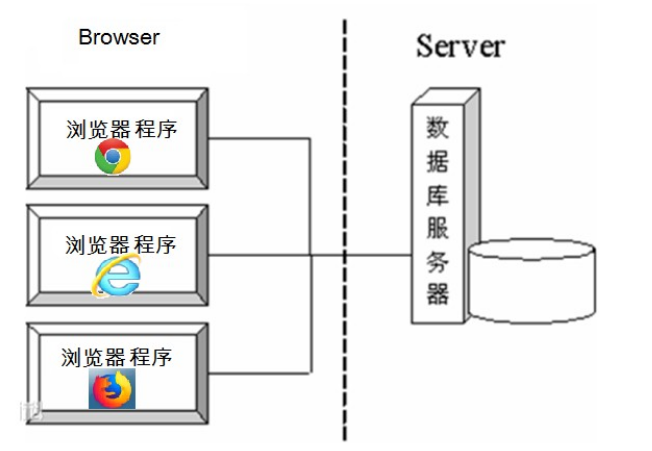
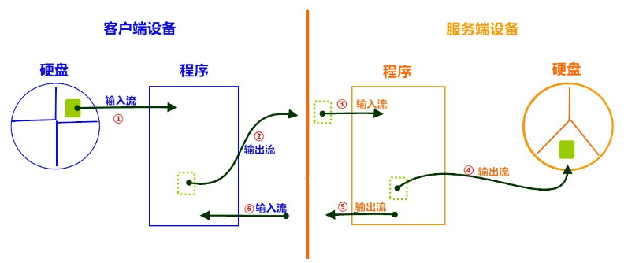

# day14【网络编程和NIO】

## 今日内容

- 网络编程三要素
- TCP通信
- 文件上传
- 模拟B/S
- NIO


## 教学目标

- [ ] 能够辨别UDP和TCP协议特点
- [ ] 能够说出TCP协议下两个常用类名称
- [ ] 能够编写TCP协议下字符串数据传输程序
- [ ] 能够理解TCP协议下文件上传案例
- [ ] 能够理解TCP协议下BS案例
- [ ] 能够说出NIO的优点

# 第一章 网络编程入门

## 知识点--软件结构

### 目标

- 了解软件结构

### 路径

- C/S结构
- B/S结构

### 讲解

- **C/S结构** ：全称为Client/Server结构，是指客户端和服务器结构。常见程序有ＱＱ、迅雷等软件。
- 特点: 客户端和服务器是分开的,需要下载客户端,对网络要求相对低, 开发和维护成本高,相对稳定


**B/S结构** ：全称为Browser/Server结构，是指浏览器和服务器结构。常见浏览器有谷歌、火狐等。

特点:没有客户端,只有服务器,不需要下载客户端,直接通过浏览器访问, 对网络要求相对高, 开发和维护成本低,服务器压力很大,相对不稳定



两种架构各有优势，但是无论哪种架构，都离不开网络的支持。**网络编程**，就是在一定的协议下，实现两台计算机的通信的程序。

### 小结

- **网络编程**，就是在一定的协议下，实现两台计算机的通信的程序。

## 知识点--网络编程三要素

### 目标

- 理解网络编程三要素

### 路径

- 协议
- IP地址
- 端口号

### 讲解

#### 协议

**网络通信协议：**通信协议是计算机必须遵守的规则，只有遵守这些规则，计算机之间才能进行通信。这就好比在道路中行驶的汽车一定要遵守交通规则一样，协议中对数据的传输格式、传输速率、传输步骤等做了统一规定，通信双方必须同时遵守，最终完成数据交换。 

`java.net` 包中提供了两种常见的网络协议的支持：

- **TCP**：传输控制协议 (Transmission Control Protocol)。TCP协议是**面向连接**的通信协议，即传输数据之前，在发送端和接收端建立逻辑连接，然后再传输数据，它提供了两台计算机之间可靠无差错的数据传输。
- **TCP协议特点: 面向连接,传输数据安全,传输速度低**
- 例如: 村长发现张三家的牛丢了    
- TCP协议:  村长一定要找到张三,面对面的告诉他他家的牛丢了    打电话: 电话一定要接通,并且是张三接的
  - 连接三次握手：TCP协议中，在发送数据的准备阶段，客户端与服务器之间的三次交互，以保证连接的可靠。
    - 第一次握手，客户端向服务器端发出连接请求，等待服务器确认。  
    - 第二次握手，服务器端向客户端回送一个响应，通知客户端收到了连接请求。
    - 第三次握手，客户端再次向服务器端发送确认信息，确认连接。整个交互过程如下图所示。


​    完成三次握手，连接建立后，客户端和服务器就可以开始进行数据传输了。由于这种面向连接的特性，TCP协议可以保证传输数据的安全，所以**应用十分广泛，例如下载文件、浏览网页等**。

- **UDP**：用户数据报协议(User Datagram Protocol)。UDP协议是一个**面向无连接**的协议。传输数据时，不需要建立连接，不管对方端服务是否启动，**直接将数据、数据源和目的地都封装在数据包中，直接发送**。每个数据包的大小限制在64k以内。它是不可靠协议，因为无连接，所以传输速度快，但是容易丢失数据。日常应用中**,例如视频会议、QQ聊天等。**
- **UDP特点: 面向无连接,传输数据不安全,传输速度快**
- 例如: 村长发现张三家的牛丢了
- UDP协议: 村长在村里的广播站广播一下张三家的牛丢了,信息丢失,信息发布速度快

#### IP地址

- **IP地址：指互联网协议地址（Internet Protocol Address）**，俗称IP。**IP地址用来给一个网络中的计算机设备做唯一的编号**。假如我们把“个人电脑”比作“一台电话”的话，那么“IP地址”就相当于“电话号码”。

**IP地址分类 **

- IPv4：是一个32位的二进制数，通常被分为4个字节，表示成`a.b.c.d` 的形式，例如`192.168.65.100` 。其中a、b、c、d都是0~255之间的十进制整数，那么最多可以表示42亿个。

- IPv6：由于互联网的蓬勃发展，IP地址的需求量愈来愈大，但是网络地址资源有限，使得IP的分配越发紧张。有资料显示，全球IPv4地址在2011年2月分配完毕。

  为了扩大地址空间，拟通过IPv6重新定义地址空间，采用128位地址长度，每16个字节一组，分成8组十六进制数，表示成`ABCD:EF01:2345:6789:ABCD:EF01:2345:6789`，号称可以为全世界的每一粒沙子编上一个网址，这样就解决了网络地址资源数量不够的问题。

**常用命令**

- 查看本机IP地址，在控制台输入：

```java
ipconfig
```

- 检查网络是否连通，在控制台输入：

```java
ping 空格 IP地址
ping 220.181.57.216
ping www.baidu.com
```

**特殊的IP地址**

- 本机IP地址：`127.0.0.1`、`localhost` 。

#### 端口号

网络的通信，本质上是两个进程（应用程序）的通信。每台计算机都有很多的进程，那么在网络通信时，如何区分这些进程呢？

如果说**IP地址**可以唯一标识网络中的设备，那么**端口号**就可以唯一标识设备中的进程（应用程序）了。

- **端口号：用两个字节表示的整数，它的取值范围是0~65535**。其中，0~1023之间的端口号用于一些知名的网络服务和应用，普通的应用程序需要使用1024以上的端口号。**如果端口号被另外一个服务或应用所占用，会导致当前程序启动失败。**

利用`协议`+`IP地址`+`端口号` 三元组合，就可以标识网络中的进程了，那么进程间的通信就可以利用这个标识与其它进程进行交互。

### 小结

- 协议: 计算机在网络中通信需要遵守的规则,常见的有TCP,UDP协议
  - TCP: 面向连接,传输数据安全,传输速度慢
  - UDP: 面向无连接,传输数据不安全,传输速度快
- IP地址: 用来标示网络中的计算机设备
  - 分类: IPV4  IPV6
  - 本地ip地址: 127.0.0.1  localhost
- 端口号: 用来标示计算机设备中的应用程序
  - 端口号: 0--65535
  -  自己写的程序指定的端口号要是1024以上
  - **如果端口号被另外一个服务或应用所占用，会导致当前程序启动失败。**

## 知识点--InetAddress类

### 目标

- 能够通过InetAddress类获取ip地址

### 路径

- InetAddress类的概述
- InetAddress类的方法

### 讲解

#### InetAddress类的概述

- 一个该类的对象就代表一个IP地址对象。

#### InetAddress类的方法

* static InetAddress getLocalHost()   获得本地主机IP地址对象
* static InetAddress getByName(String host) 根据IP地址字符串或主机名获得对应的IP地址对象
* String getHostName();获得主机名
* String getHostAddress();获得IP地址字符串

```java
public class InetAddressDemo01 {
    public static void main(String[] args) throws Exception {
              // 获取本地ip地址对象
        InetAddress ip1 = InetAddress.getLocalHost();
        System.out.println("ip1: "+ip1);// DESKTOP-U8Q5F96/192.168.0.100

        // 获取百度ip地址对象
        InetAddress ip2 = InetAddress.getByName("www.baidu.com");
        System.out.println("ip2:"+ip2);// www.baidu.com/182.61.200.7

        // 获得本地的主机名
        String hostName = ip1.getHostName();
        System.out.println("hostName:"+hostName);// DESKTOP-U8Q5F96

        // 获得本地的ip地址
        String hostAddress = ip1.getHostAddress();
        System.out.println("hostAddress:"+hostAddress);//192.168.0.100
    }
}
```

### 小结

略

# 第二章 TCP通信程序

## 知识点--TCP协议概述

### 目标

- 我们先来了解一下TCP协议使用时需要用到的流程和方法.

### 路径

- TCP概述
- TCP协议相关的类

### 讲解

#### TCP概述

- TCP协议是面向连接的通信协议，即在传输数据前先在发送端和接收器端建立逻辑连接，然后再传输数据。它提供了两台计算机之间可靠无差错的数据传输。TCP通信过程如下图所示：


#### TCP协议相关的类

* java.net.Socket : 一个该类的对象就代表一个客户端程序。
    * Socket(String host, int port)   根据ip地址字符串和端口号创建客户端Socket对象
           * 注意事项：只要执行该方法，就会立即连接指定的服务器程序，如果连接不成功，则会抛出异常。
               如果连接成功，则表示三次握手通过。
    * `OutputStream getOutputStream();` 获得字节输出流对象
    * `InputStream getInputStream();`获得字节输入流对象
    * `void close();`关闭Socket, 会自动关闭相关的流
* java.net.ServerSocket : 一个该类的对象就代表一个服务器端程序。 
    * `ServerSocket(int port);` 根据指定的端口号开启服务器。
    * `Socket accept();` 等待客户端连接并获得与客户端关联的Socket对象  如果没有客户端连接,该方法会一直阻塞
    * `void close();`关闭ServerSocket,一般不关闭

### 小结

- TCP如何建立连接: 在客户端创建Socket对象,指定服务器ip地址和端口号,就会自动连接,如果连接成功,就表示三次握手成功,程序继续执行,如果连接失败,就会报异常
- TCP如何传输数据: 使用Socket对象获得输出流写出数据,使用Socket对象获得输入流读取数据

## 实操--TCP通信案例1

### 需求

- 客户端向服务器发送字符串数据

### 路径

* 客户端实现步骤
    * 创建客户端Socket对象并指定服务器地址和端口号
    * 调用Socket对象的getOutputStream方法获得字节输出流对象
    * 使用字节输出流对象的write方法往服务器端输出数据
    * 关闭Socket对象断开连接。
* 服务器实现步骤
    * 创建ServerSocket对象并指定端口号(相当于开启了一个服务器)
    * 调用ServerSocket对象的accept方法等待客端户连接并获得对应Socket对象
    * 调用Socket对象的getInputStream方法获得字节输入流对象
    * 调用字节输入流对象的read方法读取客户端发送的数据

### 实现

- 客户端代码实现

  ```java
  public class Client {
      public static void main(String[] args) throws Exception{
          // 创建Socket对象,指定服务器ip和端口号
          Socket socket = new Socket("127.0.0.1",6666);
          // 通过socket对象获得输出流
          OutputStream os = socket.getOutputStream();
          // 写出数据
          Scanner sc = new Scanner(System.in);
          String str = sc.nextLine();
          os.write(str.getBytes());
          // 关闭流,释放资源
          socket.close();
      }
  }
  
  ```

- 服务端代码实现

  ```java
  // 服务器
  public class Server {
      public static void main(String[] args) throws Exception{
          // 创建ServerSocket对象,并指定端口号
          ServerSocket ss = new ServerSocket(6666);
          // 调用accept()方法等待客户端连接,连接成功返回Socket对象
          Socket socket = ss.accept();
          // 通过Socket对象获得输入流
          InputStream is = socket.getInputStream();
          // 定义一个byte数组,用来存储读取到的字节数据
          byte[] bys = new byte[1024];
          int len = is.read(bys);
          // 打印数据
          System.out.println(new String(bys,0,len));
          // 关闭资源
          socket.close();
          ss.close();// 服务器一般不关闭
      }
  }
  ```

### 小结

略

## 实操--TCP通信案例2

### 需求

 - 客户端向服务器发送字符串数据,服务器回写字符串数据给客户端(模拟聊天)

### 路径

* 客户端实现步骤
  * 创建客户端Socket对象并指定服务器地址和端口号
  * 调用Socket对象的getOutputStream方法获得字节输出流对象
  * 使用字节输出流对象的write方法往服务器端输出数据
  * 调用Socket对象的getInputStream方法获得字节输入流对象
  * 调用字节输入流对象的read方法读取服务器端返回的数据
  * 关闭Socket对象断开连接。
* 服务器实现步骤
  * 创建ServerSocket对象并指定端口号(相当于开启了一个服务器)
  * 调用ServerSocket对象的accept方法等待客端户连接并获得对应Socket对象
  * 调用Socket对象的getInputStream方法获得字节输入流对象
  * 调用字节输入流对象的read方法读取客户端发送的数据
  * 调用Socket对象的getOutputStream方法获得字节输出流对象
  * 调用字节输出流对象的write方法往客户端输出数据
  * 关闭Socket和ServerSocket对象

### 实现

- TCP客户端代码

```java
/*
TCP客户端代码实现步骤
        * 创建客户端Socket对象并指定服务器地址和端口号
        * 调用Socket对象的getOutputStream方法获得字节输出流对象
        * 调用字节输出流对象的write方法往服务器端输出数据
        * 调用Socket对象的getInputStream方法获得字节输入流对象
        * 调用字节输入流对象的read方法读取服务器端返回的数据
        * 关闭Socket对象断开连接。
*/
public class Client {
    public static void main(String[] args) throws Exception{
        // 创建Socket对象,指定服务器ip和端口号
        Socket socket = new Socket("127.0.0.1",6666);
        while (true) {
            // 通过socket对象获得输出流
            OutputStream os = socket.getOutputStream();
            // 写出数据
            Scanner sc = new Scanner(System.in);
            System.out.println("请输入向服务器发送的数据:");
            String str = sc.nextLine();
            os.write(str.getBytes());

            // 通过Socket对象获得输入流
            InputStream is = socket.getInputStream();
            // 定义一个byte数组,用来存储读取到的字节数据
            byte[] bys = new byte[1024];
            int len = is.read(bys);
            // 打印数据
            System.out.println(new String(bys,0,len));
        }

        // 关闭流,释放资源
        //socket.close();
    }
}
```

- 服务端代码实现

```java
/**
    TCP服务器端代码实现步骤
        * 创建ServerSocket对象并指定端口号(相当于开启了一个服务器)
        * 调用ServerSocket对象的accept方法等待客端户连接并获得对应Socket对象
        * 调用Socket对象的getInputStream方法获得字节输入流对象
        * 调用字节输入流对象的read方法读取客户端发送的数据
        * 调用Socket对象的getOutputStream方法获得字节输出流对象
        * 调用字节输出流对象的write方法往客户端输出数据
        * 关闭Socket和ServerSocket对象
 */
public class Server {
    public static void main(String[] args) throws Exception{
        // 创建ServerSocket对象,并指定端口号
        ServerSocket ss = new ServerSocket(6666);
        // 调用accept()方法等待客户端连接,连接成功返回Socket对象
        Socket socket = ss.accept();

        while (true) {
            // 通过Socket对象获得输入流
            InputStream is = socket.getInputStream();
            // 定义一个byte数组,用来存储读取到的字节数据
            byte[] bys = new byte[1024];
            int len = is.read(bys);
            // 打印数据
            System.out.println(new String(bys,0,len));

            // 通过socket对象获得输出流
            OutputStream os = socket.getOutputStream();
            // 写出数据
            Scanner sc = new Scanner(System.in);
            System.out.println("请输入向客户端发送的数据:");
            String str = sc.nextLine();
            os.write(str.getBytes());
        }

        // 关闭资源
        //socket.close();
        //ss.close();// 服务器一般不关闭
    }
}
```

### 小结

略

# 第三章 综合案例

## 实操--文件上传案例

### 需求

- 使用TCP协议, 通过客户端向服务器上传一个文件

### 分析

1. 【客户端】输入流，从硬盘读取文件数据到程序中。
2. 【客户端】输出流，写出文件数据到服务端。
3. 【服务端】输入流，读取文件数据到服务端程序。
4. 【服务端】输出流，写出文件数据到服务器硬盘中。

5. 【服务端】获取输出流，回写数据。
6. 【客户端】获取输入流，解析回写数据。



### 实现

#### 拷贝文件

```java
public class Client {
    public static void main(String[] args) throws Exception{
        // 客户端:
        // 1.创建Socket对象,指定服务器的ip地址和端口号
        Socket socket = new Socket("127.0.0.1",7777);
        // 2.创建字节输入流对象,关联数据源文件路径
        FileInputStream fis = new FileInputStream("day14\\aaa\\4.jpg");
        // 3.通过Socket对象,获取输出流对象
        OutputStream os = socket.getOutputStream();
        // 4.定义一个字节数组,用来存储读取到的字节数据
        byte[] bys = new byte[8192];
        // 4.定义一个int类型的变量,用来存储读取到的字节个数
        int len;
        // 5.循环读取数据
        while ((len = fis.read(bys)) != -1) {
            // 6.在循环中,写出数据
            os.write(bys,0,len);
        }
        // 7.关闭流,释放资源
        fis.close();
        socket.close();
    }
}
public class Server {
    public static void main(String[] args) throws Exception{
        // 服务器:
        // 1.创建ServerSocket对象,指定服务器端口号
        ServerSocket ss = new ServerSocket(7777);
        // 2.调用accept()方法,接收客户端的请求,建立连接,返回Socket对象
        Socket socket = ss.accept();
        // 3.通过Socekt对象获取字节输入流
        InputStream is = socket.getInputStream();
        // 4.创建字节输出流对象,关联目的地文件路径
        FileOutputStream fos = new FileOutputStream("day14\\bbb\\44.jpg");
        // 5.定义一个字节数组,用来存储读取到的字节数据
        byte[] bys = new byte[8192];
        // 5.定义一个int类型的变量,用来存储读取到的字节个数
        int len;
        // 6.循环读取数据
        while ((len = is.read(bys)) != -1) {
            // 7.在循环中,写出数据
            fos.write(bys,0,len);
        }
        // 8.关闭流,释放资源
        fos.close();
        socket.close();

    }
}

```

#### 文件上传成功后服务器回写字符串数据

```java
// 客户端
public class Client {
    public static void main(String[] args) throws Exception{
        // 客户端:
        // 1.创建Socket对象,指定服务器的ip地址和端口号
        Socket socket = new Socket("127.0.0.1",7777);
        // 2.创建字节输入流对象,关联数据源文件路径
        FileInputStream fis = new FileInputStream("day14\\aaa\\5.jpg");
        // 3.通过Socket对象,获取输出流对象
        OutputStream os = socket.getOutputStream();
        // 4.定义一个字节数组,用来存储读取到的字节数据
        byte[] bys = new byte[8192];
        // 4.定义一个int类型的变量,用来存储读取到的字节个数
        int len;
        // 5.循环读取数据
        while ((len = fis.read(bys)) != -1) {
            // 6.在循环中,写出数据
            os.write(bys,0,len);
        }

        // 告诉服务器,不再写数据了
        socket.shutdownOutput();

        System.out.println("==========开始接收服务器回写的数据========");

        //7.通过Socket对象获取字节输入流
        InputStream is = socket.getInputStream();
        //8.读取服务器回写的字符串数据
        int len2 = is.read(bys);// 卡
        System.out.println(new String(bys,0,len2));

        // 9.关闭流,释放资源
        fis.close();
        socket.close();
    }
}

// 服务器
public class Server {
    public static void main(String[] args) throws Exception{
        // 服务器:
        // 1.创建ServerSocket对象,指定服务器端口号
        ServerSocket ss = new ServerSocket(7777);
        // 2.调用accept()方法,接收客户端的请求,建立连接,返回Socket对象
        Socket socket = ss.accept();
        // 3.通过Socekt对象获取字节输入流
        InputStream is = socket.getInputStream();
        // 4.创建字节输出流对象,关联目的地文件路径
        FileOutputStream fos = new FileOutputStream("day14\\bbb\\55.jpg");
        // 5.定义一个字节数组,用来存储读取到的字节数据
        byte[] bys = new byte[8192];
        // 5.定义一个int类型的变量,用来存储读取到的字节个数
        int len;
        // 6.循环读取数据
        while ((len = is.read(bys)) != -1) {// 卡
            // 7.在循环中,写出数据
            fos.write(bys,0,len);
        }

        // 问题: 服务器一直在等待读取客户端写过来的数据,无法回写数据给客户端???
        // 原因: 服务器不知道客户端不会再写数据了
        // 解决: 客户端要告诉服务器不会再写数据了


        System.out.println("==========开始回写数据给客户端========");
        //8.通过Socket对象获取输出流
        OutputStream os = socket.getOutputStream();
        //9.写出字符串数据给客户端("文件上传成功!")
        os.write("文件上传成功!".getBytes());
        // 10.关闭流,释放资源
        fos.close();
        socket.close();

    }

    
}


```

#### 优化文件上传案例

```
1.文件名固定----->优化   自动生成唯一的文件名
2.服务器只能接受一次 ----> 优化  死循环去接收请求,建立连接
3.例如:如果张三先和服务器建立连接,上传了一个2GB字节大小的文件
       李四后和服务器建立连接,上传了一个2MB字节大小的文件

       李四就必须等张三上传完毕,才能上传文件

   优化---->多线程优化
   张三上传文件,开辟一条线程
   李四上传文件,开辟一条线程
```

```java
// 服务器
public class Server {
    public static void main(String[] args) throws Exception{
        // 服务器:
        // 1.创建ServerSocket对象,指定服务器端口号
        ServerSocket ss = new ServerSocket(7777);

        while (true){
            // 2.调用accept()方法,接收客户端的请求,建立连接,返回Socket对象
            Socket socket = ss.accept();

            // 开启线程,执行文件上传的代码
            new Thread(new Runnable() {
                @Override
                public void run() {
                    FileOutputStream fos = null;
                    try{
                        // 3.通过Socekt对象获取字节输入流
                        InputStream is = socket.getInputStream();
                        // 4.创建字节输出流对象,关联目的地文件路径
                         fos = new FileOutputStream("day14\\bbb\\"+System.currentTimeMillis()+".jpg");
                        // 5.定义一个字节数组,用来存储读取到的字节数据
                        byte[] bys = new byte[8192];
                        // 5.定义一个int类型的变量,用来存储读取到的字节个数
                        int len;
                        // 6.循环读取数据
                        while ((len = is.read(bys)) != -1) {// 卡
                            // 7.在循环中,写出数据
                            fos.write(bys,0,len);
                        }

                        // 问题: 服务器一直在等待读取客户端写过来的数据,无法回写数据给客户端???
                        // 原因: 服务器不知道客户端不会再写数据了
                        // 解决: 客户端要告诉服务器不会再写数据了


                        System.out.println("==========开始回写数据给客户端========");
                        //8.通过Socket对象获取输出流
                        OutputStream os = socket.getOutputStream();
                        //9.写出字符串数据给客户端("文件上传成功!")
                        os.write("文件上传成功!".getBytes());

                    }catch (Exception e){

                    }finally {
                        // 10.关闭流,释放资源
                        try {
                            if (fos != null) {
                                fos.close();
                            }
                        } catch (IOException e) {

                        }finally {
                            try {
                                socket.close();
                            } catch (IOException e) {
                                e.printStackTrace();
                            }
                        }

                    }
                }
            }).start();
        }
    } 
}

// 客户端
public class Client {
    public static void main(String[] args) throws Exception{
        // 客户端:
        // 1.创建Socket对象,指定服务器的ip地址和端口号
        Socket socket = new Socket("127.0.0.1",7777);
        // 2.创建字节输入流对象,关联数据源文件路径
        FileInputStream fis = new FileInputStream("day14\\aaa\\5.jpg");
        // 3.通过Socket对象,获取输出流对象
        OutputStream os = socket.getOutputStream();
        // 4.定义一个字节数组,用来存储读取到的字节数据
        byte[] bys = new byte[8192];
        // 4.定义一个int类型的变量,用来存储读取到的字节个数
        int len;
        // 5.循环读取数据
        while ((len = fis.read(bys)) != -1) {
            // 6.在循环中,写出数据
            os.write(bys,0,len);
        }

        // 告诉服务器,不再写数据了
        socket.shutdownOutput();

        System.out.println("==========开始接收服务器回写的数据========");

        //7.通过Socket对象获取字节输入流
        InputStream is = socket.getInputStream();
        //8.读取服务器回写的字符串数据
        int len2 = is.read(bys);// 卡
        System.out.println(new String(bys,0,len2));

        // 9.关闭流,释放资源
        fis.close();
        socket.close();
    }
}
```

### 小结

略

## 实操--模拟B\S服务器  扩展

### 需求

- 模拟网站服务器，使用浏览器访问自己编写的服务端程序，查看网页效果。

### 分析

1. 准备页面数据，web文件夹。
2. 我们模拟服务器端，ServerSocket类监听端口，使用浏览器访问，查看网页效果

### 实现

浏览器工作原理是遇到图片会开启一个线程进行单独的访问,因此在服务器端加入线程技术。

```java
public class Demo {
    public static void main(String[] args) throws Exception {
        // 通过读取浏览器端的请求信息,获取浏览器需要访问的页面的路径
        // 1.创建ServerSocket对象,指定端口号为9999
        ServerSocket ss = new ServerSocket(9999);

        while (true) {
            // 2.调用accept()方法,接收请求,建立连接,返回Socket对象
            Socket socket = ss.accept();

            new Thread(new Runnable() {
                @Override
                public void run() {
                    try {
                        // 3.通过返回的Socket对象获取字节输入流,关联连接通道
                        InputStream is = socket.getInputStream();

                        // 4.把字节输入流转换为字符输入流
                        InputStreamReader isr = new InputStreamReader(is);

                        // 5.创建字符缓冲输入流
                        BufferedReader br = new BufferedReader(isr);

                        // 6.使用字符缓冲输入流读取第一行数据
                        String line = br.readLine();

                        // 7.使用空格对读取到的第一行数据进行分割
                        String[] arr = line.split(" ");

                        // 8.获取分割后数组中索引为1的元素,对其进行截取
                        String path = arr[1].substring(1);
                        System.out.println("浏览器需要访问的页面路径是:" + path);

                        // 服务器把浏览器需要访问的页面响应给浏览器
                        // 9.创建一个字节输入流,关联数据源文件路径
                        FileInputStream fis = new FileInputStream(path);

                        // 10.通过Socket对象获得输出流,关联连接通道
                        OutputStream os = socket.getOutputStream();

                        // 11.定义一个变量,用来存储读取到的字节数据
                        byte[] bys = new byte[8192];
                        int len;

                        // 响应页面的时候需要同时把以下响应过去给浏览器
                        os.write("HTTP/1.1 200 OK\r\n".getBytes());
                        os.write("Content-Type:text/html\r\n".getBytes());
                        os.write("\r\n".getBytes());


                        // 12.循环读取
                        while ((len = fis.read(bys)) != -1) {
                            // 13.在循环中,写出数据给浏览器
                            os.write(bys, 0, len);
                        }

                        // 关闭Socket对象,释放资源
                        fis.close();
                        socket.close();
                    } catch (IOException e) {

                    }
                }
            }).start();
        }
    }

    /**
     * 1.读取到浏览器端的请求信息
     *
     * @return
     * @throws IOException
     */
    private static Socket method01() throws IOException {
        //  1.读取到浏览器端的请求信息
        // 1.1 创建ServerSocket对象,指定端口号为9999
        ServerSocket ss = new ServerSocket(9999);
        // 1.2 调用accept()方法,接收请求,建立连接,返回Socket对象
        Socket socket = ss.accept();
        // 1.3 通过返回的Socket对象获取输入流,关联连接通道
        InputStream is = socket.getInputStream();
        // 1.4 使用输入流去读取数据
        byte[] bys = new byte[8192];
        int len = is.read(bys);
        // 1.5 打印读取到的数据
        System.out.println(new String(bys, 0, len));
        /*
            GET /day12/web/index.html HTTP/1.1
            Host: localhost:9999
            Connection: keep-alive
            Cache-Control: max-age=0
            Upgrade-Insecure-Requests: 1
            User-Agent: Mozilla/5.0 (Windows NT 6.1; Win64; x64) AppleWebKit/537.36 (KHTML, like Gecko) Chrome/78.0.3904.108 Safari/537.36
            Sec-Fetch-User: ?1
            Accept: text/html,application/xhtml+xml,application/xml;q=0.9,image/webp,image/apng,**;q=0.8,application/signed-exchange;v=b3
                    Sec-Fetch-Site: none
                    Sec-Fetch-Mode: navigate
                    Accept-Encoding: gzip, deflate, br
                    Accept-Language: zh-CN,zh;q=0.9
                    Cookie: Idea-7071e3d8=cc177568-5581-4562-aeac-26fcb6ca7e56
         */
        return socket;
    }
}

```

**访问效果：**


**图解：**


### 小结

略

# 第四章 NIO

## 知识点--NIO概述

### 目的

- 了解NIO的概述

### 路径

- 同步和异步
- 阻塞和非阻塞

### 讲解

在我们学习Java的NIO流之前，我们都要了解几个关键词

- 同步与异步（synchronous/asynchronous）：**同步**是一种可靠的有序运行机制，当我们进行同步操作时，后续的任务是等待当前调用返回，才会进行下一步；而**异步**则相反，其他任务不需要等待当前调用返回，通常依靠事件、回调等机制来实现任务间次序关系
  - 同步: 调用方法之后,必须要得到一个返回值       例如: 买火车票,一定要买到票,才能继续下一步    
  - 异步: 调用方法之后,不需要有返回值,但是会有回调函数,回调函数指的是满足条件之后会自动执行的方法   例如: 买火车票, 不一定要买到票,我可以交代售票员,当有票的话,你就帮我出张票
- 阻塞与非阻塞：在进行**阻塞**操作时，当前线程会处于阻塞状态，无法从事其他任务，只有当条件就绪才能继续，比如ServerSocket新连接建立完毕，或者数据读取、写入操作完成；而**非阻塞**则是不管IO操作是否结束，直接返回，相应操作在后台继续处理
  - 阻塞:如果没有达到方法的目的,就会一直停在那里(等待) ,  例如: ServerSocket的accept()方法
  - 非阻塞: 不管方法有没有达到目的,都直接往下执行(不等待)
- IO: 同步阻塞
- NIO: 同步非阻塞
- AIO: 异步非阻塞

**在Java1.4之前的I/O系统中**，提供的都是面向流的I/O系统，系统一次一个字节地处理数据，一个输入流产生一个字节的数据，一个输出流消费一个字节的数据，**面向流的I/O速度非常慢**，而在**Java 1.4中推出了NIO**，这是一个**面向块的I/O系统，系统以块的方式处理数据**，每一个操作在一步中产生或者消费一个数据，按块处理要比按字节处理数据快的多。

**在 Java 7 中，NIO 有了进一步的改进，也就是 NIO 2\AIO，引入了异步非阻塞 IO 方式，也有很多人叫它 AIO（Asynchronous IO）**。异步 IO 操作基于事件和回调机制，可以简单理解为，应用操作直接返回，而不会阻塞在那里，当后台处理完成，操作系统会通知相应线程进行后续工作。

NIO之所以是同步，是因为它的accept/read/write方法的内核I/O操作都会阻塞当前线程

首先，我们要先了解一下NIO的三个主要组成部分：**Buffer（缓冲区）、Channel（通道）、Selector（选择器）**

### 小结

- Buffer（缓冲区）、Channel（通道）、Selector（选择器）是NIO的三个部分
- NIO是在访问个数特别大的时候才使用的 , 比如流行的软件或者流行的游戏中会有高并发和大量连接.

# 第三章 Buffer类（缓冲区）

## 知识点--Buffer的概述和分类

### 目标

- 了解Buffer概述

### 路径

- Buffer的概述
- Buffer的分类

### 讲解

 概述:Buffer是一个对象，它是对某种基本类型的数组进行了封装。  

作用: 在NIO中，就是通过 Buffer 来读写数据的。所有的数据都是用Buffer来处理的，它是NIO读写数据的中转池, 通常使用字节数组。

Buffer主要有如下几种：

- ByteBuffer
- CharBuffer
- DoubleBuffer
- FloatBuffer
- IntBuffer
- LongBuffer
- ShortBuffer

### 小结

略

## 知识点--创建ByteBuffer

### 目标

- 掌握创建ByteBuffer对象

### 路径

- 创建ByteBuffer对象的三种方式

### 讲解

- ByteBuffer类内部封装了一个byte[]数组，并可以通过一些方法对这个数组进行操作。

- 创建ByteBuffer对象

  - 方式一：在堆中创建缓冲区：allocate(int capacity)
  - 方式二: 在系统内存创建缓冲区：allocatDirect(int capacity)
  - 方式三：通过数组创建缓冲区：wrap(byte[] arr)
  
- 案例演示:

  - 方式一：在堆中创建缓冲区：allocate(int capacity)

    ```java
    public static void main(String[] args) {
        	//创建堆缓冲区
            ByteBuffer byteBuffer = ByteBuffer.allocate(10);
    }
    ```

    

  - 方式二: 在系统内存创建缓冲区：allocatDirect(int capacity)

    ```java
    public static void main(String[] args) {
        	//创建直接缓冲区
            ByteBuffer byteBuffer = ByteBuffer.allocateDirect(10);
    }
    ```

    - 在堆中创建缓冲区称为：间接缓冲区
    - 在系统内存创建缓冲区称为：直接缓冲区

    - 间接缓冲区的创建和销毁效率要高于直接缓冲区
    - 间接缓冲区的工作效率要低于直接缓冲区

- 方式三：通过数组创建缓冲区：wrap(byte[] arr)

  ```java
     public static void main(String[] args) {
            byte[] byteArray = new byte[10];
            ByteBuffer byteBuffer = ByteBuffer.wrap(byteArray);
     }
  ```

  - 此种方式创建的缓冲区为：间接缓冲区

### 小结

略

## 知识点--添加数据-put

### 目标

- 掌握添加数据-put方法的使用

### 路径

- 添加数据-put方法的使用

### 讲解

- public ByteBuffer put(byte b)：向当前可用位置添加数据。

- public ByteBuffer put(byte[] byteArray)：向当前可用位置添加一个byte[]数组

- public ByteBuffer put(byte[] byteArray,int offset,int len)：添加一个byte[]数组的一部分

  ```java
  public static void main(String[] args) {
          yteBuffer b1 = ByteBuffer.allocate(10);
          // 添加数据
          b1.put((byte)11);
          b1.put((byte)12);
          b1.put((byte)13);
  
          // ByteBuffer转换为普通字节数组
          byte[] bytes = b1.array();
          System.out.println(Arrays.toString(bytes));
          // 打印结果: [11, 12, 13, 0, 0, 0, 0, 0, 0, 0]
  }
  ```

  ```java
  public class Test_添加数据 {
      public static void main(String[] args) {
          ByteBuffer b1 = ByteBuffer.allocate(10);
          // 添加数据
          b1.put((byte)11);
          b1.put((byte)12);
          b1.put((byte)13);
  
          // ByteBuffer转换为普通字节数组
          byte[] bytes = b1.array();
          System.out.println(Arrays.toString(bytes));
          //打印结果: [11, 12, 13, 0, 0, 0, 0, 0, 0, 0]
  
          System.out.println("=======================");
          byte[] b2 = {14,15,16};
          // 添加数据
          b1.put(b2);
          // ByteBuffer转换为普通字节数组
          byte[] b = b1.array();
          System.out.println(Arrays.toString(b));
          //打印结果: [11, 12, 13, 14, 15, 16, 0, 0, 0, 0]
      }
  }
  
  ```

  ```java
  public class Test_添加数据 {
      public static void main(String[] args) {
          ByteBuffer b1 = ByteBuffer.allocate(10);
          // 添加数据
          b1.put((byte)11);
          b1.put((byte)12);
          b1.put((byte)13);
  
          // ByteBuffer转换为普通字节数组
          byte[] bytes = b1.array();
          System.out.println(Arrays.toString(bytes));
          // 打印结果: [11, 12, 13, 0, 0, 0, 0, 0, 0, 0]
  
          System.out.println("=======================");
          byte[] b2 = {14,15,16};
          // 添加数据
          b1.put(b2,0,1);
          // ByteBuffer转换为普通字节数组
          byte[] b = b1.array();
          System.out.println(Arrays.toString(b));
          // 打印结果: [11, 12, 13, 14, 0, 0, 0, 0, 0, 0]
      }
  }
  ```


### 小结

略

## 知识点--容量-capacity

### 目标

- 掌握容量-capacity方法的使用

### 路径

- 容量-capacity方法的使用

### 讲解

- Buffer的容量(capacity)是指：Buffer所能够包含的元素的最大数量。定义了Buffer后，容量是不可变的。

- 示例代码：

  ```java
  public static void main(String[] args) {
      ByteBuffer b1 = ByteBuffer.allocate(10);
      System.out.println("容量：" + b1.capacity());//10。之后不可改变
  
      byte[] byteArray = {97, 98, 99, 100};
      ByteBuffer b2 = ByteBuffer.wrap(byteArray);
      System.out.println("容量：" + b2.capacity());//4。之后不可改变
  }
  ```

- 结果：

  ```java
  容量：10
  容量：4
  ```

### 小结

略

## 知识点--限制-limit

### 目标

- 掌握限制-limit方法的使用

### 路径

- 限制-limit方法的使用

### 讲解

- 限制limit是指：第一个不应该读取或写入元素的index索引。缓冲区的限制(limit)不能为负，并且不能大于容量。

- 有两个相关方法：

  - public int limit()：获取此缓冲区的限制。
  - public Buffer limit(int newLimit)：设置此缓冲区的限制。

- 示例代码：

  ```java
  public class Test_添加数据 {
      public static void main(String[] args) {
          ByteBuffer b1 = ByteBuffer.allocate(10);
          // 添加数据
          b1.put((byte)10);
  
          // 获取限制
          int limit1 = b1.limit();
          System.out.println("limit1:"+limit1);// 10
  
          // 设置限制
          b1.limit(3);
  
          // 添加元素
          b1.put((byte)20);
        b1.put((byte)30);
          // b1.put((byte)40);// 报异常,因为限制位置索引为3,所以再存14就会报异常:BufferOverflowException
  
      }
  }
  ```

  图示：

  

### 小结

略

## 知识点--位置-position

### 目标

- 掌握位置-position方法的使用

### 路径

- 位置-position方法的使用

### 讲解

- 位置position是指：当前可写入的索引。位置不能小于0，并且不能大于"限制"。

- 有两个相关方法：

  - public int position()：获取当前可写入位置索引。
  - public Buffer position(int p)：更改当前可写入位置索引。

- 示例代码：

  ```java
  public class Test_添加数据 {
      public static void main(String[] args) {
          ByteBuffer b1 = ByteBuffer.allocate(10);
          // 添加数据
          b1.put((byte)11);
  
          // 获取当前位置索引
          int position = b1.position();
          System.out.println("position:"+position);// 1
  
          // 设置当前位置索引
          b1.position(5);
  
          b1.put((byte)22);
          b1.put((byte)33);
          System.out.println("position:"+b1.position());// 7
          System.out.println(Arrays.toString(b1.array()));
          // 打印结果:[11, 0, 0, 0, 0, 22, 33, 0, 0, 0]
      }
  }
  ```

### 小结

略

## 知识点--标记-mark

### 目标

- 掌握标记-mark方法的使用

### 路径

- 标记-mark方法的使用

### 讲解

- 标记mark是指：当调用缓冲区的reset()方法时，会将缓冲区的position位置重置为该索引。

- 相关方法：

  - public Buffer mark()：设置此缓冲区的标记为当前的position位置。
  - public Buffer reset() : 将此缓冲区的位置重置为以前标记的位置。

- 示例代码：

  ```java
  public static void main(String[] args) {
          ByteBuffer b1 = ByteBuffer.allocate(10);
          // 添加数据
          b1.put((byte)11);
  
          // 获取当前位置索引
          int position = b1.position();
          System.out.println("position:"+position);// 1
  
          // 标记当前位置索引
          b1.mark();
  
          // 添加元素
          b1.put((byte)22);
          b1.put((byte)33);
  
          // 获取当前位置索引
          System.out.println("position:"+b1.position());// 3
          System.out.println(Arrays.toString(b1.array()));
          // 打印结果:[11, 22, 33, 0, 0, 0, 0, 0, 0, 0]
  
          // 重置当前位置索引
          b1.reset();
          // 获取当前位置索引
          System.out.println("position:"+b1.position());// 1
  
          // 添加元素
          b1.put((byte)44);
          System.out.println(Arrays.toString(b1.array()));
          // 打印结果:[11, 44, 33, 0, 0, 0, 0, 0, 0, 0]
  
      }
  ```

### 小结

-略

## 知识点--其它方法

### 目标

- 了解其它方法方法的使用

### 路径

-  其它方法的使用

### 讲解

```java
- public int remaining()：获取position与limit之间的元素数。
- public boolean isReadOnly()：获取当前缓冲区是否只读。
- public boolean isDirect()：获取当前缓冲区是否为直接缓冲区。
- public Buffer rewind()：重绕此缓冲区。
  - 将position位置设置为：0
  - 限制limit不变。
  - 丢弃标记。
- public Buffer clear()：还原缓冲区的状态。
  - 将position设置为：0
  - 将限制limit设置为容量capacity；
  - 丢弃标记mark。
- public Buffer flip()：缩小limit的范围。
  - 将limit设置为当前position位置；
  - 将当前position位置设置为0；
  - 丢弃标记。
```


```java
public static void main(String[] args) {
        //创建对象
        ByteBuffer buffer = ByteBuffer.allocate(10);

        //添加元素
        buffer.put((byte)11);
        buffer.put((byte)22);
        buffer.put((byte)33);

        //限制
        buffer.limit(6);

        //容量是10 位置是3 限制是6
        System.out.println("容量是" + buffer.capacity() + " 位置是" + buffer.position() + " 限制是" + buffer.limit());
        

        //还原
        buffer.clear();

        //容量是10 位置是0 限制是10
        System.out.println("容量是" + buffer.capacity() + " 位置是" + buffer.position() + " 限制是" + buffer.limit());
  }

public static void main(String[] args) {
        //创建对象
        ByteBuffer buffer = ByteBuffer.allocate(10);
        //添加元素
        buffer.put((byte)11);
        buffer.put((byte)22);
        buffer.put((byte)33);
        //限制
        buffer.limit(6);

        //容量是10 位置是3 限制是6
        System.out.println("容量是" + buffer.capacity() + " 位置是" + buffer.position() + " 限制是" + buffer.limit());

        //切换
        buffer.flip();

        //容量是10 位置是0 限制是3
        System.out.println("容量是" + buffer.capacity() + " 位置是" + buffer.position() + " 限制是" + buffer.limit());
    }
```

### 小结

略

# 第四章 Channel（通道）

## 知识点--Channel概述

### 目标

- 理解Channel 的概述和分类

### 路径

- Channel 的概述
- Channel 的分类

### 讲解

#### Channel 的概述

Channel（通道）：Channel是一个对象，可以通过它读取和写入数据, 可以把它看做是IO中的流，不同的是：Channel是双向的, Channel对象既可以调用读取的方法, 也可以调用写出的方法 。

输入流: 读

输出流: 写

Channel: 读,写

#### Channel 的分类

在Java NIO中的Channel主要有如下几种类型：

- FileChannel：从文件读取数据的       输入流和输出流
- DatagramChannel：读写UDP网络协议数据   DatagramPackge
- SocketChannel：读写TCP网络协议数据      Socket
- ServerSocketChannel：可以监听TCP连接    ServerSocket

### 小结

略

## 知识点--FileChannel类的基本使用

### 目标

- 使用FileChannel类完成文件的复制

### 路径

- 获取FileChannel类的对象
- 使用FileChannel类完成文件的复制

### 讲解

#### 获取FileChannel类的对象

- java.nio.channels.FileChannel (抽象类)：用于读、写文件的通道。

- FileChannel是抽象类，我们可以通过FileInputStream和FileOutputStream的getChannel()方法方便的获取一个它的子类对象。

  ```java
  FileInputStream fi=new FileInputStream(new File(src));
  FileOutputStream fo=new FileOutputStream(new File(dst));
  //获得传输通道channel
  FileChannel inChannel=fi.getChannel();
  FileChannel outChannel=fo.getChannel();
  ```

#### 使用FileChannel类完成文件的复制

- 我们将通过CopyFile这个示例让大家体会NIO的操作过程。CopyFile执行三个基本的操作：创建一个Buffer，然后从源文件读取数据到缓冲区，然后再将缓冲区写入目标文件。

```java
 public static void main(String[] args) throws Exception{
        FileInputStream fis = new FileInputStream("day19\\aaa\\a.txt");
        FileOutputStream fos = new FileOutputStream("day19\\aaa\\aCopy1.txt");
        // 获得FileChannel管道对象
        FileChannel c1 = fis.getChannel();
        FileChannel c2 = fos.getChannel();

        // 创建ByteBuffer数组
        ByteBuffer b = ByteBuffer.allocate(1000);

        // 循环读取数据
        while ((c1.read(b)) != -1){// 读取的字节会填充postion到limit位置之间
            // 重置 postion为0,limit为postion的位置
            b.flip();
            // 写出数据
            c2.write(b);// 会把postion到limit之间的数据写出
            // 还原
            b.clear();// positon为:0  limit为: capacity 用于下次读取
        }

        // 释放资源
        c2.close();
        c1.close();
        fos.close();
        fis.close();

        /*byte[] bys = new byte[8192];
        int len;
        while ((len = fis.read(bys)) != -1){
            fos.write(bys,0,len);
        }
        fos.close();
        fis.close();*/
    }
```

### 小结

略

## 知识点--FileChannel结合MappedByteBuffer实现高效读写

### 目标

- MappedByteBuffer类的使用

### 路径

- MappedByteBuffer类的概述
- FileChannel结合MapppedByteBuffer复制2G以下文件
- FileChannel结合MapppedByteBuffer复制2G以上文件

### 讲解

#### MappedByteBuffer类的概述

- 上例直接使用FileChannel结合ByteBuffer实现的管道读写，但并不能提高文件的读写效率。

- ByteBuffer有个抽象子类：MappedByteBuffer，它可以将文件直接映射至内存，**把硬盘中的读写变成内存中的读写,** 所以可以提高大文件的读写效率。

- 可以调用FileChannel的map()方法获取一个MappedByteBuffer，map()方法的原型：

  ​		**MappedByteBuffer map(MapMode mode, long position, long size);** 

  ​		**说明：将节点中从position开始的size个字节映射到返回的MappedByteBuffer中。**

#### 复制2GB以下的文件

- 复制d:\\b.rar文件，此文件大概600多兆，复制完毕用时不到2秒。此例不能复制大于2G的文件，因为map的第三个参数被限制在Integer.MAX_VALUE(字节) = 2G。

```java
public static void main(String[] args) throws Exception{
        //java.io.RandomAccessFile类，可以设置读、写模式的IO流类。
        //"r"表示：只读--输入流，只读就可以。
        RandomAccessFile r1 = new RandomAccessFile("day19\\aaa\\a.txt","r");
        //"rw"表示：读、写--输出流，需要读、写。
        RandomAccessFile r2 = new RandomAccessFile("day19\\aaa\\aCopy2.txt","rw");

        // 获得FileChannel管道对象
        FileChannel c1 = r1.getChannel();
        FileChannel c2 = r2.getChannel();

        // 获取文件的大小
        long size = c1.size();

        // 直接把硬盘中的文件映射到内存中
        MappedByteBuffer b1 = c1.map(FileChannel.MapMode.READ_ONLY, 0, size);
        MappedByteBuffer b2 = c2.map(FileChannel.MapMode.READ_WRITE, 0, size);

        // 循环读取数据
        for (long i = 0; i < size; i++) {
            // 读取字节
            byte b = b1.get();
            // 保存到第二个数组中
            b2.put(b);
        }
        // 释放资源
        c2.close();
        c1.close();
        r2.close();
        r1.close();
    }
```

- 代码说明：

- map()方法的第一个参数mode：映射的三种模式，在这三种模式下得到的将是三种不同的MappedByteBuffer：三种模式都是Channel的内部类MapMode中定义的静态常量，这里以FileChannel举例：
  1). **FileChannel.MapMode.READ_ONLY**：得到的镜像只能读不能写（只能使用get之类的读取Buffer中的内容）；

  2). **FileChannel.MapMode.READ_WRITE**：得到的镜像可读可写（既然可写了必然可读），对其写会直接更改到存储节点；

  3). **FileChannel.MapMode.PRIVATE**：得到一个私有的镜像，其实就是一个(position, size)区域的副本罢了，也是可读可写，只不过写不会影响到存储节点，就是一个普通的ByteBuffer了！！

- 为什么使用RandomAccessFile？

  1). 使用InputStream获得的Channel可以映射，使用map时只能指定为READ_ONLY模式，不能指定为READ_WRITE和PRIVATE，否则会抛出运行时异常！

  2). 使用OutputStream得到的Channel不可以映射！并且OutputStream的Channel也只能write不能read！

  3). 只有RandomAccessFile获取的Channel才能开启任意的这三种模式！

#### 复制2GB以上的文件

- 下例使用循环，将文件分块，可以高效的复制大于2G的文件

```java
    public static void main(String[] args) throws Exception{
        //java.io.RandomAccessFile类，可以设置读、写模式的IO流类。
        //"r"表示：只读--输入流，只读就可以。
        RandomAccessFile r1 = new RandomAccessFile("H:\\课堂资料.zip","r");
        //"rw"表示：读、写--输出流，需要读、写。
        RandomAccessFile r2 = new RandomAccessFile("H:\\课堂资料2.zip","rw");

        // 获得FileChannel管道对象
        FileChannel c1 = r1.getChannel();
        FileChannel c2 = r2.getChannel();

        // 获取文件的大小
        long size = c1.size();

        // 每次期望复制500M
        int everySize = 1024*1024*500;

        // 总共需要复制多少次
        long count = size % everySize == 0 ? size/everySize : size/everySize+1;

        // 开始复制
        for (long i = 0; i < count; i++) {
            // 每次开始复制的位置
            long start = everySize*i;

            // 每次复制的实际大小
            long trueSize = size - start > everySize ? everySize : size - start;

            // 直接把硬盘中的文件映射到内存中
            MappedByteBuffer b1 = c1.map(FileChannel.MapMode.READ_ONLY, start, trueSize);
            MappedByteBuffer b2 = c2.map(FileChannel.MapMode.READ_WRITE, start, trueSize);

            // 循环读取数据
            for (long j = 0; j < trueSize; j++) {
                // 读取字节
                byte b = b1.get();
                // 保存到第二个数组中
                b2.put(b);
            }
        }

        // 释放资源
        c2.close();
        c1.close();
        r2.close();
        r1.close();
        
    }
```

### 小结

略

## 知识点--ServerSocketChannel和SocketChannel创建连接

### 目标

- ServerSocketChannel和SocketChannel创建连接

### 路径

- SocketChannel创建连接
- ServerSocketChanne创建连接

### 讲解

#### SocketChannel创建连接

- 客户端：SocketChannel类用于连接的客户端，它相当于：Socket。

  1). 先调用SocketChannel的open()方法打开通道：

  ```java
  SocketChannel socket = SocketChannel.open()
  ```

    2). 调用SocketChannel的实例方法connect(SocketAddress add)连接服务器：

  ```java
   socket.connect(new InetSocketAddress("localhost", 8888));
  ```

  示例：客户端连接服务器：

  ```java
  public class Client {
      public static void main(String[] args) throws Exception {
          SocketChannel socket = SocketChannel.open();
          socket.connect(new InetSocketAddress("localhost", 8888));
  		  System.out.println("后续代码......");
          
      }
  }
  ```

#### ServerSocketChanne创建连接

- **服务器端：ServerSocketChannel**类用于连接的服务器端，它相当于：ServerSocket。

- 调用ServerSocketChannel的静态方法open()就可以获得ServerSocketChannel对象, 但并没有指定端口号, 必须通过其套接字的bind方法将其绑定到特定地址，才能接受连接。

  ```java
  ServerSocketChannel serverChannel = ServerSocketChannel.open()
  ```

- 调用ServerSocketChannel的实例方法bind(SocketAddress add)：绑定本机监听端口，准备接受连接。

  ​      注：java.net.SocketAddress(抽象类)：代表一个Socket地址。

  ​              我们可以使用它的子类：java.net.InetSocketAddress(类)

  ​			  构造方法：InetSocketAddress(int port)：指定本机监听端口。

  ```java
  serverChannel.bind(new InetSocketAddress(8888));
  ```

- 调用ServerSocketChannel的实例方法accept()：等待连接。

  ```java
  SocketChannel accept = serverChannel.accept();
  System.out.println("后续代码...");
  ```

  示例：服务器端等待连接(默认-阻塞模式)

  ```java
  public class Server {
      public static void main(String[] args) throws Exception{
          ServerSocketChannel serverChannel = ServerSocketChannel.open();
          serverChannel.bind(new InetSocketAddress(8888));
          System.out.println("【服务器】等待客户端连接...");
          SocketChannel accept = serverChannel.accept();
          System.out.println("后续代码......");
      }
  }
  ```

  运行后结果：

  ```java
  【服务器】等待客户端连接...
  ```

- **我们可以通过ServerSocketChannel的configureBlocking(boolean b)方法设置accept()是否阻塞**

  ```java
  public class Server {
      public static void main(String[] args) throws Exception {
          ServerSocketChannel ssc = ServerSocketChannel.open();
          ssc.bind(new InetSocketAddress(8888));
          System.out.println("【服务器】等待客户端连接...");
          //设置非阻塞连接
          ssc.configureBlocking(false);// 写成false叫非阻塞, 写成true叫阻塞
          
           while(true) {
                //获取客户端连接
                SocketChannel sc = ssc.accept();
  
                if(sc != null){
                    //不等于null说明连接上了客户端
                    System.out.println("连接上了。。");
                    //读取数据操作
                    break;
                }else{
                    //没连接上客户端
                    System.out.println("打会儿游戏~");
                    Thread.sleep(2000);
                }
            }
      }
  }
  ```

  运行后结果：

  ```java
  【服务器】等待客户端连接...
  打会儿游戏~
  有客户端来了就输出: 连接上了。。
  ```

### 小结

略

## 知识点--NIO网络编程收发信息

### 目标

- 使用ServerSocketChannel代替之前的ServerSocket，来完成网络编程的收发数据。

### 路径

- 书写服务器代码
- 书写客户端代码

### 讲解

#### 书写服务器代码

```java
public class Server {
    public static void main(String[] args)  throws IOException{
		//创建对象
        //ServerSocket ss = new ServerSocket(8888);

        //创建
        ServerSocketChannel ssc = ServerSocketChannel.open();
        //服务器绑定端口
        ssc.bind(new InetSocketAddress(8888));

        //连接上客户端
        SocketChannel sc = ssc.accept();
       
        //服务器端接受数据
        //创建数组
        ByteBuffer buffer = ByteBuffer.allocate(1024);
        //接收数据
        int len = sc.read(buffer);
        //打印结构
        System.out.println(new String(buffer.array(),0,len));

        //关闭资源
        sc.close();
    }
}
```

#### 书写客户端代码

```java
public class Client {
    public static void main(String[] args) {
        //创建对象
        //Socket s = new Socket("127.0.0.1",8888);

        //创建对象
        SocketChannel sc = SocketChannel.open();
        //连接服务器
        sc.connect(new InetSocketAddress("127.0.0.1",8888));

        //客户端发数据
        //创建数组
        ByteBuffer buffer = ByteBuffer.allocate(1024);
        //数组中添加数据
        buffer.put("你好啊~".getBytes());
        //切换
        buffer.flip();
        //发出数据
        sc.write(buffer);

        //关流
        sc.close();
    }
}

```

### 小结

略

# 第五章 Selector(选择器)

## 知识点--多路复用的概念

### 目标

- 了解多路复用的概念

### 路径

- 服务器端的非多路复用效果
- 服务器端的多路复用效果

### 讲解

选择器Selector是NIO中的重要技术之一。它与SelectableChannel联合使用实现了非阻塞的多路复用。使用它可以节省CPU资源，提高程序的运行效率。

**"多路"是指：服务器端同时监听多个“端口”的情况。每个端口都要监听多个客户端的连接。**

- 服务器端的非多路复用效

  

  **如果不使用“多路复用”，服务器端需要开很多线程处理每个端口的请求。如果在高并发环境下，造成系统性能下降。**

- 服务器端的多路复用效果

  

  **使用了多路复用，只需要一个线程就可以处理多个通道，降低内存占用率，减少CPU切换时间，在高并发、高频段业务环境下有非常重要的优势**

### 小结

- 多路复用的意思就是一个Selector可以监听多个服务器端口。

## 知识点--选择器Selector的获取和注册

### 目标

- 理解Selector的作用以及基本使用

### 路径

- Selector选择器的概述和作用
- Selector选择器的获取
- 注册Channel到Selector

### 讲解

#### Selector选择器的概述和作用

**概述:** Selector被称为：选择器，也被称为：多路复用器，可以把多个Channel注册到一个Selector选择器上, 那么就可以实现利用一个线程来处理这多个Channel上发生的事件，并且能够根据事件情况决定Channel读写。这样，通过一个线程管理多个Channel，就可以处理大量网络连接了, 减少系统负担, 提高效率。因为线程之间的切换对操作系统来说代价是很高的，并且每个线程也会占用一定的系统资源。所以，对系统来说使用的线程越少越好。

**作用:** 一个Selector可以监听多个Channel发生的事件, 减少系统负担 , 提高程序执行效率 . 

#### Selector选择器的获取

```java
Selector selector = Selector.open();
```

#### 注册Channel到Selector

通过调用 channel.register(Selector sel, int ops)方法来实现注册：

```java
channel.configureBlocking(false);// 设置非阻塞
SelectionKey key =channel.register(selector,SelectionKey.OP_READ);
```

**register()方法的第二个参数：**是一个int值，意思是在**通过Selector监听Channel时对什么事件感兴趣**。可以监听四种不同类型的事件，而且可以使用SelectionKey的四个常量表示：

 1. 连接就绪--常量：SelectionKey.OP_CONNECT

 2. 接收就绪--常量：SelectionKey.OP_ACCEPT      (ServerSocketChannel在注册时只能使用此项)

 3. 读就绪--常量：SelectionKey.OP_READ

 4. 写就绪--常量：SelectionKey.OP_WRITE

    **注意：对于ServerSocketChannel在注册时，只能使用OP_ACCEPT，否则抛出异常。**

- 案例演示; 监听一个通道

  ```java
  public class Test1 {
      public static void main(String[] args) throws Exception{
          /*
              - Selector选择器的概述和作用
                  概述: Selector被称为：选择器，也被称为：多路复用器，可以把多个Channel注册到一个Selector选择器上,
                        那么就可以实现利用一个线程来处理这多个Channel上发生的事件，并且能够根据事件情况决定Channel读写。
                  作用: 一个Selector可以监听多个Channel发生的事件, 减少系统负担 , 提高程序执行效率 .
  
              - Selector选择器的获取
                    通过Selector.open()来获取Selector选择器对象
              - 注册Channel到Selector
                  通过Channel的register(Selector sel, int ops)方法把Channel注册到指定的选择器上
                  参数1: 表示选择器
                  参数2: 选择器要监听Channel的什么事件
                 注意:
                   1.对于ServerSocketChannel在注册时，只能使用OP_ACCEPT，否则抛出异常。
                   2.ServerSocketChannel要设置成非阻塞
           */
          // 获取ServerSocketChannel服务器通道对象
          ServerSocketChannel ssc1 = ServerSocketChannel.open();
          // 绑定端口号
          ssc1.bind(new InetSocketAddress(7777));
  
          // 设置非阻塞
          ssc1.configureBlocking(false);
  
          // 获取Selector选择器对象
          Selector selector = Selector.open();
  
          // 把服务器通道的accept()交给选择器来处理
          // 注册Channel到Selector选择器上
          ssc1.register(selector, SelectionKey.OP_ACCEPT);
      }
  }
  ```

- 示例：服务器创建3个通道，同时监听3个端口，并将3个通道注册到一个选择器中

~~~java
public class Test2 {
    public static void main(String[] args) throws Exception{
        /*
            把多个Channel注册到一个选择器上
         */
        // 获取ServerSocketChannel服务器通道对象
        ServerSocketChannel ssc1 = ServerSocketChannel.open();
        // 绑定端口号
        ssc1.bind(new InetSocketAddress(7777));

        // 获取ServerSocketChannel服务器通道对象
        ServerSocketChannel ssc2 = ServerSocketChannel.open();
        // 绑定端口号
        ssc2.bind(new InetSocketAddress(8888));


        // 获取ServerSocketChannel服务器通道对象
        ServerSocketChannel ssc3 = ServerSocketChannel.open();
        // 绑定端口号
        ssc3.bind(new InetSocketAddress(9999));


        // 设置非阻塞
        ssc1.configureBlocking(false);
        ssc2.configureBlocking(false);
        ssc3.configureBlocking(false);

        // 获取Selector选择器对象
        Selector selector = Selector.open();

        // 把服务器通道的accept()交给选择器来处理
        // 注册Channel到Selector选择器上
        ssc1.register(selector, SelectionKey.OP_ACCEPT);
        ssc2.register(selector,SelectionKey.OP_ACCEPT);
        ssc3.register(selector,SelectionKey.OP_ACCEPT);
    }
}
~~~

接下来，就可以通过选择器selector操作三个通道了。

### 小结

略

## 知识点--Selector的常用方法

### 目标

- Selector的常用方法

### 路径

- Selector的select()方法
- Selector的selectedKeys()方法
- Selector的keys()方法

### 讲解

#### Selector的select()方法:

- 作用:  服务器等待客户端连接的方法

- 阻塞问题:

  - 在连接到第一个客户端之前,会一直阻塞
  - 当连接到客户端后,如果客户端没有被处理,该方法会计入不阻塞状态
  - 当连接到客户端后,如果客户端有被处理,该方法又会进入阻塞状态

  ```java
  public class Server1 {
      public static void main(String[] args) throws Exception {
          /*
              - Selector的select()方法
                  作用:服务器等待客户端连接的方法
                  阻塞:
                      1.在没有客户端连接之前该方法会一直阻塞
                      2.当连接到客户端后没有被处理,该方法就会进入不阻塞状态
                      3.当连接到客户端后有被处理,该方法就会进入阻塞状态
           */
          // 获取ServerSocketChannel服务器通道对象
          ServerSocketChannel ssc1 = ServerSocketChannel.open();
          // 绑定端口号
          ssc1.bind(new InetSocketAddress(7777));
  
          // 获取ServerSocketChannel服务器通道对象
          ServerSocketChannel ssc2 = ServerSocketChannel.open();
          // 绑定端口号
          ssc2.bind(new InetSocketAddress(8888));
  
  
          // 获取ServerSocketChannel服务器通道对象
          ServerSocketChannel ssc3 = ServerSocketChannel.open();
          // 绑定端口号
          ssc3.bind(new InetSocketAddress(9999));
  
  
          // 设置非阻塞
          ssc1.configureBlocking(false);
          ssc2.configureBlocking(false);
          ssc3.configureBlocking(false);
  
          // 获取Selector选择器对象
          Selector selector = Selector.open();
  
          // 把服务器通道的accept()交给选择器来处理
          // 注册Channel到Selector选择器上
          ssc1.register(selector, SelectionKey.OP_ACCEPT);
          ssc2.register(selector, SelectionKey.OP_ACCEPT);
          ssc3.register(selector, SelectionKey.OP_ACCEPT);
  
          // 死循环一直接受客户端的连接请求
          while (true) {
              System.out.println(1);
              // 服务器等待客户端的连接
              selector.select();// 阻塞
              System.out.println(2);
  
              // 处理客户端请求的代码--->暂时看不懂,先放着
              Set<SelectionKey> keySet = selector.selectedKeys();// 存储所有被连接的服务器Channel对象
              for (SelectionKey key : keySet) {
                  ServerSocketChannel ssc = (ServerSocketChannel)key.channel();
                  SocketChannel sc = ssc.accept();
                  System.out.println("...开始处理,接受数据,代码省略...");
                  //...
              }
          }
  
      }
  }
  
  ```

#### Selector的selectedKeys()方法

- 获取已连接的所有通道集合

  ```java
  public class Server2 {
      public static void main(String[] args) throws Exception {
          /*
              - Selector的selectedKeys()方法
                  作用:  获取所有被连接的服务器Channel对象的Set集合
                         该Set集合中的元素类型是SelectionKey,该SelectionKey类其实就是对Channel的一个封装
                  如何获取被连接的服务器Channel对象:
                      遍历所有被连接的服务器Channel对象的Set集合
                      获取该集合中的SelectionKey对象
                      根据SelectionKey对象调用channel方法,获得服务器Channel对象
              - Selector的keys()方法
           */
          // 获取ServerSocketChannel服务器通道对象
          ServerSocketChannel ssc1 = ServerSocketChannel.open();
          // 绑定端口号
          ssc1.bind(new InetSocketAddress(7777));
  
          // 获取ServerSocketChannel服务器通道对象
          ServerSocketChannel ssc2 = ServerSocketChannel.open();
          // 绑定端口号
          ssc2.bind(new InetSocketAddress(8888));
  
  
          // 获取ServerSocketChannel服务器通道对象
          ServerSocketChannel ssc3 = ServerSocketChannel.open();
          // 绑定端口号
          ssc3.bind(new InetSocketAddress(9999));
  
  
          // 设置非阻塞
          ssc1.configureBlocking(false);
          ssc2.configureBlocking(false);
          ssc3.configureBlocking(false);
  
          // 获取Selector选择器对象
          Selector selector = Selector.open();
  
          // 把服务器通道的accept()交给选择器来处理
          // 注册Channel到Selector选择器上
          ssc1.register(selector, SelectionKey.OP_ACCEPT);
          ssc2.register(selector, SelectionKey.OP_ACCEPT);
          ssc3.register(selector, SelectionKey.OP_ACCEPT);
  
          // 获取所有被连接的服务器Channel对象的Set集合
          // 该Set集合中的元素类型是SelectionKey,该SelectionKey类其实就是对Channel的一个封装
          Set<SelectionKey> keySet = selector.selectedKeys();
          System.out.println("被连接的服务器对象有多少个:"+keySet.size());// 0
  
          // 死循环一直接受客户端的连接请求
          while (true) {
              System.out.println(1);
              // 服务器等待客户端的连接
              selector.select();// 阻塞
              System.out.println(2);
              System.out.println("被连接的服务器对象个数:"+keySet.size());// 有多少个客户端连接服务器成功,就打印几
  
              // 处理客户端请求的代码--->暂时看不懂,先放着
              // 获取所有被连接的服务器Channel对象的集合
              /*Set<SelectionKey> keySet = selector.selectedKeys();
              // 遍历所有被连接的服务器Channel对象,拿到每一个SelectionKey
              for (SelectionKey key : keySet) {
                  // 根据SelectionKey获取服务器Channel对象
                  ServerSocketChannel ssc = (ServerSocketChannel)key.channel();
                  // 获得客户端Channel对象
                  SocketChannel sc = ssc.accept();
                  // 处理
                  System.out.println("...开始处理,接受数据,代码省略...");
                  //...
              }*/
          }
  
      }
  }
  
  ```

  


#### Selector的keys()方法

- 获取已注册的所有通道集合

  ```java
  public class Server3 {
      public static void main(String[] args) throws Exception {
          /*
              - Selector的keys()方法
                  获取所有被注册的服务器Channel对象的Set集合
                  该Set集合中的元素类型是SelectionKey,该SelectionKey类其实就是对Channel的一个封装
           */
          // 获取ServerSocketChannel服务器通道对象
          ServerSocketChannel ssc1 = ServerSocketChannel.open();
          // 绑定端口号
          ssc1.bind(new InetSocketAddress(7777));
  
          // 获取ServerSocketChannel服务器通道对象
          ServerSocketChannel ssc2 = ServerSocketChannel.open();
          // 绑定端口号
          ssc2.bind(new InetSocketAddress(8888));
  
  
          // 获取ServerSocketChannel服务器通道对象
          ServerSocketChannel ssc3 = ServerSocketChannel.open();
          // 绑定端口号
          ssc3.bind(new InetSocketAddress(9999));
  
  
          // 设置非阻塞
          ssc1.configureBlocking(false);
          ssc2.configureBlocking(false);
          ssc3.configureBlocking(false);
  
          // 获取Selector选择器对象
          Selector selector = Selector.open();
  
          // 把服务器通道的accept()交给选择器来处理
          // 注册Channel到Selector选择器上
          ssc1.register(selector, SelectionKey.OP_ACCEPT);
          ssc2.register(selector, SelectionKey.OP_ACCEPT);
          ssc3.register(selector, SelectionKey.OP_ACCEPT);
  
          // 获取所有被连接的服务器Channel对象的Set集合
          // 该Set集合中的元素类型是SelectionKey,该SelectionKey类其实就是对Channel的一个封装
          Set<SelectionKey> keySet = selector.selectedKeys();
          System.out.println("被连接的服务器对象有多少个:"+keySet.size());// 0
  
          // 获取所有被注册的服务器Channel对象的Set集合
          // 该Set集合中的元素类型是SelectionKey,该SelectionKey类其实就是对Channel的一个封装
          Set<SelectionKey> keys = selector.keys();
          System.out.println("被注册的服务器对象有多少个:"+keys.size()); // 3
  
  
          // 死循环一直接受客户端的连接请求
          while (true) {
              System.out.println(1);
              // 服务器等待客户端的连接
              selector.select();// 阻塞
              System.out.println(2);
              System.out.println("被连接的服务器对象个数:"+keySet.size());// 有多少个客户端连接服务器成功,就打印几
              System.out.println("被注册的服务器对象个数:"+keys.size());// 选择器上注册了多少个服务器Channel,就打印几
          }
  
      }
  }
  ```

### 小结

略

## 实操--Selector多路复用

### 需求

- 使用Selector进行多路复用,监听3个服务器端口

### 分析

- 创建3个服务器通道,设置成非阻塞
- 获取Selector选择器
- 把Selector注册到三个服务器通道上
- 循环去等待客户端连接
- 遍历所有被连接的服务器通道集合
- 处理客户端请求

### 实现

- 案例:

  ```java
  public class Server1 {
      public static void main(String[] args) throws Exception {
          /*
              需求: 使用Selector进行多路复用,监听3个服务器端口
              分析:
                  1.创建3个服务器Channel对象,并绑定端口号
                  2.把3个服务器Channel对象设置成非阻塞
                  3.获得Selector选择器
                  4.把3个个服务器Channel对象对象注册到同一个Selector选择器上,指定监听事件
                  5.死循环去等待客户端的连接
                  6.获取所有被连接的服务器Channel对象的Set集合
                  7.循环遍历所有被连接的服务器Channel对象
                  8.处理客户端的请求
           */
          // 1.创建3个服务器Channel对象,并绑定端口号
          ServerSocketChannel ssc1 = ServerSocketChannel.open();
          ssc1.bind(new InetSocketAddress(7777));
  
          ServerSocketChannel ssc2 = ServerSocketChannel.open();
          ssc2.bind(new InetSocketAddress(8888));
  
          ServerSocketChannel ssc3 = ServerSocketChannel.open();
          ssc3.bind(new InetSocketAddress(9999));
  
          // 2.把3个服务器Channel对象设置成非阻塞
          ssc1.configureBlocking(false);
          ssc2.configureBlocking(false);
          ssc3.configureBlocking(false);
  
          // 3.获得Selector选择器
          Selector selector = Selector.open();
  
          // 4.把3个个服务器Channel对象对象注册到同一个Selector选择器上,指定监听事件
          ssc1.register(selector, SelectionKey.OP_ACCEPT);
          ssc2.register(selector, SelectionKey.OP_ACCEPT);
          ssc3.register(selector, SelectionKey.OP_ACCEPT);
  
          // 5.死循环去等待客户端的连接
          while (true) {
              // 服务器等待客户端连接
              System.out.println(1);
              selector.select();
  
              // 6.获取所有被连接的服务器Channel对象的Set集合
              Set<SelectionKey> keySet = selector.selectedKeys(); // 2
  
              // 7.循环遍历所有被连接的服务器Channel对象,获取每一个被连接的服务器Channel对象
              for (SelectionKey key : keySet) {// 遍历出7777端口  8888端口
                  // 8.由于SelectionKey是对Channel的封装,所以我们得根据key获取被连接的服务器Channel对象
                  ServerSocketChannel ssc = (ServerSocketChannel)key.channel();
                  // 9.处理客户端的请求
                  // 9.1 获取连接的客户端对象
                  SocketChannel sc = ssc.accept();
                  // 9.2 创建ByteBuffer缓冲数组
                  ByteBuffer b = ByteBuffer.allocate(1024);
                  // 9.3 读取数据
                  int len = sc.read(b);// 把读取到的字节数据存储到b缓冲数组中,返回读取到的字节个数
                  // 9.4 打印输出
                  System.out.println(new String(b.array(), 0, len));
                  // 10. 释放资源
                  sc.close();
              }
          }
          /*
                  - 问题: Selector把所有被连接的服务器对象放在了一个Set集合中,但是使用完后并没有删除,
                          导致在遍历集合时,遍历到已经没用的对象,出现了异常
                  - 解决办法: 使用完了,应该从集合中删除,由于遍历的同时不能删除,所以使用迭代器进行遍历
  
           */
      }
  }
  
  ```

- 问题: Selector把所有被连接的服务器对象放在了一个Set集合中,但是使用完后并没有删除,导致在遍历集合时,遍历到已经没用的对象,出现了异常

- 解决办法: 使用完了,应该从集合中删除,由于遍历的同时不能删除,所以使用迭代器进行遍历

- 代码如下:

  ```java
  public class Server2 {
      public static void main(String[] args) throws Exception {
          /*
              需求: 使用Selector进行多路复用,监听3个服务器端口
              分析:
                  1.创建3个服务器Channel对象,并绑定端口号
                  2.把3个服务器Channel对象设置成非阻塞
                  3.获得Selector选择器
                  4.把3个个服务器Channel对象对象注册到同一个Selector选择器上,指定监听事件
                  5.死循环去等待客户端的连接
                  6.获取所有被连接的服务器Channel对象的Set集合
                  7.循环遍历所有被连接的服务器Channel对象
                  8.处理客户端的请求
  
                 - 问题: Selector把所有被连接的服务器对象放在了一个Set集合中,但是使用完后并没有删除,
                          导致在遍历集合时,遍历到已经没用的对象,出现了异常
                  - 解决办法: 使用完了,应该从集合中删除,由于遍历的同时不能删除,所以使用迭代器进行遍历
           */
          // 1.创建3个服务器Channel对象,并绑定端口号
          ServerSocketChannel ssc1 = ServerSocketChannel.open();
          ssc1.bind(new InetSocketAddress(7777));
  
          ServerSocketChannel ssc2 = ServerSocketChannel.open();
          ssc2.bind(new InetSocketAddress(8888));
  
          ServerSocketChannel ssc3 = ServerSocketChannel.open();
          ssc3.bind(new InetSocketAddress(9999));
  
          // 2.把3个服务器Channel对象设置成非阻塞
          ssc1.configureBlocking(false);
          ssc2.configureBlocking(false);
          ssc3.configureBlocking(false);
  
          // 3.获得Selector选择器
          Selector selector = Selector.open();
  
          // 4.把3个个服务器Channel对象对象注册到同一个Selector选择器上,指定监听事件
          ssc1.register(selector, SelectionKey.OP_ACCEPT);
          ssc2.register(selector, SelectionKey.OP_ACCEPT);
          ssc3.register(selector, SelectionKey.OP_ACCEPT);
  
          // 5.死循环去等待客户端的连接
          while (true) {
              // 服务器等待客户端连接
              System.out.println(1);
              selector.select();
  
              // 6.获取所有被连接的服务器Channel对象的Set集合
              Set<SelectionKey> keySet = selector.selectedKeys();
  
              // 7.循环遍历所有被连接的服务器Channel对象,获取每一个被连接的服务器Channel对象
              Iterator<SelectionKey> it = keySet.iterator();
              // 迭代器的快捷键: itit
              while (it.hasNext()){
  
                  // 遍历出来的SelectionKey
                  SelectionKey key = it.next();
  
                  // 8.由于SelectionKey是对Channel的封装,所以我们得根据key获取被连接的服务器Channel对象
                  ServerSocketChannel ssc = (ServerSocketChannel)key.channel();
                  // 9.处理客户端的请求
                  // 9.1 获取连接的客户端对象
                  SocketChannel sc = ssc.accept();
                  // 9.2 创建ByteBuffer缓冲数组
                  ByteBuffer b = ByteBuffer.allocate(1024);
                  // 9.3 读取数据
                  int len = sc.read(b);// 把读取到的字节数据存储到b缓冲数组中,返回读取到的字节个数
                  // 9.4 打印输出
                  System.out.println(new String(b.array(), 0, len));
                  // 10. 释放资源
                  sc.close();
  
                  // 用完了就得删除
                  it.remove();
              }
          }
      }
  }
  
  ```

### 小结

略

# 第六章 NIO2-AIO(异步、非阻塞)

## 知识点--AIO概述

### 目标

- 了解AIO的概述

### 路径

- 同步,异步,阻塞,非阻塞概念回顾
- AIO相关类和方法介绍

### 讲解

#### 同步,异步,阻塞,非阻塞概念回顾

	- 同步：调用方法之后，必须要得到一个返回值。
	
	- 异步：调用方法之后，没有返回值，但是会有回调函数。回调函数指的是满足条件之后会自动执行的方法
	
	- 阻塞：如果没有达到方法的目的，就一直停在这里【等待】。  
	
	- 非阻塞：不管有没有达到目的，都直接【往下执行】。  


#### AIO相关类和方法介绍

AIO是异步IO的缩写，虽然NIO在网络操作中，提供了非阻塞的方法，但是NIO的IO行为还是同步的。对于NIO来说，我们的业务线程是在IO操作准备好时，得到通知，接着就由这个线程自行进行IO操作，IO操作本身是同步的。

但是对AIO来说，则更加进了一步，它不是在IO准备好时再通知线程，而是在IO操作已经完成后，再给线程发出通知。因此AIO是不会阻塞的，此时我们的业务逻辑将变成一个回调函数，等待IO操作完成后，由系统自动触发。

与NIO不同，当进行读写操作时，只须直接调用API的read或write方法即可。这两种方法均为异步的，对于读操作而言，当有流可读取时，操作系统会将可读的流传入read方法的缓冲区，并通知应用程序；对于写操作而言，当操作系统将write方法传递的流写入完毕时，操作系统主动通知应用程序。 即可以理解为，read/write方法都是异步的，完成后会主动调用回调函数。 **在JDK1.7中，这部分内容被称作NIO.2---->AIO**，主要在Java.nio.channels包下增加了下面四个异步通道：

* **AsynchronousSocketChannel**
* **AsynchronousServerSocketChannel**
* **AsynchronousFileChannel**
* **AsynchronousDatagramChannel**

在AIO socket编程中，服务端通道是AsynchronousServerSocketChannel，这个类提供了一个open()静态工厂，一个bind()方法用于绑定服务端IP地址（还有端口号），另外还提供了accept()用于接收用户连接请求。在客户端使用的通道是AsynchronousSocketChannel,这个通道处理提供open静态工厂方法外，还提供了read和write方法。

在AIO编程中，发出一个事件（accept read write.connect等）之后要指定事件处理类（回调函数），AIO中的事件处理类是CompletionHandler<V,A>，这个接口定义了如下两个方法，分别在异步操作成功和失败时被回调。

void completed(V result, A attachment);  成功

void failed(Throwable exc, A attachment);

### 小结

略

## 实操--AIO 同步连接同步读(没有意义,不要求写)

### 需求

- AIO同步写法,读取客户端写过来的数据

### 分析

- 获取AsynchronousServerSocketChannel对象,绑定端口
- 同步接收客户端请求
- 读取数据

### 实现

```java
  public static void main(String[] args) throws Exception {
        //创建对象
        AsynchronousServerSocketChannel assc = AsynchronousServerSocketChannel.open();

        //绑定端口
        assc.bind(new InetSocketAddress(8888));

        //获取连接
        //Future里面放的就是方法的结果
        //********同步********
        System.out.println("准备连接客户端");
        Future<AsynchronousSocketChannel> future = assc.accept();
        //Future方法需要调用get()方法获取真正的返回值
        AsynchronousSocketChannel sc = future.get();
        System.out.println("连接上了客户端");
        //读取客户端发来的数据
        ByteBuffer buffer = ByteBuffer.allocate(1024);
        //读取
        //以前返回的是读取到的个数,真正的个数就在Future里面放着
        //********同步********
        System.out.println("准备读取数据");
        Future<Integer> future2 = sc.read(buffer);
        //获取真正的返回值
        Integer len = future2.get();
        System.out.println("读取到了数据");
        //打印
        System.out.println(new String(buffer.array(),0,len));
    }
```

### 小结

## 实操--AIO 异步非阻塞连接

### 需求

- AIO异步非阻塞的连接方法

### 分析

- 获取AsynchronousServerSocketChannel对象,绑定端口
- 异步接收客户端请求
  - void accept(A attachment, CompletionHandler<AsynchronousSocketChannel,? super A> handler)
  - 第一个参数: 附件,没啥用,传入null即可
  - 第二个参数: CompletionHandler抽象类 ，AIO中的事件处理类
    - void completed(V result, A attachment);异步连接成功,就会自动调用这个方法
    - void failed(Throwable exc, A attachment);异步连接失败,就会自动调用这个方法

### 实现

- 服务器端：

~~~java
public static void main(String[] args) throws IOException {
        //服务器异步的连接方法
        //创建对象
        AsynchronousServerSocketChannel assc = AsynchronousServerSocketChannel.open();
        //绑定端口
        assc.bind(new InetSocketAddress(8000));
        //【异步非阻塞】方式！！！！！连接客户端
        System.out.println("11111111111");
        assc.accept(null, new CompletionHandler<AsynchronousSocketChannel, Object>() {
            @Override
            //回调函数,当成功连接了客户端之后,会自动回来调用这个方法
            public void completed(AsynchronousSocketChannel result, Object attachment) {
                //completed是完成,如果连接成功会自动调用这个方法
                System.out.println("completed");
            }

            @Override
            public void failed(Throwable exc, Object attachment) {
                //failed是失败,如果连接失败会自动调用这个方法
            }
        });
        System.out.println("22222222222");

        //写一个死循环让程序别结束(因为程序结束了无法演示效果)
        while(true){

        }
    }
~~~

### 小结

略

## 实操--AIO 异步非阻塞连接和异步读

### 需求

- 实现异步连接,异步读

### 分析

- 获取AsynchronousServerSocketChannel对象,绑定端口
- 异步接收客户端请求
- 在CompletionHandler的completed方法中异步读数据

### 实现

- 服务器端代码：

~~~java
//异步非阻塞连接和读取
    public static void main(String[] args) throws IOException {
        //创建对象
        AsynchronousServerSocketChannel assc  = AsynchronousServerSocketChannel.open();
        //绑定端口
        assc.bind(new InetSocketAddress(8000));
        //异步非阻塞连接！！！！
        //第一个参数是一个附件
        System.out.println(1);
        assc.accept(null, new CompletionHandler<AsynchronousSocketChannel, Object>() {
            @Override
            public void completed(AsynchronousSocketChannel s, Object attachment) {
                //如果连接客户端成功,应该获取客户端发来的数据
                //completed()的第一个参数表示的是Socket对象.
                System.out.println(5);
                //创建数组
                ByteBuffer buffer = ByteBuffer.allocate(1024);
                //异步非阻塞读！！！！！
                System.out.println(3);
                s.read(buffer, null, new CompletionHandler<Integer, Object>() {
                    @Override
                    public void completed(Integer len, Object attachment) {
                        //读取成功会自动调用这个方法
                        //completed()方法的第一个参数是read()读取到的实际个数
                        //打印数据
                        System.out.println(6);
                        System.out.println(new String(buffer.array(),0,len));
                    }

                    @Override
                    public void failed(Throwable exc, Object attachment) {

                    }
                });
                System.out.println(4);
            }

            @Override
            public void failed(Throwable exc, Object attachment) {

            }
        });

        System.out.println(2);

        //让程序别结束写一个死循环
        while(true){

        }
    }
~~~

### 小结

略

## 实操--AIO 异步非阻塞客户端请求连接(没有意思)

### 需求

- 完成异步非阻塞客户端请求连接

### 分析

- 创建客户端对象
- 异步请求连接服务器

### 实现

```java
public class Demo客户端AIO {
    public static void main(String[] args) throws IOException {
        //客户端也有AIO对象
        AsynchronousSocketChannel asc = AsynchronousSocketChannel.open();
        System.out.println(1);
        //指定要连接的服务器的ip和端口
        asc.connect(new InetSocketAddress("123.23.44.3",8000), null, new CompletionHandler<Void, Object>() {
            @Override
            public void completed(Void result, Object attachment) {
                //成功就执行这个方法
                System.out.println(3);
            }

            @Override
            public void failed(Throwable exc, Object attachment) {
                //失败就执行这个方法
                System.out.println(4);

            }
        });
        System.out.println(2);

        //写一个循环让main方法别结束
        while(true){

        }
    }
}
如果连接成功：
	1
	2
	3
	
如果连接失败：
	1
	2
	4
```

### 小结

略

# 总结

```java
- 能够辨别UDP和TCP协议特点
    UDP: 面向无连接,传输数据不安全,速度快
    TCP: 面向连接,传输数据安全,速度慢
- 能够说出TCP协议下两个常用类名称
    Socket\ServerSocket
    常用方法
- 能够编写TCP协议下字符串数据传输程序
 - 客户端实现步骤
  - 创建客户端Socket对象并指定服务器地址和端口号
  - 调用Socket对象的getOutputStream方法获得字节输出流对象
  - 使用字节输出流对象的write方法往服务器端输出数据
  - 调用Socket对象的getInputStream方法获得字节输入流对象
  - 调用字节输入流对象的read方法读取服务器端返回的数据
  - 关闭Socket对象断开连接。
- 服务器实现步骤
  - 创建ServerSocket对象并指定端口号(相当于开启了一个服务器)
  - 调用ServerSocket对象的accept方法等待客端户连接并获得对应Socket对象
  - 调用Socket对象的getInputStream方法获得字节输入流对象
  - 调用字节输入流对象的read方法读取客户端发送的数据
  - 调用Socket对象的getOutputStream方法获得字节输出流对象
  - 调用字节输出流对象的write方法往客户端输出数据
  - 关闭Socket和ServerSocket对象

- 能够理解TCP协议下文件上传案例
        1. 【客户端】输入流，从硬盘读取文件数据到程序中。
        2. 【客户端】输出流，写出文件数据到服务端。
        3. 【服务端】输入流，读取文件数据到服务端程序。
        4. 【服务端】输出流，写出文件数据到服务器硬盘中。
        5. 【服务端】获取输出流，回写数据。
        6. 【客户端】获取输入流，解析回写数据。
    注意: 客户端上传文件的数据后,一定要调用shutDownOutput()方法,告诉服务器不会再写数据了
- 能够理解TCP协议下BS案例  了解
        1. 准备页面数据，web文件夹。
		2. 我们模拟服务器端，ServerSocket类监听端口，使用浏览器访问，查看网页效果

- 能够说出NIO的优点
     IO: 同步阻塞
     NIO: 同步非阻塞
     NIO2\AIO: 异步非阻塞  
```


