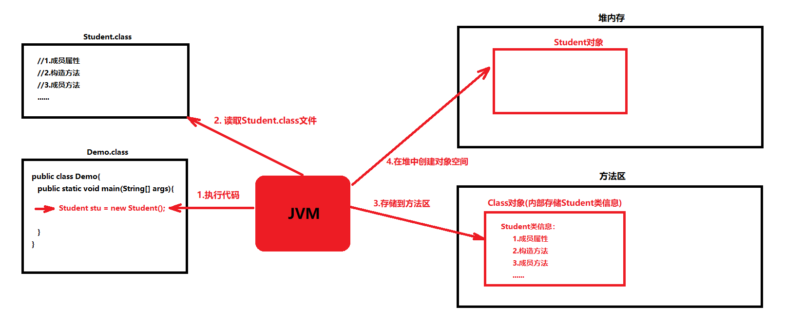

# day15【JUnit单元测试、反射、注解、动态代理、JDK8新特性】

## 今日内容

- JUnit单元测试
- 反射
- 注解
- 动态代理
- JDK8新特性

## 学习目标 

- [ ] 能够使用Junit进行单元测试
- [ ] 能够通过反射技术获取Class字节码对象
- [ ] 能够通过反射技术获取构造方法对象，并创建对象。
- [ ] 能够通过反射获取成员方法对象，并且调用方法。
- [ ] 能够通过反射获取属性对象，并且能够给对象的属性赋值和取值。
- [ ] 能够说出注解的作用 
- [ ] 能够自定义注解和使用注解
- [ ] 能够说出常用的元注解及其作用
- [ ] 能够解析注解并获取注解中的数据
- [ ] 能够完成注解的MyTest案例
- [ ] 能够说出动态代理模式的作用
- [ ] 能够使用Proxy的方法生成代理对象
- [ ] 能够使用四种方法的引用
- [ ] 能够使用Base64对基本数据、URL和MIME类型进行编解码

# 第一章 Junit单元测试

## 知识点--Junit单元测试

### 目标

- 掌握Junit的使用

### 路径

- Junit的概念
- Junit的使用步骤
- 执行测试方法

### 讲解

#### Junit的概念

- 概述 : Junit是Java语言编写的第三方单元测试框架(工具类)
- 作用 : 用来做“单元测试”——针对某个普通方法，可以像main()方法一样独立运行，它专门用于测试某个方法。

#### Junit的使用步骤

- 1.在模块下创建lib文件夹,把Junit的jar包复制到lib文件夹中

- 2.选中Junit的jar包,右键选中 add as Library,把JUnit4的jar包添加到classPath中

- 3.在测试方法上面写上@Test注解

- 4.执行测试方法 

  ```java
  public class Person {
  
      @Test
      public void test1(){
          System.out.println("Person test1 方法执行了....");
      }
  
      @Test
      public void test2(){
          System.out.println("Person test2 方法执行了....");
      }
  
  }
  
  ```

#### 执行测试方法

- 1.选中方法名--->右键--->选中执行             只执行选中的测试方法
- 2.选中类名----->右键--->选中执行             执行该类中所有的测试方法
- 3.选中模块---- ->右键--->选中all tests 执行   执行该模块中所有的测试方法 

- 如何查看测试结果
  * 绿色：表示测试通过
  * 红色：表示测试失败，有问题

### 小结

略

## 知识点--Junit单元测试的注意实现

### 目标

- 测试方法注意事项:

### 路径

- 测试方法注意事项:

### 讲解

- 1.测试方法的权限修饰符一定是public
- 2.测试方法的返回值类型一定是void
- 3.测试方法一定没有参数
- 4.测试方法 的声明之上一定要使用@Test注解

### 小结

- 测试方法一定是一个公共的无参数无返回值的方法

## 知识点--Junit其他注解

### 目标

- Junit其他注解的使用

### 路径

- Junit其他注解

### 讲解

* @Before：用来修饰方法，该方法会在每一个测试方法执行之前执行一次。
* @After：用来修饰方法，该方法会在每一个测试方法执行之后执行一次。
* @BeforeClass：用来静态修饰方法，该方法会在所有测试方法之前执行一次，而且只执行一次。
* @AfterClass：用来静态修饰方法，该方法会在所有测试方法之后执行一次，而且只执行一次。

```java
public class Student {

    @BeforeClass
    public static void beforeClass1(){
        System.out.println("Student beforeClass1静态方法执行了...");
    }

    @BeforeClass
    public static void beforeClass2(){
        System.out.println("Student beforeClass2静态方法执行了...");
    }


    @Before
    public void b1(){
        System.out.println("Student b1方法执行了...");
    }

    @Before
    public void b2(){
        System.out.println("Student b2方法执行了...");
    }

    @Before
    public void b3(){
        System.out.println("Student b3方法执行了...");
    }


    @Test
    public void test1(){
        System.out.println("Student test1 方法执行了....");
    }

    @Test
    public void test2(){
        System.out.println("Student test2 方法执行了....");
    }

    @After
    public void a1(){
        System.out.println("Student a1方法执行了...");
    }

    @After
    public void a2(){
        System.out.println("Student a2方法执行了...");
    }

    @After
    public void a3(){
        System.out.println("Student a3方法执行了...");
    }

    @AfterClass
    public static void afterClass1(){
        System.out.println("Student afterClass1方法执行了...");
    }

    @AfterClass
    public static void afterClass2(){
        System.out.println("Student afterClass2方法执行了...");
    }

}

```

### 小结

略

## 知识点--Junit断言

### 目标

- Junit断言

### 路径

- Junit断言

### 讲解

- 断言：预先判断某个条件是否成立，如果条件不成立，则直接报错。 使用Assert类中的assertEquals()方法
- 案例:

```java
public class Demo02 {
    @Test
    public void addTest(){
        //测试
        int add = add(3, 6);

        //断言判断结果
        //第一个参数表示期望值
        //第二个参数表示实际值
        //如果结果正确的就测试通过,如果结果错误的,就会报错
        Assert.assertEquals(9,add);
    }

    //加法
    //这个代码的语法没问题，也没有异常。他是逻辑错误，系统不知道你要算的是加法
    public int add(int a, int b){
        int sum = a * b;
        return sum;
    }

}
```

### 小结

略

# 第二章 反射

## 知识点--类加载器

### 目标

- 理解类在什么时候加载,以及如何获取类加载器

### 路径

- 类的加载
- 类的加载时机
- 类加载器

### 讲解

#### 类的加载

- 当我们的程序在运行后，第一次使用某个类的时候，会将此类的class文件读取到内存，并将此类的所有信息存储到一个Class对象中



#### 类的加载时机

1. 创建类的实例。

2. 类的静态变量，或者为静态变量赋值。

3. 类的静态方法。

4. 使用反射方式来强制创建某个类或接口对应的java.lang.Class对象。

5. 初始化某个类的子类。

6. 直接使用java.exe命令来运行某个主类。

   以上六种情况的任何一种，都可以导致JVM将一个类加载到方法区。

```java
public class Test {
    public static void main(String[] args) throws Exception{
        // 类的加载时机
        //  1. 创建类的实例。
        //  Student stu = new Student();

        // 2. 类的静态变量，或者为静态变量赋值。
        // Person.country = "中国";

        // 3. 类的静态方法。
        // Person.method();

        // 4. 使用反射方式来强制创建某个类或接口对应的java.lang.Class对象。
        // Class<?> c = Class.forName("com.itheima.demo1_类的加载.Student");

        //  5. 初始化某个类的子类。
        // Zi zi = new Zi();

        // 6. 直接使用java.exe命令来运行某个主类。
    }
}

```

#### 类加载器

​	**类加载器：是负责将磁盘上的某个class文件读取到内存并生成Class的对象。**

- Java中有三种类加载器，它们分别用于加载不同种类的class：
  - 启动类加载器(Bootstrap ClassLoader)：用于加载系统类库<JAVA_HOME>\bin目录下的class，例如：rt.jar。
  - 扩展类加载器(Extension ClassLoader)：用于加载扩展类库<JAVA_HOME>\lib\ext目录下的class。
  - 应用程序类加载器(Application ClassLoader)：用于加载我们自定义类的加载器。

~~~java
public class Test{
    public static void main(String[] args){
          // 获取类加载器:
        // 获取Student类的类加载器
        System.out.println(Student.class.getClassLoader());// AppClassLoader
        // 获取String类的类加载器
        System.out.println(String.class.getClassLoader());// null
        // API中说明：一些实现可能使用null来表示引导类加载器。 如果此类由引导类加载器加载，则此方法将在此类实现中返回null
		
    }
}
~~~

### 小结

略

## 知识点--反射的概述

### 目标

- 理解反射的概念

### 路径

- 反射的引入
- 反射的概念
- 使用反射操作类成员的前提
- 射在实际开发中的应用

### 讲解

#### 反射的引入

* 问题：IDEA中的对象是怎么知道类有哪些属性，哪些方法的呢？

```java
 通过反射技术对象类进行了解剖得到了类的所有成员。
```

#### 反射的概念

```java
 反射是一种机制，利用该机制可以在程序运行过程中对类进行解剖并操作类中的所有成员(成员变量，成员方法，构造方法)
```

#### 使用反射操作类成员的前提

```java
要获得该类字节码文件对象，就是Class对象
```

#### 反射在实际开发中的应用

```java
* 开发IDE(集成开发环境)，比如IDEA,Eclipse
* 各种框架的设计和学习 比如Spring，Hibernate，Struct，Mybaits....
```

### 小结

- 通过反射技术去获取一个类的成员变量,成员方法,构造方法...,并可以访问

## 知识点--Class对象的获取方式

### 目标

- 能够获取一个类的Class对象

### 路径

- 通过类名.class获得
- 通过对象名.getClass()方法获得
- 通过Class类的静态方法获得： static Class forName("类全名")

### 讲解

```java
* 方式1: 通过类名.class获得
* 方式2：通过对象名.getClass()方法获得
* 方式3：通过Class类的静态方法获得： static Class forName("类全名")
    * 每一个类的Class对象都只有一个。
```

- 示例代码

~~~java
package com.itheima.demo2_Class对象的获取;

/**
 * @Author：pengzhilin
 * @Date: 2020/5/14 9:35
 */
public class Student {
    private String name;

    public void method1(){

    }
}

~~~

```java
public class Test {
    public static void main(String[] args) throws Exception{
          /*
            Class对象的获取:
                通过类名.class获得
                通过对象名.getClass()方法获得
                通过Class类的静态方法获得： static Class forName("类全名")
           */
        // 1.方式一:通过类名.class获得
        Class<Student> c1 = Student.class;
        System.out.println(c1);

        // 2.方式二:通过对象名.getClass()方法获得
        Student stu = new Student();
        Class<? extends Student> c2 = stu.getClass();
        System.out.println(c2);

        // 3.方式三:通过Class类的静态方法获得： static Class forName("类全名")
        Class<?> c3 = Class.forName("com.itheima.demo2_Class对象的获取.Student");
        System.out.println(c3);

        // 问题:一个类只有一个字节码对象(Class对象)
        System.out.println(c1 == c2);// true
        System.out.println(c1 == c3);// true
    }
}

```

### 小结

略

## 知识点--Class类常用方法

### 目标

- Class类的常用方法

### 路径

- Class类的常用方法

### 讲解

```java
String getSimpleName(); 获得类名字符串：类名
String getName();  获得类全名：包名+类名
T newInstance() ;  创建Class对象关联类的对象
```

- 示例代码

```java
public class ReflectDemo02 {
    public static void main(String[] args) throws Exception {
        // 获得Class对象
        Class c = Student.class;
        // 获得类名字符串：类名
        System.out.println(c.getSimpleName());
        // 获得类全名：包名+类名
        System.out.println(c.getName());
        // 创建对象
        Student stu = (Student) c.newInstance();
        System.out.println(stu);
    }
}
```

### 小结

略

## 知识点--反射之操作构造方法

### 目标

- 通过反射获取类的构造方法,并执行构造方法

### 路径

-  Constructor类概述
- 通过反射获取类的构造方法
- 通过反射执行构造方法

### 讲解

#### Constructor类概述

```java
反射之操作构造方法的目的
    * 获得Constructor对象来创建类的对象。

Constructor类概述
    * 类中的每一个构造方法都是一个Constructor类的对象
```

#### 通过反射获取类的构造方法

```java
Class类中与Constructor相关的方法 
1. Constructor getConstructor(Class... parameterTypes)
        * 根据参数类型获得对应的Constructor对象。
        * 只能获得public修饰的构造方法
 2. Constructor getDeclaredConstructor(Class... parameterTypes)
        * 根据参数类型获得对应的Constructor对象
    	* 可以是public、protected、(默认)、private修饰符的构造方法。
 3. Constructor[] getConstructors()
        获得类中的所有构造方法对象，只能获得public的
 4. Constructor[] getDeclaredConstructors()
        获得类中的所有构造方法对象
    	可以是public、protected、(默认)、private修饰符的构造方法。
```

#### 通过反射执行构造方法

```java
Constructor对象常用方法
1. T newInstance(Object... initargs)
 	根据指定的参数创建对象
2. void setAccessible(true)
   设置"暴力反射"——是否取消权限检查，true取消权限检查，false表示不取消
```

#### 示例代码

~~~java
package com.itheima.demo4_反射之构造方法;

/**
 * @Author：pengzhilin
 * @Date: 2020/5/14 10:13
 */
public class Student {
    // 属性
    public String name;// 姓名
    public String sex;// 性别
    public int age;// 年龄

    // 构造方法
    public Student() {
    }

    public Student(String name, String sex, int age) {
        this.name = name;
        this.sex = sex;
        this.age = age;
    }

    private Student(String name, int age) {
        this.name = name;
        this.age = age;
    }

    // 成员方法

    @Override
    public String toString() {
        return "Student{" +
                "name='" + name + '\'' +
                ", sex='" + sex + '\'' +
                ", age=" + age +
                '}';
    }
}

~~~

```java
public class Test1 {
    public static void main(String[] args) throws Exception{
        /*
            - 通过反射获取类的构造方法,并执行构造方法创建该类的对象
                - Constructor类概述
                    概述:类中的每一个构造方法都是一个Constructor类的对象
                    通过反射获取类的构造方法,其实就是获取该构造方法对于的Constructor对象

                - 通过反射获取类的构造方法: 使用Class类中的方法
                   我们每一个类都会有一个对于的Class对象,所以该类中的构造方法就在我们的Class对象中,
                   所以可以使用Class对象获取构造方法
                   Class类中与Constructor相关的方法
                        1. Constructor getConstructor(Class... parameterTypes)  获取单个public修饰的构造方法
                                * 根据参数类型获得对应的Constructor对象。
                                * 只能获得public修饰的构造方法
                         2. Constructor getDeclaredConstructor(Class... parameterTypes) 获取单个构造方法
                                * 根据参数类型获得对应的Constructor对象
                                * 可以是public、protected、(默认)、private修饰符的构造方法。
                         3. Constructor[] getConstructors() 获取所有public修饰的构造方法
                                获得类中的所有构造方法对象，只能获得public的
                         4. Constructor[] getDeclaredConstructors() 获取所有构造方法
                                获得类中的所有构造方法对象
                                可以是public、protected、(默认)、private修饰符的构造方法。
                    记忆方法:
                        1. 加了s的就是获取多个,不加s的就是获取单个
                        2. 加了Declared的就是获取任意修饰符修饰的构造方法,不加就只能获取public修饰的构造方法

                 小结:
                     Constructor getDeclaredConstructor(Class... parameterTypes) 获取单个构造方法
                     Constructor[] getDeclaredConstructors() 获取所有构造方法

                - 通过反射执行构造方法:使用Constructor对象中的方法,来执行该对象表示的构造方法
                    Constructor对象常用方法
                        1. T newInstance(Object... initargs)
                            根据指定的参数创建对象
                        2. void setAccessible(true)
                           设置"暴力反射"——是否取消权限检查，true取消权限检查，false表示不取消

         */
        // 0.获取Student类的Class对象
        Class<?> c = Class.forName("com.itheima.demo4_反射之构造方法.Student");

        // 1.获取单个public修饰的构造方法
        // Constructor getConstructor(Class... parameterTypes)  获取单个public修饰的构造方法
        //    参数:传入你要获取的构造方法的参数类型的Class对象

        // 获取Student类的空参构造方法
        Constructor<?> cons1 = c.getConstructor();
        System.out.println(cons1);

        // 获取Student类的带有三个参数的构造方法,并且参数的类型顺序为:String,String,int
        Constructor<?> cons2 = c.getConstructor(String.class,String.class, int.class);

        // public Student(String name,String sex,int.class);
        // public Student(String name,int.class,String sex);

        System.out.println(cons2);

        // 2.获取单个非public修饰的构造方法
        // Constructor getDeclaredConstructor(Class... parameterTypes) 获取单个构造方法
        //    参数:传入你要获取的构造方法的参数类型的Class对象

        // 获取Student类的带有2个参数的构造方法,并且参数的类型顺序为:String,int
        Constructor<?> cons3 = c.getDeclaredConstructor(String.class, int.class);
        System.out.println(cons3);

        System.out.println("============================================");
        // 3.获取多个public修饰的方法
        // Constructor[] getConstructors() 获取所有public修饰的构造方法
        Constructor<?>[] conArr1 = c.getConstructors();
        for (Constructor<?> con : conArr1) {
            System.out.println(con);
        }

        System.out.println("============================================");
        // 4.获取所有修饰的方法
        // Constructor[] getDeclaredConstructors() 获取所有构造方法
        Constructor<?>[] conArr2 = c.getDeclaredConstructors();
        for (Constructor<?> con : conArr2) {
            System.out.println(con);
        }

    }
}


public class Test2 {
    public static void main(String[] args) throws Exception{
        /*
            - 获取类的构造方法:
                    Constructor getDeclaredConstructor(Class... parameterTypes) 获取单个构造方法
                     Constructor[] getDeclaredConstructors() 获取所有构造方法

            - 通过反射执行构造方法:使用Constructor对象中的方法,来执行该对象表示的构造方法
                Constructor对象常用方法
                    1. T newInstance(Object... initargs)
                        根据指定的参数创建对象
                        参数: 传入执行该构造方法需要的实际参数

                    2. void setAccessible(boolean b)
                       设置"暴力反射"——是否取消权限检查，true取消权限检查，false表示不取消
         */
        // 获取Student类的Class对象
        Class<?> c = Class.forName("com.itheima.demo4_反射之构造方法.Student");

        // 1.获取public修饰的构造方法对象,并执行该对象表示的构造方法来创建对象
        // 1.1 获取public修饰的构造方法对象  public Student(String name, String sex, int age)
        Constructor<?> cons1 = c.getDeclaredConstructor(String.class, String.class, int.class);

        // 1.2 执行该对象表示的构造方法来创建对象
        Object obj = cons1.newInstance("张三", "女", 18);// 真正返回的是Student对象
        System.out.println(obj);// Student{name='张三', sex='女', age=18}

        System.out.println("==========================================");
        // 2.获取private修饰的构造方法对象,并执行该对象表示的构造方法来创建对象
        // 2.1 获取private修饰的构造方法对象
        Constructor<?> cons2 = c.getDeclaredConstructor(String.class, int.class);

        // 2.2 执行该对象表示的构造方法来创建对象
        // 设置"暴力反射"
        cons2.setAccessible(true);

        Object obj2 = cons2.newInstance("李四", 19);
        System.out.println(obj2);
    }
}

```

### 小结

略

## 知识点--反射之操作成员方法

### 目标

- 通过反射获取类的成员方法,并执行成员方法

### 路径

- Method类概述
- 通过反射获取类的成员方法
- 通过反射执行成员方法

### 讲解

#### Method类概述

```java
反射之操作成员方法的目的
    * 操作Method对象来调用成员方法
Method类概述
    * 每一个成员方法都是一个Method类的对象。
```

#### 通过反射获取类的成员方法

```java
* Method getMethod(String name,Class...args);
      * 根据方法名和参数类型获得对应的成员方法对象，只能获得public的
* Method getDeclaredMethod(String name,Class...args);     掌握
       * 根据方法名和参数类型获得对应的成员方法对象，包括public、protected、(默认)、private的
* Method[] getMethods();
        * 获得类中的所有成员方法对象，返回数组，只能获得public修饰的且包含父类的
* Method[] getDeclaredMethods();    掌握
         * 获得类中的所有成员方法对象，返回数组,只获得本类的，包括public、protected、(默认)、private的
```

#### 通过反射执行成员方法

```java
Method对象常用方法
*  Object invoke(Object obj, Object... args)
    * 调用指定对象obj的该方法
    * args：调用方法时传递的参数
*  void setAccessible(true)
    设置"暴力访问"——是否取消权限检查，true取消权限检查，false表示不取消
```

#### 示例代码

~~~java
ackage com.itheima.demo5_反射之操作成员方法;

/**
 * @Author：pengzhilin
 * @Date: 2020/5/14 10:13
 */
public class Student {
    public void show1(){
        System.out.println("public 修饰的show1方法,无参数...");
    }

    public void show1(String str,int num){
        System.out.println("public 修饰的show1方法,2个参数...");
        System.out.println("str:"+str+",num:"+num);
    }

    public void show2(){
        System.out.println("public 修饰的show2方法...");
    }

    private void show3(){
        System.out.println("private 修饰的show3方法...");
    }
}

~~~


```java
package com.itheima.demo5_反射之操作成员方法;

import java.lang.reflect.Method;

/**
 * @Author：pengzhilin
 * @Date: 2020/5/14 11:03
 */
public class Test1 {
    public static void main(String[] args) throws Exception {
        /*
            反射之操作成员方法:
                - 通过反射获取类的成员方法,并通过反射技术执行成员方法
                    - Method类概述
                            每一个成员方法都是一个Method类的对象。

                    - 通过反射获取类的成员方法
                            Class类中与Method相关的方法
                                * Method getMethod(String name,Class...args); 获取单个public修饰的成员方法
                                    * 根据方法名和参数类型获得对应的构造方法对象，只能获得public的

                                * Method getDeclaredMethod(String name,Class...args); 获取任意修饰符修饰的单个成员方法
                                    * 根据方法名和参数类型获得对应的构造方法对象，包括public、protected、(默认)、private的

                                * Method[] getMethods();  获取所有public修饰的成员方法
                                    * 获得类中的所有成员方法对象，返回数组，只能获得public修饰的且包含父类的

                                * Method[] getDeclaredMethods(); 获取所有成员方法
                                    * 获得类中的所有成员方法对象，返回数组,只获得本类的，包括public、protected、(默认)、private的

                        记忆:
                            Method getDeclaredMethod(String name,Class...args); 获取任意修饰符修饰的单个成员方法\
                            Method[] getDeclaredMethods(); 获取所有成员方法

                    - 通过反射执行成员方法
         */
        // 1.获取Student类的Class对象
        Class<?> c = Class.forName("com.itheima.demo5_反射之操作成员方法.Student");

        // 2.获取单个成员方法
        // 2.1 获取单个public修饰的方法
        // Method getMethod(String name,Class...args);
        // 第一个参数: 方法名
        // 第二个参数: 该方法的参数类型的Class对象,如果没有参数就不传入
        Method show1M1 = c.getMethod("show1");// 第一个show1方法
        System.out.println(show1M1);

        Method show1M2 = c.getMethod("show1", String.class, int.class);
        System.out.println(show1M2);

        // 2.2 获取单个private修饰的成员方法
        // Method getDeclaredMethod(String name,Class...args);
        // 第一个参数: 方法名
        // 第二个参数: 该方法的参数类型的Class对象,如果没有参数就不传入
        Method show3M = c.getDeclaredMethod("show3");
        System.out.println(show3M);

        System.out.println("=======================");

        // 3.获取多个public修饰的成员方法
        // 3.1 获取所有public修饰的成员方法
        // Method[] getMethods();
        Method[] mArr1 = c.getMethods();
        for (Method method : mArr1) {
            System.out.println(method);
        }

        System.out.println("=======================");

        // 3.2 获取所有的成员方法
        // Method[] getDeclaredMethods();
        Method[] mArr2 = c.getDeclaredMethods();
        for (Method method : mArr2) {
            System.out.println(method);
        }

    }
}
package com.itheima.demo5_反射之操作成员方法;

import java.lang.reflect.Method;

/**
 * @Author：pengzhilin
 * @Date: 2020/5/14 11:33
 */
public class Test2 {
    public static void main(String[] args) throws Exception {
        /*
             Method getDeclaredMethod(String name,Class...args); 获取任意修饰符修饰的单个成员方法\
             Method[] getDeclaredMethods(); 获取所有成员方法

            通过反射技术执行成员方法:
                Method对象常用方法
                    *  Object invoke(Object obj, Object... args)
                        * 参数1: 调用该方法的对象
                        * 参数2：调用方法时传递的实际参数,如果方法没有参数,就不传
                    *  void setAccessible(true)
                        设置"暴力访问"——是否取消权限检查，true取消权限检查，false表示不取消
         */
        // 0.获取Student类的Class对象
        Class<?> c = Class.forName("com.itheima.demo5_反射之操作成员方法.Student");

        // 1.通过反射获取public修饰的成员方法对象,并通过反射执行该方法
        // 1.1 通过反射获取public修饰的成员方法对象
        Method show1M = c.getDeclaredMethod("show1", String.class, int.class);

        // 1.2 通过反射执行该方法
        Student stu = new Student();// 使用反射创建对象:通过反射获取构造方法对象,执行该构造方法
        show1M.invoke(stu,"itheima",14);

        System.out.println("=======================");
        // 2.通过反射获取private修饰的成员方法对象,并通过反射执行该方法
        // 2.1 通过反射获取private修饰的成员方法对象
        Method show3M = c.getDeclaredMethod("show3");

        // 2.2 通过反射执行该方法
        // 设置暴力反射
        show3M.setAccessible(true);
        show3M.invoke(stu);
    }
}

```

### 小结

略

## 知识点--反射之操作成员变量【自学】

### 目标

- 通过反射获取类的成员变量,并访问成员变量

### 路径

- Field类概述
- 通过反射获取类的成员变量
- 通过反射访问成员变量

### 讲解

#### Field类概述

```java
反射之操作成员变量的目的
    * 通过Field对象给对应的成员变量赋值和取值

Field类概述
    * 每一个成员变量都是一个Field类的对象。
```

#### 通过反射获取类的成员变量

```java
Class类中与Field相关的方法
* Field getField(String name);
    *  根据成员变量名获得对应Field对象，只能获得public修饰
* Field getDeclaredField(String name);
    *  根据成员变量名获得对应Field对象，包括public、protected、(默认)、private的
* Field[] getFields();
    * 获得所有的成员变量对应的Field对象，只能获得public的
* Field[] getDeclaredFields();
    * 获得所有的成员变量对应的Field对象，包括public、protected、(默认)、private的
```

#### 通过反射访问成员变量

```java
Field对象常用方法
void  set(Object obj, Object value) 
void setInt(Object obj, int i) 	
void setLong(Object obj, long l)
void setBoolean(Object obj, boolean z) 
void setDouble(Object obj, double d) 

Object get(Object obj)  
int	getInt(Object obj) 
long getLong(Object obj) 
boolean getBoolean(Object ob)
double getDouble(Object obj) 

void setAccessible(true);暴力反射，设置为可以直接访问私有类型的属性。
Class getType(); 获取属性的类型，返回Class对象。
```

> setXxx方法都是给对象obj的属性设置使用，针对不同的类型选取不同的方法。
>
> getXxx方法是获取对象obj对应的属性值的，针对不同的类型选取不同的方法。

#### 示例代码

~~~java
package com.itheima.demo6_反射之操作成员变量;

/**
 * @Author：pengzhilin
 * @Date: 2020/5/14 10:13
 */
public class Student {
    public String name;// 姓名
    public int age;// 年龄
    private String sex;// 性别

    @Override
    public String toString() {
        return "Student{" +
                "name='" + name + '\'' +
                ", age=" + age +
                ", sex='" + sex + '\'' +
                '}';
    }
}

~~~


```java
public class Test1 {
    public static void main(String[] args) throws Exception{
        /*
            反射之操作成员变量:
                - Field类概述 : 每一个成员变量都是一个Field类的对象。
                - 通过反射获取类的成员变量
                        Class类中与Field相关的方法
                            * Field getField(String name);获取单个public修饰的成员变量
                                *  根据成员变量名获得对应Field对象，只能获得public修饰
                            * Field getDeclaredField(String name);获取单个任意修饰符修饰的成员变量
                                *  根据成员变量名获得对应Field对象，包括public、protected、(默认)、private的
                            * Field[] getFields();获取所有的public修饰的成员变量
                                * 获得所有的成员变量对应的Field对象，只能获得public的
                            * Field[] getDeclaredFields();获取所有的成员变量
                                * 获得所有的成员变量对应的Field对象，包括public、protected、(默认)、private的
                     结论:
                        Field getDeclaredField(String name);获取单个任意修饰符修饰的成员变量
                            参数:成员变量名  字符串类型
                        Field[] getDeclaredFields();获取所有的成员变量

                - 通过反射访问成员变量
         */
        // 通过反射获取类的成员变量
        // 1.获取Student类的Class对象
        Class<?> c = Class.forName("com.itheima.demo6_反射之操作成员变量.Student");

        // 2. 获取单个成员变量的Field对象
        // 2.1 获取单个public修饰的成员变量
        Field nameF = c.getDeclaredField("name");
        System.out.println(nameF);

        // 2.2 获取单个private修饰的成员变量
        Field sexF = c.getDeclaredField("sex");
        System.out.println(sexF);

        System.out.println("==============================================");

        // 3.获取所有的成员变量的Field对象
        Field[] fieldArr = c.getDeclaredFields();
        for (Field field : fieldArr) {
            System.out.println(field);
        }


    }
}

public class Test2 {
    public static void main(String[] args) throws Exception {
        /*
               通过反射获取类的成员变量
                        Field getDeclaredField(String name);获取单个任意修饰符修饰的成员变量
                            参数:成员变量名  字符串类型
                        Field[] getDeclaredFields();获取所有的成员变量

               通过反射访问成员变量:
                Field对象常用方法
                    为成员变量设置值的方法
                        void  set(Object obj, Object value)    记住
                        参数1: 要赋值属性的对象
                        参数2: 属性具体的值

                    获取成员变量值的方法
                        Object get(Object obj)      记住
                        参数: 要获取属性值的对象
                        返回值: 属性具体的值

                    void setAccessible(true);暴力反射，设置为可以直接访问私有类型的属性。  记住

                    Class getType(); 获取属性的类型，返回Class对象。
         */
        // 通过反射获取类的成员变量
        // 1.获取Student类的Class对象
        Class<?> c = Class.forName("com.itheima.demo6_反射之操作成员变量.Student");

        // 2. 获取单个成员变量的Field对象
        // 2.1 获取单个public修饰的成员变量
        Field nameF = c.getDeclaredField("name");
        // 2.2 通过反射为name属性赋值
        Student stu = new Student();
        nameF.set(stu,"张三");

        Field ageF = c.getDeclaredField("age");
        // ageF.set(stu,18);
        ageF.setInt(stu,19);

        System.out.println(stu);// Student{name='张三', age=18, sex='null'}

        // 2.3 获取某个属性的值
        System.out.println(nameF.get(stu));// 张三
        System.out.println(ageF.get(stu));// 19

        // 2.2 获取单个private修饰的成员变量
        Field sexF = c.getDeclaredField("sex");
        // 暴力反射
        sexF.setAccessible(true);
        sexF.set(stu,"李四");

        // 获取
        System.out.println(sexF.get(stu));// 李四


        // 获取nameF属性的类型
        Class<?> c1 = nameF.getType();
        System.out.println(c1);// class java.lang.String


    }
}

```

### 小结

略

# 第三章 注解

## 知识点-注解概述

### 目标

- 掌握什么是注解, 注解的作用

### 路径

- 注解概述
- 注解的作用

### 讲解

#### 注解概述

- 注解(annotation),是一种代码级别的说明,和类 接口平级关系.
  
  - 注解（Annotation）相当于一种标记，在程序中加入注解就等于为程序打上某种标记，以后，javac编译器、开发工具和其他程序可以通过反射来了解你的类及各种元素上有无标记，看你的程序有什么标记，就去干相应的事
  
  - 我们之前使用过的注解：
  
    ​                   1)[.@Override](mailto:.@Override)：子类重写方法时——编译时起作用
  
    ​                   2)[.@FunctionalInterface](mailto:.@FunctionalInterface)：函数式接口——编译时起作用
  
    ​                   3)[.@Test：JUnit](mailto:.@Test：JUnit)的测试注解——运行时起作用

#### 注解的作用

- 生成帮助文档**：**@author和@version	

- 执行编译期的检查 例如:@Override   
- 框架的配置(框架=代码+配置)

  - 具体使用请关注框架课程的内容的学习。

### 小结

1. 注解用在“源码中”，作为一个“标记”。给“注解解析器”看的，告诉“注解解析器”怎样编译、运行下面的代码。
2. 开发中,我们一般都是使用注解

## 知识点-JDK提供的三个基本的注解

### 目标

- 掌握JDK中提供的三个基本的注解

### 路径

- 三个基本的注解

### 讲解

​	@Override:描述方法的重写.

​	@SuppressWarnings:压制\忽略警告.

​	@Deprecated:标记过时

### 小结

1. @Override: 重写父类的方法
2. @SuppressWarnings: 压制警告
3. @Deprecated: 标记方法的过时

## 知识点-自定义注解

### 目标

- 掌握自定义注解和定义注解属性

### 路径

- 自定义注解格式
- 定义注解属性

### 讲解

#### 自定义注解语法

```java
public @interface 注解名{
     属性
}
```

- 示例代码

```java
/**
 * 定义了注解
 *
 */
public @interface Annotation01 {

}
```

#### 注解属性

##### 格式

- `数据类型 属性名();`

##### 属性类型

​	1.基本类型

​	2.String

​	3.Class类型 

​	4.注解类型

​	5. 枚举类型

​	6.以上类型的一维数组类型  

- 示例代码

```java
public @interface Annotation01 {
    // 1.基本数据类型(4类8种)
    int a();
    double b();

    // 2.String类型
    String c();

    // 3.Class类型
    Class d();

    // 4.注解类型
    Annotation02 f();
    
    // 5.枚举类型
    Sex e();
    // 6.以上类型的一维数组类型
    int[] g();
    double[] h();
    String[] i();
    Sex[] j();
    Annotation02[] k();
}
```

### 小结

略

## 知识点-- 使用注解并给注解属性赋值

### 目标

- 能够使用注解并给注解属性赋值

### 路径

- 使用注解并给注解属性赋值

### 讲解

```java
 使用注解:
        如果一个注解中有属性,那么使用注解的时候一定要给注解属性赋值
        如果一个注解没用属性,那么就不需要给注解属性赋值,直接使用即可
如何给注解属性赋值:
        @注解名(属性名=值,属性名2=值2) 
```
##### 案例演示

```java
public @interface MyAnnotation1 {
    // 不定义注解属性
}
public @interface MyAnnotation2 {
    int a();

    String[] b();
}

@MyAnnotation1()
public class Test1 {
    @MyAnnotation1
    public static void main(String[] args) {
        /*
            使用注解:
                不带属性的注解: 注解中没有定义属性,或者里面的属性已经给了默认值
                     在需要使用该注解的地方,写上 @注解名 即可 或者 @注解名()


         */
    }
}

@MyAnnotation2(a=18,b={"itheima","itcast"})
public class Test2 {

    @MyAnnotation2(a=18,b={"itheima","itcast"})
    public static void main(String[] args) {
        /*
             使用注解:
                带有属性的注解: 注解中定义了属性,并这些属性没有给默认值
                    标准格式: @注解名(属性名=属性值,属性名=属性值,....)
         */

    }
}


```

### 小结

略

## 知识点--给注解属性赋值的注意事项

### 目标

- 理解给注解属性赋值的注意事项

### 路径

### 讲解

- 一旦注解有属性了,使用注解的时候,属性必须有值
- 若属性类型是一维数组的时候,当数组的值只有一个的时候可以省略{}
- 如果注解中只有一个属性,并且属性名为value,那么使用注解给注解属性赋值的时候,注解属性名value可以省略
- 注解属性可以有默认值  格式:属性类型 属性名() defaul t 默认值;

```java
public @interface MyAnnotation1 {
    int a();
}

public @interface MyAnnotation2 {
    int[] arr();
}

public @interface MyAnnotation3 {
    int value();
}

public @interface MyAnnotation33 {
    String[] value();
}

public @interface MyAnnotation4 {
    int a() default 10;
}

public class Test {
    public static void main(String[] args) {
        /*
            给注解属性赋值的注意事项:
                - 一旦注解有属性了,使用注解的时候,属性必须有值
                - 若属性类型是一维数组的时候,当数组的值只有一个的时候可以省略{}
                - 如果注解中只有一个属性,并且属性名为value,那么使用注解给注解属性赋值的时候,注解属性名value可以省略
                - 注解属性可以有默认值  格式:属性类型 属性名() defaul t 默认值;

         */
    }

    //  注解属性可以有默认值  格式:属性类型 属性名() defaul t 默认值;
    //@MyAnnotation4
    //@MyAnnotation4()
    @MyAnnotation4(a = 100)
    public static void method4(){

    }

    // 若属性类型是一维数组的时候,当数组的值只有一个的时候可以省略{}
    //如果注解中只有一个属性,并且属性名为value,那么使用注解给注解属性赋值的时候,注解属性名value可以省略
    //@MyAnnotation33(value={"itheima","itcast"})
    //@MyAnnotation33(value={"itheima"})
    //@MyAnnotation33(value="itheima")
    @MyAnnotation33("itheima")
    public static void method33(){

    }

    // 如果注解中只有一个属性,并且属性名为value,那么使用注解给注解属性赋值的时候,注解属性名value可以省略
    //@MyAnnotation3(value=10)
    @MyAnnotation3(10)
    public static void method3(){

    }

    // 若属性类型是一维数组的时候,当数组的值只有一个的时候可以省略{}
    // @MyAnnotation2(arr={10,20,30})
    // @MyAnnotation2(arr={10})
    @MyAnnotation2(arr=10)
    public static void method2(){

    }

    // 一旦注解有属性了,使用注解的时候,属性必须有值
    @MyAnnotation1(a = 10)
    public static void method1(){

    }

}

```

### 小结

略

## 知识点-元注解

### 目标

- 能够说出常用的元注解及其作用

### 路径

- 什么是元注解
- 常见的元注解

### 讲解

#### 什么是元注解

​	定义在注解上的注解

#### 常见的元注解

​	@Target:表示该注解作用在什么上面(位置),默认注解可以在任何位置. 值为:ElementType的枚举值

​		METHOD:方法

​		TYPE:类 接口

​		FIELD:字段

​		CONSTRUCTOR:构造方法声明

​	@Retention:定义该注解保留到那个代码阶段, 值为:RetentionPolicy类型,==默认只在源码阶段保留==

​		SOURCE:只在源码上保留(默认)

​		CLASS:在源码和字节码上保留

​		RUNTIME:在所有的阶段都保留 

.java (源码阶段) ----编译---> .class(字节码阶段) ----加载内存--> 运行(RUNTIME)

案例:

```java
// 标准格式:
//@Target(value={ElementType.TYPE,ElementType.FIELD,ElementType.METHOD,ElementType.LOCAL_VARIABLE})
//@Retention(value= RetentionPolicy.RUNTIME)
    // 省略格式
@Target({ElementType.TYPE,ElementType.FIELD,ElementType.METHOD,ElementType.LOCAL_VARIABLE})
@Retention(RetentionPolicy.RUNTIME)
public @interface MyAnnotation1 {// 默认该注解可以在任何位置使用

}

@MyAnnotation1
public class Test1 {

    @MyAnnotation1
    int age = 18;

    @MyAnnotation1
    public static void main(String[] args) {
       
        @MyAnnotation1
        int num1 = 10;// 局部变量

        // jdk中的@Override
        // @Override // 编译报错
        int num2 = 10;// 局部变量

    }

    @Override
    public String toString() {
        return super.toString();
    }
}

```

### 小结

略

## 知识点-注解解析

### 目标

- 理解常见注解解析方法

### 路径

- 使用注解解析

### 讲解

java.lang.reflect.AnnotatedElement接口: Class、Method、Field、Constructor等实现了AnnotatedElement

- **T getAnnotation(Class<T>annotationType):得到指定类型的注解引用。没有返回null。**

- **boolean isAnnotationPresent(Class<?extends Annotation> annotationType)**：判断指定的注解有没有。


```java
@Target(ElementType.METHOD)
@Retention(RetentionPolicy.RUNTIME)
public @interface MyAnnotation1 {
    String name();

    int age();

}


public class Test {

    @MyAnnotation1(name="张三",age=18)
    public void show1(){
        System.out.println("show1方法执行了....");
    }

    public void show2(){
        System.out.println("show2方法执行了....");
    }

    public static void main(String[] args) throws Exception{
        /*
            java.lang.reflect.AnnotatedElement接口: Class、Method、Field、Constructor等实现了AnnotatedElement
            - T getAnnotation(Class<T> annotationType):得到指定类型的注解引用。没有返回null。
            - boolean isAnnotationPresent(Class<?extends Annotation> annotationType)：判断指定的注解有没有。

         */
        // 需求:1.获取show1方法上面的注解对象
        // 1.1 得到Test类的Class对象
        Class<?> c = Class.forName("com.itheima.demo12_注解解析.Test");

        // 1.2 获得show1方法的Method对象
        Method show1M = c.getDeclaredMethod("show1");

        // 1.3 根据Method对象调用getAnnotation()方法得到注解对象
        MyAnnotation1 a1 = show1M.getAnnotation(MyAnnotation1.class);
        System.out.println(a1.name());
        System.out.println(a1.age());

        System.out.println("======================");

        // 2.需求: 判断某个方法上是否有MyAnnotation1注解
        // 判断show1方法上是否有MyAnnotation1注解
        boolean res1 = show1M.isAnnotationPresent(MyAnnotation1.class);
        System.out.println(res1);// true

        // 判断show2方法上是否有MyAnnotation1注解
        Method show2M = c.getDeclaredMethod("show2");
        boolean res2 = show2M.isAnnotationPresent(MyAnnotation1.class);
        System.out.println(res2);// false

    }
}

```

### 小结

略

## 实操--完成注解的MyTest案例 

### 需求

​	在一个类(测试类,TestDemo)中有三个方法,其中两个方法上有@MyTest,另一个没有.还有一个主测试类(MainTest)中有一个main方法.  在main方法中,让TestDemo类中含有@MyTest方法执行.   自定义@MyTest, 模拟单元测试.

### 思路分析

1. 定义两个类和一个注解

2. 在MainTest的main()方法里面:

   ​	//1.获得TestDemo字节码对象
   ​	//2.反射获得TestDemo里面的所有的方法
   ​	//3.遍历方法对象的数组. 判断是否有@MyTest(isAnnotationPresent)
   ​	//4.有就执行(method.invoke())

   

### 代码实现

- MyTest.java

```java
@Target(ElementType.METHOD)
@Retention(RetentionPolicy.RUNTIME)
public @interface MyTest {

}
```

- TestDemo.java

```java
public class TestDemo {
    @MyTest
    public void show1(){
        System.out.println("show1方法执行了...");
    }

    @MyTest
    public void show2(){
        System.out.println("show2方法执行了...");
    }

    public void show3(){
        System.out.println("show3方法执行了...");
    }

}

```

- MainTest.java

```java
public class MainTest {

    public static void main(String[] args) throws Exception {
        // 让第一个类中含有@MyTest注解的方法执行
        // 1.获取TestDemo类的字节码对象
        Class<TestDemo> clazz = TestDemo.class;

        // 2.使用字节码对象获取该类中所有方法对象
        Method[] methods = clazz.getDeclaredMethods();

        // 3.循环遍历所有方法对象
        for (Method method : methods) {
            // 4.在循环中,判断遍历出来的方法对象是否含有@MyTest注解
            boolean res = method.isAnnotationPresent(MyTest.class);
            if (res) {
                // 5.如果有,就调用该方法执行
                method.invoke(clazz.newInstance());
            }
        }

    }

}
```

### 小结

略

# 第四章 动态代理 

### 目标

- 能够使用动态代理生成一个代理对象

### 路径

- 代理模式概念
- 动态代理
- 动态代理相关api介绍
- 案例演示

### 讲解

#### 代理模式概述

为什么要有“代理”？生活中就有很多代理的例子，例如，我现在需要出国，但是我不愿意自己去办签证、预定机票和酒店（觉得麻烦 ，那么就可以找旅行社去帮我办，这时候旅行社就是代理，而我自己就是被代理了。

代理模式的定义：被代理者没有能力或者不愿意去完成某件事情，那么就需要找个人代替自己去完成这件事,这个人就是代理者, 所以代理模式包含了3个角色: 被代理角色     代理角色    抽象角色(协议)

静态代理:

```java
public interface Happy {// 协议,被代理者需要代理的方法,就定义在这里,然后让代理者和被代理者去实现
    // 被代理者实现: 为了确保和代理者实现的方法一致
    // 代理者实现: 为了增强被代理者的这些方法
    public abstract void happy();
}


public class JinLian implements Happy {

    public void happy(){
        System.out.println("金莲在happy...");
    }

}


public class WangPo implements Happy{
    // 成员变量
    JinLian jl;

    // 构造方法
    public WangPo(JinLian jl) {
        this.jl = jl;
    }

    // 成员方法
    @Override
    public void happy() {
        System.out.println("王婆以做衣服的名义开好房间,并把2人约到房间里...");
        // 金莲happy
        jl.happy();
        System.out.println("王婆打扫战场...");
    }
}


public class XiMen {
    public static void main(String[] args) {
        /*
            案例: 金莲要找西门happy
            代理模式的定义：被代理者没有能力或者不愿意去完成某件事情，那么就需要找个人代替自己去完成这件事,这个人就是代理者,
            所以代理模式包含了3个角色: 被代理角色     代理角色    抽象角色(协议)

         */
        // 不请代理: 金莲直接找西门happy
        // 创建金莲对象
        JinLian jl = new JinLian();
        // happy
        // jl.happy();

        // 请代理: 静态代理,代理类真实存在
        Happy wp = new WangPo(jl);// wp:代理对象   WangPo类: 代理类   Happy接口: 协议  JinLian: 被代理类
        wp.happy();
    }
}

```

#### 动态代理介绍

- 概述 : 动态代理就是直接通过反射生成一个代理对象,代理对象所属的类是不需要存在的

- 动态代理的获取:

  ​	jdk提供一个Proxy类可以直接给实现接口类的对象直接生成代理对象 


#### 动态代理相关api介绍

Java.lang.reflect.Proxy类可以直接生成一个代理对象  

- Proxy.newProxyInstance(ClassLoader loader, Class<?>[] interfaces, InvocationHandler h)生成一个代理对象
  - 参数1:ClassLoader loader 被代理对象的类加载器 
  - 参数2:Class<?>[] interfaces 被代理对象的要实现的接口 
  - 参数3:InvocationHandler h (接口)执行处理接口
  - 返回值: 代理对象
  - 前2个参数是为了帮助在jvm内部生成被代理对象的代理对象,第3个参数,用来监听代理对象调用方法,帮助我们调用方法
- InvocationHandler中的Object invoke(Object proxy, Method method, Object[] args)方法：调用代理类的任何方法，此方法都会执行
  - 参数1:代理对象(慎用)
  - 参数2:当前执行的方法
  - 参数3:当前执行的方法运行时传递过来的参数
  - 返回值:当前方法执行的返回值			

#### 案例演示


##### 案例1: 代理方法无参数

```java
public interface Happy {// 协议,被代理者需要代理的方法,就定义在这里,然后让代理者和被代理者去实现
    // 被代理者实现: 为了确保和代理者实现的方法一致
    // 代理者实现: 为了增强被代理者的这些方法
    public abstract void happy();
}


public class JinLian implements Happy {

    public void happy(){
        System.out.println("金莲在happy...");
    }

}


public class XiMen {
    public static void main(String[] args) {
        /*
            案例: 金莲要找西门happy
            代理模式的定义：被代理者没有能力或者不愿意去完成某件事情，那么就需要找个人代替自己去完成这件事,这个人就是代理者,
            所以代理模式包含了3个角色: 被代理角色     代理角色    抽象角色(协议)

         */
        // 不请代理: 金莲直接找西门happy
        // 创建金莲对象
        JinLian jl = new JinLian();
        // happy
        // jl.happy();

        // 请代理: 静态代理,代理类真实存在
        Happy wp = new WangPo(jl);// wp:代理对象   WangPo类: 代理类   Happy接口: 协议  JinLian: 被代理类
        wp.happy();

        /*
            问题:
                1.金莲不方便直接找西门happy
                2.金莲的happy方法需要增强一下,例如:happy之前需要开房,happy之后需要打扫战场

            静态代理: 代理类是真实存在的,通过代理类产生代理对象
            动态代理: 代理类是不真实存在的,在程序运行中,直接产生代理对象
            前提: 被代理类需要实现接口
            动态代理实现获取代理对象:
                jdk提供一个Proxy类可以直接给实现接口类的对象直接生成代理对象
                Proxy.newProxyInstance(ClassLoader loader, Class<?>[] interfaces, InvocationHandler h)生成一个代理对象
                    参数1loader:被代理类的类加载器
                    参数2interfaces: 被代理类所有实现的接口的Class对象
                    参数3InvocationHandler: 执行处理类
                    前2个参数是为了帮助在jvm内部生成被代理类的代理对象,第3个参数用来监听代理对象调用的方法,帮助我们代理对象调用方法
         */
        System.out.println("=========================================");

        // 使用动态代理直接产生金莲的代理对象
        // 动态代理: 代理类是不真实存在的,但代理类是一定实现了被代理类的接口的
        // p:动态代理产生的代理对象 代理类是不真实存在的
        Happy p = (Happy) Proxy.newProxyInstance(JinLian.class.getClassLoader(), JinLian.class.getInterfaces(), new InvocationHandler() {
            @Override
            public Object invoke(Object proxy, Method method, Object[] args) throws Throwable {
                // 回调方法: 当代理对象调用了方法,就会来执行该invoke方法, 在该方法中就可以增强被代理类的方法
                // 参数1: 生成的代理对象 这里就是p这个代理对象 (慎用)
                // 参数2: 当前代理对象执行的方法 这里method就是happy()方法对象
                // 参数3: 当前代理对象执行的方法,传入的实际参数
                // 返回值:当前代理对象执行的方法的返回值
                // System.out.println("invoke");
                // 王婆开房
                System.out.println("王婆以做衣服的名义开好房间,把2人约到房间...");

   				// 金莲happy
                method.invoke(jl);
             

                // 王婆打扫
                System.out.println("王婆打印战场...");
                return null;
            }
        });

        // 代理happy
        p.happy();// 无参数
    }
}

```

##### 案例2: 代理方法有参数和代理多个方法

```java
public class Test {
    public static void main(String[] args) {
        /*
            需求:
                对List接口进行代理，以前的remove(Object obj)方法是删除集合中第一次出现的元素
                (比如集合中有多个“abc”,调用remove(“abc”)后只会删除一个元素)。
                代理后，要求在调用remove(Object obj)方法后，能够删除集合中所有匹配的元素。【动态代理】
            动态代理步骤:
                1.使用Proxy调用newProxyInstance()方法动态获取代理对象
                2.在InvocationHandler中的invoke方法进行增强代理的方法
         */
        // ArrayList看成被代理类
        ArrayList<String> list = new ArrayList<>();// JinLian
        list.add("abc");
        list.add("bac");
        list.add("cba");
        list.add("abc");
        list.add("abc");
        list.add("abc");
        list.add("abc");
        System.out.println("删除前:"+list);// [abc, bac, cba, abc, abc, abc, abc]

        // 获取代理对象
        List<String> proxy = (List<String>)Proxy.newProxyInstance(list.getClass().getClassLoader(),ArrayList.class.getInterfaces(), new InvocationHandler() {
            @Override
            public Object invoke(Object proxy, Method method, Object[] args) throws Throwable {
                // 代理对象调用方法就会来到这里
                Object res = method.invoke(list, args);

                if (method.getName().equals("remove")){
                    // 迭代器循环删除
                    Iterator<String> it = list.iterator();
                    while (it.hasNext()) {
                        String e = it.next();
                        if (e.equals(args[0])){// false
                            it.remove();
                        }
                    }
                }

                if (method.getName().equals("set")){
                    System.out.println("hhhhhhhhh....");
                }
                return res;
            }
        });

        // 代理对象.remover("abc"); //  [bac, cba]
        boolean res = proxy.remove("abc");// 拆箱
        System.out.println("res:"+res);// true
        System.out.println("删除后:"+list);// [bac, cba]


        // 调用proxy调用set方法设置值
        String res2 = proxy.set(0, "acb");
        System.out.println("res2:"+res2);// res2: bac
        System.out.println("设置后:"+list);// [bac, cba]

        // 未使用代理
        // list.remove("abc");
        // System.out.println("删除后:"+list);// [bac, cba, abc, abc, abc, abc]
    }
}

```

### 小结

略

# 第五章JDK8新特性

## 知识点--方法引用

### 目标

- 什么是方法引用,方法引用的使用场景

### 路径

- 方法引用概述

### 讲解

#### 方法引用概述

- 方法引用使用一对冒号 **::** , 方法引用就是用来在一定的情况下,替换Lambda表达式

#### 方法引用基本使用

- 使用场景:
  - 如果一个Lambda表达式大括号中的代码和另一个方法中的代码一模一样,那么就可以使用方法引用把该方法引过来,从而替换Lambda表达式
  - 如果一个Lambda表达式大括号中的代码就是调用另一方法,那么就可以使用方法引用把该方法引过来,从而替换Lambda表达式

```java
public class Demo {

    public static void printStr(){
        System.out.println("任务执行了...");
    }

    public static void main(String[] args) {
        // 创建线程并启动线程
        // 1.匿名内部类的方式
        new Thread(new Runnable() {
            @Override
            public void run() {
                System.out.println("任务执行了...");
            }
        }).start();

        // 2.Lambda表达式的方式
        new Thread(()->{System.out.println("任务执行了...");}).start();// 这个Lambda表达式大括号中的代码和Demo类的printStr()方法一模一样,符合方法引用替换Lambda表达式的场景

        new Thread(()->{Demo.printStr();}).start();// 这个Lambda表达的大括号中其实就是调用Demo类的printStr()方法,符合方法引用替换Lambda表达式的场景
        
	    // 3.方法引用的方式:
        new Thread(Demo::printStr).start();
    }
}
```

### 小结

略

## 知识点--方法引用的分类

### 目标

- 能够正确书写方法引用

### 路径

- 构造方法引用
- 静态方法引用
- 对象成员方法引用
- 类的成员方法引用

### 讲解

#### 构造方法引用

```java
public class Test2 {
    public static void main(String[] args) {
        //创建集合
        ArrayList<String> list = new ArrayList<>();
        list.add("杨紫");
        list.add("迪丽热巴");
        list.add("陈钰琪");

        // 需求: 把集合中的元素转换为Person对象,打印输出
        list.stream().map(s-> new Person(s)).forEach(s-> System.out.println(s));

        System.out.println("======================");
       
        list.stream().map(Person::new).forEach(s-> System.out.println(s));
	
    }
}
```

#### 静态方法引用

```java
public class Test2 {
    public static void main(String[] args) {
        //创建集合
        ArrayList<String> list = new ArrayList<>();
        list.add("110");
        list.add("111");
        list.add("112");

        // 需求:把集合中的元素转换为int类型,打印输出
        list.stream().map(s-> Integer.parseInt(s)).forEach(s-> System.out.println(s));

        System.out.println("======================");

        list.stream().map(Integer::parseInt).forEach(s-> System.out.println(s));

    }
}
```

#### 对象成员方法引用

- 成员方法有参数

  ```java
  public class Test2 {
      public static void main(String[] args) {
          //创建集合
          ArrayList<String> list = new ArrayList<>();
          list.add("杨紫");
          list.add("迪丽热巴");
          list.add("陈钰琪");
  
          // 需求:把集合中所有元素打印输出
          list.stream().forEach(s-> System.out.println(s));
  
          System.out.println("=================================");
          
          list.stream().forEach(System.out::println);
  
      }
  }
  ```

#### 类的成员方法引用

- 成员方法没有参数

  ```java
  public class Test2 {
      public static void main(String[] args) {
          //创建集合
          ArrayList<String> list = new ArrayList<>();
          list.add("杨紫");
          list.add("迪丽热巴");
          list.add("陈钰琪");
  
          // 需求: 把集合中的元素转换为该元素对应的字符长度,打印输出
          list.stream().map(s->s.length()).forEach(System.out::println);
  
          System.out.println("=================================");
  		//会默认的用参数s去调用String类中的length()方法
          list.stream().map(String::length).forEach(System.out::println);
  
      }
  }
  ```

### 小结

```
总结:使用方法引用的步骤
    1.分析要写的Lambda表达式的大括号中是否就是调用另一个方法
    2.如果是,就可以使用方法引用替换,如果不是,就不能使用方法引用
    3.确定引用的方法类型(构造方法,成员方法,静态方法,类的成员方法)
    4.按照对应的格式去引用:
        构造方法: 类名::new
        成员方法(有参数): 对象名::方法名
        静态方法: 类名::方法名
        类的成员方法\成员方法(无参数):  类名::方法名
```

## 知识点--Base64

### 目标

- 会使用Base64对数据进行编码和解码

### 路径

- Base64概述
- Base64内嵌类和方法描述
- Base64代码演示

### 讲解

#### Base64概述

- Base64是jdk8提出的一个新特性,可以用来进行按照一定规则编码和解码

#### Base64编码和解码的相关方法

- 编码的步骤:

  - 获取编码器
  - 调用方法进行编码

- 解码步骤:

  - 获取解码器
  - 调用方法进行解码

- Base64工具类提供了一套静态方法获取下面三种BASE64编解码器：

  - **基本：**输出被映射到一组字符A-Za-z0-9+/，编码不添加任何行标，输出的解码仅支持A-Za-z0-9+/。
  - **URL：**输出映射到一组字符A-Za-z0-9+_，输出是URL和文件。
  - **MIME：**输出隐射到MIME友好格式。输出每行不超过76字符，并且使用'\r'并跟随'\n'作为分割。编码输出最后没有行分割。

- 获取编码器和解码器的方法

  ```java
  static Base64.Decoder getDecoder() 基本型 base64 解码器。
  static Base64.Encoder getEncoder() 基本型 base64 编码器。
  
  static Base64.Decoder getMimeDecoder() Mime型 base64 解码器。
  static Base64.Encoder getMimeEncoder() Mime型 base64 编码器。
  
  static Base64.Decoder getUrlDecoder() Url型 base64 解码器。
  static Base64.Encoder getUrlEncoder() Url型 base64 编码器。
  ```

- 编码和解码的方法:

  ```java
  Encoder编码器:  encodeToString(byte[] bys)编码
  Decoder解码器:  decode(String str) 解码
  ```

#### 案例演示

- 基本

```java
public class Test1 {
    public static void main(String[] args) {
        // 使用基本型的编码器和解码器对数据进行编码和解码:
        // 1.获取编码器
        Base64.Encoder encoder = Base64.getEncoder();

        // 2.对字符串进行编码
        String str = "name=中国?password=123456";
        String str1 = encoder.encodeToString(str.getBytes());

        // 3.打印输出编码后的字符串
        System.out.println("编码后的字符串:"+str1);

        // 4.获取解码器
        Base64.Decoder decoder = Base64.getDecoder();

        // 5.对编码后的字符串进行解码
        byte[] bys = decoder.decode(str1);
        String str2 = new String(bys);

        // 6.打印输出解码后的字符串
        System.out.println("解码后的字符串:"+str2);
    }
}
```

- URL

```JAVA
public class Test2 {
    public static void main(String[] args) {

        // 使用URL型的编码器和解码器对数据进行编码和解码:
        // 1.获取编码器
        Base64.Encoder encoder = Base64.getUrlEncoder();

        // 2.对字符串进行编码
        String str = "name=中国?password=123456";
        String str1 = encoder.encodeToString(str.getBytes());

        // 3.打印输出编码后的字符串
        System.out.println("编码后的字符串:"+str1);

        // 4.获取解码器
        Base64.Decoder decoder = Base64.getUrlDecoder();

        // 5.对编码后的字符串进行解码
        byte[] bys = decoder.decode(str1);
        String str2 = new String(bys);

        // 6.打印输出解码后的字符串
        System.out.println("解码后的字符串:"+str2);
    }
}

```

- MIME

```java
public class Test3 {
    public static void main(String[] args) {
        // 使用MIME型的编码器和解码器对数据进行编码和解码:
        // 1.获取编码器
        Base64.Encoder encoder = Base64.getMimeEncoder();

        // 2.对字符串进行编码
        String str = "";
        for (int i = 0; i < 100; i++) {
            str += i;
        }
        System.out.println("编码前的字符串:"+str);

        String str1 = encoder.encodeToString(str.getBytes());

        // 3.打印输出编码后的字符串
        System.out.println("编码后的字符串:"+str1);

        // 4.获取解码器
        Base64.Decoder decoder = Base64.getMimeDecoder();

        // 5.对编码后的字符串进行解码
        byte[] bys = decoder.decode(str1);
        String str2 = new String(bys);

        // 6.打印输出解码后的字符串
        System.out.println("解码后的字符串:"+str2);
    }
}
```

### 小结

略

# 总结

```java
- 能够使用Junit进行单元测试
    拷贝Junit的jar包到模块的lib文件夹下
    添加到classpath路径中
    在测试方法上面使用@Test注解修饰
    执行
- 能够通过反射技术获取Class字节码对象
   类名.class
   对象名.getClass()
   Class.forName(类的全路径)
- 能够通过反射技术获取构造方法对象，并创建对象。
     getDeclaredConstructor(Class... parameterType) 
    getDeclaredConstructors() 
     newInstance(Object... initargs)
     void setAccessible(true)
- 能够通过反射获取成员方法对象，并且调用方法。
     getDeclaredMethod(String name,Class... parameterType) 
     getDeclaredMethods() 
     invoke(Object obj,Object... initargs)
     void setAccessible(true)
- 能够通过反射获取属性对象，并且能够给对象的属性赋值和取值。
     getDeclaredField(String name) 
     Field[] getDeclaredFields();
     set(Object obj,Object value)
     get(Object obj)
     void setAccessible(true)
- 能够说出注解的作用 
     编译检查
     生成文档
     框架配置
- 能够自定义注解和使用注解
    public @interface 注解名{
         数据类型 属性名();
     }
     没有属性: @注解名   @注解名()
     有属性:  @注解名(属性名=属性值,属性名=属性值)
     如果属性名为value,那么赋值的时候属性名可以省略
     如果属性是数组类型,并且赋值的时候数组中只有一个值,那么大括号可以省略
- 能够说出常用的元注解及其作用
      @Target   用来限制注解可以使用的位置
      @Retention  用来限制注解可以保留到哪个阶段
- 能够解析注解并获取注解中的数据
       T getAnnotation(Class<T> annotationType):
       boolean isAnnotationPresent(Class<?extends Annotation> annotationType)
- 能够完成注解的MyTest案例
        获取类的字节码对象
        获取所有的方法对象
        遍历所有方法的对象
        判断方法上是否有注解
        如果有注解就执行该方法
- 能够说出动态代理模式的作用
      动态的生成一个代理对象,并且可以增强被代理里的方法
- 能够使用Proxy的方法生成代理对象
      Proxy.newProxyInstance(ClassLoader c, Class[] interfaces,InvocationHandler i)
- 能够使用四种方法的引用
      构造方法: 类名::new
      静态方法: 类名::方法名
      对象成员方法(有参数): 对象::方法名
      类成员方法(无参数): 类名::方法名
- 能够使用Base64对基本数据、URL和MIME类型进行编解码
     获取编码器,对数据进行编码
     获取解码器,对数据进行解码
```


